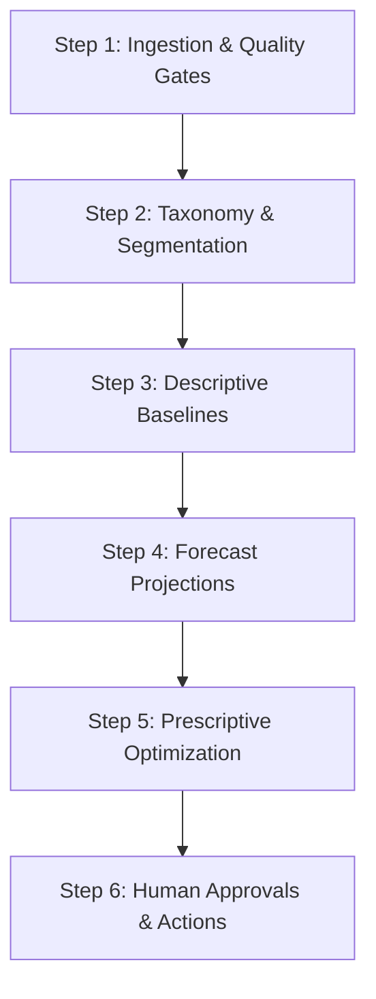

# MedShield Executive DSS Dashboard: Business-Friendly Design & Step-by-Step Build Guide

This document defines the step-by-step methodology for constructing an executive-level Decision Support System (DSS) dashboard. It bridges technical data engineering, predictive forecasting, and prescriptive optimization into a clean, business-friendly interface. Each step integrates the specific UI elements to add, design considerations, and the bad practices to avoid to ensure a sensible, accurate, and dynamic system.

---

## The Executive Dashboard Philosophy

An executive DSS dashboard must support **critical decisions, not display raw data clutter**. Executives require:
1. **Immediate Context**: High-level, red-or-green strategic metrics.
2. **Actionable Recommendations**: Clear, cost-justified suggestions (what to order, where to allocate).
3. **Auditable Guardrails**: Full visibility into assumptions, data limitations, and override audit trails.
4. **No Black Boxes**: Explainable optimization constraints and models.

---

## Consolidated Analytics Pipeline Outputs

To ensure the executive DSS dashboard functions as a unified decision engine, it consolidates and exposes the **entire set of outputs** generated across all three analytical stages, mapped directly to our North Star Mind Map items:

### 1. Descriptive Analytics Outputs (Historical Baseline)
* **Ingestion Quality Logs**: Total rows processed vs. accepted clean rows, highlighting isolated margin anomalies.
* **Geographic & Channel Segmentations** `[North Star 2A & 6A & 7A]`: Clean actual sales vs. sales with backward-allocated service contracts (clearly flagged as `estimated_backward_allocation`).
* **Seasonality Indices** `[North Star 3A]`: Calculated monthly historical demand multipliers via STL decomposition (e.g., historical Dengue seasonal surges).
* **YoY Demand Growth Trends** `[North Star 5A]`: Comparative monthly growth percentages between consecutive baseline years (2021–2025).
* **Pareto Revenue Share bands** `[North Star 4A]`: Categorized product groups (A, B, C bands based on historical sales concentration).

### 2. Predictive Analytics Outputs (Forecasting & Risk Scoring)
* **Prophet Demand Forecasts** `[North Star 2B]`: Monthly expected demand volumes `y(t)` for the target planning period (2026/2027), mapped with upper and lower confidence intervals.
* **Forecast Accuracy Metrics** `[North Star 3B]`: Display of MAPE, RMSE, MAE, and naive seasonal benchmarks to establish trust.
* **Model Fallback Indicators** `[North Star 4B & 5B]`: Visual flags showing whether forecast calculations are using active exogenous regressors (`DLI/DII` for disease-driven demand, `RSI` for rainfall-driven demand) or have safely downgraded to a historical naive baseline.
* **XGBoost Classifications & Scores** `[North Star 6B & 7B]`: Predicted ABC class designations and continuous numerical Demand Urgency Scores for cold-start (new/low-history) and existing SKUs.

### 3. Prescriptive Analytics Outputs (Optimization & Action)
* **MCDA Priority Scores** `[North Star 6C]`: Unified territory priority scores calculated via weighted multi-criteria ranks (revenue, growth, and epidemiological risk).
* **Inventory Control Parameters** `[North Star 2C & 3C]`: Cost-minimized Economic Order Quantities (EOQ), reorder triggers (Reorder Points - ROP), and target Safety Stock buffers.
* **LP Allocation Matrices** `[North Star 2C & 6C]`: Optimized stock distribution quantities mapped by product and province, detailing active binding constraints (e.g., budget limits or capacity ceilings).
* **Collaborative Filtering Recommendations** `[North Star 7C]`: Recommended product-territory expansion pairings with matching cosine similarity metrics.
* **Stop-Purchasing Flag** `[North Star 8C]`: System flag isolating dead-stock Class C items based on the trailing 6-month transaction velocity.
* **System Override Records** `[North Star 4C & 5C]`: High-contrast typhoon and outbreak alert banners overriding default parameters, paired with mandatory planner comments in the immutable audit log.

---

## Weather & Disease Data Integration (Baselines & Context)

To support environmental decision models, the dashboard relies on the following clean external datasets. The interface must explicitly present their parameters and limitations:

1. **Department of Health (DOH) Disease Data (2021–2025)**:
   * *UI Representation*: Sourced from [doh_historical_clean.csv](file:///c:/Users/Ethan/medshield-alt-working-repo/datasources/clean/doh/doh_historical_clean.csv).
   * *Metric*: Monthly Disease Intensity Indicator (DII) by province for Dengue, Leptospirosis, and Influenza.
   * *Limitation*: The system must label this data as **"Historical epidemiological reference signals"** and *never* describe it as a live, real-time disease outbreak surveillance alert.
2. **PAGASA Meteorological Reference (2021–2024)**:
   * *UI Representation*: Sourced from [pagasa_historical_clean.csv](file:///c:/Users/Ethan/medshield-alt-working-repo/datasources/clean/pagasa/pagasa_historical_clean.csv).
   * *Metric*: Rainfall (mm), humidity, wind speed, and temperature from historical station logs.
   * *Limitation*: Sourced from historical logs only; cannot be used for post-2024 active forecasting.
3. **Open-Meteo Weather API Reanalysis Proxy (2021–2025)**:
   * *UI Representation*: Sourced from [weather_api_observations_clean.csv](file:///c:/Users/Ethan/medshield-alt-working-repo/datasources/clean/weather_api/weather_api_observations_clean.csv).
   * *Metric*: Localized weather patterns by coordinates, used to generate the Monthly Severity Proxy (0.0 to 1.0) and Rainfall Severity Index (RSI).
   * *Limitation*: Must be labeled as **"Provider-derived weather proxy observations"** and *never* presented as official PAGASA alert signals.

---

## Interface Layout & Navigation Architecture (Ideal Setup)

To support executive workflows and separate analytical diagnostic detail from day-to-day operations, the MedShield DSS is organized into a **4-Page Layout Structure**:

```text
+--------------------------------------------------------------------------------+
|  MedShield DSS   [Executive Overview]   [Diagnostics]   [Planning]   [Admin]   |
+--------------------------------------------------------------------------------+
```

### Page 1: Executive Overview Hub (Strategic view)
* **Target Audience**: Chief Executive Officer (CEO), Chief Operations Officer (COO), and VP of Procurement.
* **Layout Goal**: Provide immediate, read-only situational awareness within 5 seconds of loading the page.
* **Page Elements**:
  * **Top Banner**: High-contrast, dynamic environmental alerts (disease outbreaks or typhoon triggers).
  * **KPI Summary Cards**: Corporate Revenue, Gross Profit Margin, Active Alerts Count, and Data Pipeline Health.
  * **Unified Trend Chart**: Historical sales transitioning into the Prophet demand forecast with a shaded confidence interval range.

### Page 2: Diagnostics & Prioritization (Analytical View)
* **Target Audience**: Business Analysts, Category Managers, and QA Engineers.
* **Layout Goal**: Identify which products and areas drive performance and require prioritized attention.
* **Page Elements**:
  * **Interactive Filter Sidebar**: Toggles for Actual vs. Allocated Contract Sales, and dropdowns for Territory, Customer Channel, and Product Category.
  * **Product Urgency Table**: Lists SKUs sorted by the gradient-boosted XGBoost Urgency Score, showing historical and predicted ABC classifications.
  * **Seasonality Heatmap**: Visual grid of monthly seasonality multipliers by product group.
  * **Territory & Channel Leaderboards**: Rank tables comparing sales and profit performance by geographic area and institutional channel.

### Page 3: Prescriptive Planning & Scenario Engine (Operational View)
* **Target Audience**: Procurement Officers, Inventory Planners, and Supply Chain Executives.
* **Layout Goal**: Test inventory scenarios, approve orders, and allocate stock.
* **Page Elements**:
  * **Scenario Control Sidebar**: Interactive sliders for adjusting replenishment Lead Time, Holding Cost rates, Target Service Levels (Z-factor), and Allocation Budgets.
  * **Reorder planning Table**: Table showing EOQ, ROP, Safety Stock levels, current stock, and inline "Approve/Modify" action buttons.
  * **LP Stock Allocation Matrix**: Grid displaying optimized allocation recommendations by territory with a "Binding Constraints" explanation panel.
  * **Product-Region Expansion List**: Sourced from collaborative filtering, suggesting product pairings with high cosine similarity for unstocked territories.

### Page 4: Operations & System Audit (Governance View)
* **Target Audience**: System Administrators, DevOps Engineers, and Security Officers.
* **Layout Goal**: Monitor system logs, audit decision trails, and manage data parameters.
* **Page Elements**:
  * **DSS Action Log Table**: Immutable audit log of all human approvals, quantity modifications, timestamps, and planner comments.
  * **Manual Alert Override Console**: Administrator toggle panel to manually simulate DOH disease alerts or PAGASA typhoon contingencies.
  * **ETL Ingestion Log**: Detail panel showing file run statistics, duplicate records isolated, and data contract validations.

---

## Step-by-Step Dashboard Build Process



### Step 1: Establish Data Trust & Quality Gates (Ingestion Layer)
Executives will reject a dashboard if they find even a minor math discrepancy. Building trust starts at the ingestion gate.
* **Objective**: Ensure the data feeding the dashboard is audited and clean.
* **UI Elements to Add (Page 4)**:
  * **Data Health Status Badge**: A high-level visual indicator (e.g., green "100% Reconciled" or amber "Warning: Anomalies Isolated").
  * **ETL Cleanliness Summary Card**: Shows raw transaction row count, accepted clean sales row count, and the number of isolated or unmapped records.
* **Design Considerations**:
  * *Background Aggregations*: Raw file validation must run asynchronously in background jobs (e.g., using scheduled tasks) rather than on page load, keeping page load times under 2 seconds.
  * *Audit Log Security*: Store all ingestion validation flags and rejected row logs in a read-only audit table in Supabase.
* **Bad Practices to Avoid**:
  * *Never hide data quality issues*: Do not average out or ignore anomalous dates. Display a simple status card outlining raw rows loaded versus accepted rows.
  * *Isolate Gross Margin anomalies*: If cost exceeds sales price in error, flag it and separate it. Do not let company-wide gross margins display skewed numbers.

---

### Step 2: Align Clean Business Taxonomy (Segmentation Layer)
Before displaying sales or product performance, clean historical files of operational noise that skew business performance.
* **Objective**: Group records into standard, approved corporate segments.
* **UI Elements to Add (Page 2)**:
  * **Global Segmentation Filters**: Dropdown selectors for Physical Territory (e.g., Batangas, Quezon), Customer Channel (e.g., Government, Hospital, Pharmacy), and Product Category.
  * **Allocated Service Contract Toggle**: A visible switch allowing planners to view "Actual Sales Only" versus "Sales with Allocated Service Contracts."
  * **Backward-Allocated Row Indicator**: Clear tags or color-coding next to product rows generated via backward approximation.
* **Design Considerations**:
  * *Client-side Caching*: Store segment filter configurations locally in client memory. Swapping territories or channels should trigger instant client-side transitions without sluggish full-page refreshes.
* **Bad Practices to Avoid**:
  * *Do not mix internal cost centers with sales*: Non-sales rows (like administrative costs or inventory write-offs) must be automatically filtered out of revenue metrics.
  * *Separate Service Contracts from Product Sales*: Bulk area contracts (e.g., "PAGBILAO # 13,500,000") must be allocated to estimated child SKUs via a historical product-mix profile. The dashboard must clearly label these rows as `estimated_backward_allocation` so executives know they are estimates.

---

### Step 3: Render Descriptive Strategic Baselines (Historical Layer)
Provide the backward-looking context that anchors executive goals.
* **Objective**: Show how the business has performed historically, accounting for seasonality and growth.
* **UI Elements to Add (Pages 1 & 2)**:
  * **YoY Demand Growth Chart**: Dual-axis line and bar chart displaying monthly sales trends compared against prior years.
  * **Seasonality Index Heatmap**: Visual grid translating time-series decompositions into simple monthly demand multipliers (e.g., "Dengue medicines see a 1.3x typical demand spike in August").
  * **Territory Revenue & Margin Leaderboard**: Clean ranked lists of physical delivery areas sorted by profit margin and total revenue contribution.
* **Design Considerations**:
  * *Visual Hierarchy*: Place high-level KPI cards at the top of this view, followed by seasonality heatmaps, and detail lists at the bottom.
* **Bad Practices to Avoid**:
  * *Do not compare partial periods directly*: Late 2025 contains incomplete records. Comparing late 2025 to 2024 without a disclaimer is a bad practice that displays a false business decline. The dashboard must grey out and label partial periods.

---

### Step 4: Project Demand Ranges & Confidence Limits (Predictive Layer)
Look forward using predictive forecasting, but always frame predictions within risk boundaries.
* **Objective**: Show expected demand for the upcoming planning cycle.
* **UI Elements to Add (Pages 1 & 2)**:
  * **Demand Forecast Chart**: Interactive trend chart displaying historical sales transitioning seamlessly into a forecast line (e.g., 2026/2027) surrounded by a shaded forecast demand range (upper and lower confidence bounds).
  * **Model Fallback Status Indicator**: A badge showing if the model is currently using exogenous disease/weather regressors (e.g., `DII_lag`, `RSI`) or if it has downgraded to the historical Naive Baseline.
  * **Cold-Start ABC Classifier Labels**: A badge indicating XGBoost-predicted ABC ranks for new/low-history SKUs, accompanied by a classifier performance score.
* **Design Considerations**:
  * *Readable Visualizations*: Always pair forecast lines with hover tooltips displaying the exact upper and lower bounds to help planners assess inventory risk.
* **Bad Practices to Avoid**:
  * *Do not present forecasts as absolute certainty*: Always display the shaded confidence interval.
  * *Disclose forecast model fallbacks*: If external DOH disease or PAGASA weather data feeds are offline, display a fallback label showing that the system has downgraded to a historical-only Naive Baseline.

---

### Step 5: Display Prescriptive Scenarios & Cost Levers (Optimization Layer)
Provide actionable guidance for stock purchases and allocations, while making operational limits transparent.
* **Objective**: Provide recommended order quantities (EOQ), reorder triggers (ROP), and regional stock allocations.
* **UI Elements to Add (Page 3)**:
  * **Scenario Sliders Sidebar**: Interactive input sliders for lead times, holding costs, target service levels, and optimization budgets.
  * **EOQ & ROP Planning Table**: Reorder list detailing current stock, Safety Stock target, ROP trigger, and recommended order quantity (EOQ).
  * **LP Stock Allocation Table**: Multi-column matrix showing optimized allocation splits by region, highlighting unmet demand.
  * **Product-Region Recommendations Matrix**: Sourced from collaborative filtering, showing products recommended for expansion into new regions based on cosine similarity.
* **Design Considerations**:
  * *Explain optimization limits (No Black Boxes)*: Provide a sidebar showing which **binding constraints** restricted allocations (e.g., "Allocation limited by: Budget Limit" or "Allocation limited by: Safety Stock minimum").
* **Bad Practices to Avoid**:
  * *Do not label illustrative outputs as finalized optimizations*: If actual operating costs, warehouse capacity, and lead-time data are incomplete in the database, the dashboard must label these views as **"Scenario-Based Demonstrations"** rather than "Cost-Minimizing Recommendations."

---

### Step 6: Enforce Human-in-the-Loop Approvals (Action Layer)
A decision support system should support the executive, not replace them.
* **Objective**: Convert dashboard views into recorded business actions.
* **UI Elements to Add (Page 3 & 4)**:
  * **Approval Buttons**: Interactive "Approve Recommendation" and "Modify and Apply" actions next to every ROP/EOQ and allocation row.
  * **Override Entry Form**: A text area to capture the planner's mandatory justification before applying custom reorder or allocation numbers.
  * **DSS Action Log**: A historical log table displaying planner approvals, custom quantity adjustments, timestamps, and reviews.
  * **Dynamic Override Alert Banners**: High-contrast banners showing when typhoon overrides (PAGASA Warning Signal >= 2) or disease alerts (cases > baseline + 2 * std dev) have bypassed normal rules.
* **Design Considerations**:
  * *Role-Based Security*: Restrict approval actions and override configurations to authorized procurement officers and executives.
  * *Immutable Audit Logging*: Ensure that every approved action and approval comment is written to an immutable history table in Supabase.
* **Bad Practices to Avoid**:
  * *No automated unchecked actions*: Any approved reorder or stock transfer must prompt the user for an approval comment and record the action, creating a transparent **Audit Trail** in the system database.
