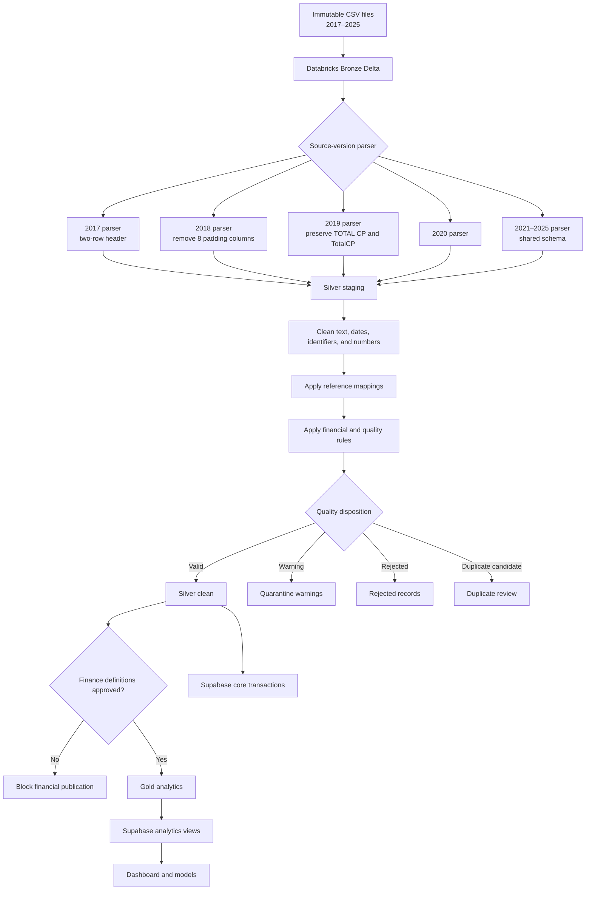

# MedShield Databricks Data-Cleaning Workflow

## Decision

Proceed with Databricks when MedShield will use the same platform for recurring ingestion, multi-year data integration, forecasting, disease and weather enrichment, and predictive analytics.

The current CSV volume may not require a distributed platform by itself. Databricks is still the stronger strategic choice when the cleaning pipeline will become a repeatable production workflow rather than a one-time manual cleanup. KNIME remains useful for exploratory profiling and visual prototyping, but the production transformation rules should have one authoritative implementation.

## Platform Responsibilities

| Platform | Primary responsibility |
|---|---|
| Databricks | Ingest raw files, parse source versions, standardize columns, clean values, apply mappings, validate quality, quarantine problems, reconcile financial fields, and build analytical tables. |
| Supabase | Store approved operational records and dashboard-ready summaries, enforce relational constraints and access controls, and serve the application. |
| KNIME, optional | Prototype or visually inspect transformations before encoding the approved rules in Databricks. It should not become a second production implementation of the same cleaning logic. |

Supabase is a suitable destination for cleaned data, but it is not the main cleaning engine for this workflow. Perform the heavy parsing, standardization, validation, and reconciliation in Databricks before publishing approved records to Supabase.

## Target Architecture

Use a medallion-style pipeline with Delta tables at every Databricks layer.

| Layer | Contents | Rules |
|---|---|---|
| Bronze | Immutable copies of the 2017–2025 CSV records plus file metadata. | Preserve original strings and source structure. Never modify or overwrite source values. |
| Silver staging | Parsed records using a source-version-specific schema. | Correct headers, remove report titles and blank padding columns, remove footer totals, and retain the original row number. |
| Silver clean | Standardized records using the approved 28-column canonical schema. | Clean text, dates, identifiers, numeric fields, aliases, and quality metadata. |
| Quarantine | Rows that cannot safely enter the approved dataset. | Keep reason codes, source lineage, original values, and proposed corrections. Never silently discard rows. |
| Gold | Reconciled, business-approved analytical tables and aggregates. | Publish transaction, product, SKU, area, year, and dashboard summaries only after business-definition approval. |
| Supabase | Approved Silver transactions and selected Gold summaries or views. | Apply constraints, indexes, private schemas, and row-level security where data is exposed through the API. |

## End-to-End Flow



## Databricks Workflow

Create the workflow as separately testable notebooks or Python modules. Keep table names and catalog/schema names configurable for development, testing, and production environments.

### Repository implementation mapping

The current `databricks/` implementation groups the conceptual stages below into six ordered notebooks:

| Implemented notebook | Conceptual stages covered |
|---|---|
| `00_setup.py` | Create schemas and the raw-file volume. |
| `01_bronze.py` | `01_ingest_bronze` |
| `02_stage.py` | `02_parse_source_versions` |
| `03_clean_quality.py` | `03_standardize_columns` through `08_publish_silver` |
| `04_gold.py` | `09_build_gold` |
| `05_validate.py` | Batch reconciliation and publication gates. |

`10_sync_to_supabase` remains a controlled later step. Do not add it until the Databricks Silver and Gold outputs have been reviewed and approved.

### `01_ingest_bronze`

1. Discover CSV files only from the approved raw-data location.
2. Record an `import_batch_id` for the run.
3. Capture at least:
   - source file name;
   - source-relative path;
   - file modification timestamp;
   - ingestion timestamp;
   - source row number;
   - file year inferred from the controlled inventory, not trusted blindly from the name;
   - file checksum when practical.
4. Read all source fields as strings.
5. Write append-only Bronze Delta records.
6. Reject an accidental re-ingestion of the same file checksum unless the run is explicitly marked as a replay.

### `02_parse_source_versions`

Route each file through the parser matching its actual source layout.

| Source version | Required parser behavior |
|---|---|
| 2017 | Reconstruct the two-row header. Preserve both discount rate and discount amount. Keep ambiguous quantity fields as temporary candidates until reconciled. |
| 2018 | Remove the eight empty padding columns. Confirm that column shifting has not changed values or types. |
| 2019 | Preserve `TOTAL CP` and `TotalCP` as separate source fields until their meanings are approved and mapped. Do not normalize them into the same name prematurely. |
| 2020 | Create `gross_margin_pct` as null when the source does not provide a reliable value. Derive it only after the finance definition is approved. |
| 2021–2025 | Use the shared parser, while retaining file-level validation because a familiar header does not guarantee consistent values. |

Parser output must keep every usable record and send structural failures to quarantine with a reason code.

### `03_standardize_columns`

Map every parsed source to the canonical 28-column schema documented in [MedShield CSV Data-Cleaning Plan](MEDSHIELD_CSV_DATA_CLEANING_PLAN.md). Apply these rules:

- use lowercase `snake_case` names;
- keep source identifiers as strings to preserve leading zeroes;
- use a true date type for transaction dates;
- use decimal types for currency, rates, and calculated financial measures;
- use integer or decimal types for quantity according to the approved business rule;
- add lineage and quality fields outside the 28 business columns;
- represent unavailable values as null rather than invented zeroes.

Recommended technical fields include:

```text
import_batch_id
source_file_name
source_row_number
source_year
ingested_at
parser_version
record_hash
quality_status
quality_rule_codes
```

### `04_clean_values`

Apply deterministic transformations in this order:

1. Normalize encoding and remove non-printing characters.
2. Trim leading and trailing whitespace.
3. Convert empty strings and approved null tokens to null.
4. Normalize internal whitespace without changing meaningful punctuation.
5. Parse dates using explicit accepted formats; do not use ambiguous automatic parsing.
6. Remove currency symbols, percent signs, grouping commas, and accounting parentheses before numeric conversion.
7. Preserve the original value in lineage or issue details whenever parsing fails.
8. Normalize controlled categories through lookup tables rather than free-text replacement scattered across notebooks.
9. Apply product, SKU, area, customer, and transaction-type aliases only after exact-match and review rules are defined.

### `05_apply_quality_rules`

Every record receives one disposition:

| Status | Meaning | Publication rule |
|---|---|---|
| `valid` | All required structural, domain, and financial checks pass. | Eligible for Silver clean. |
| `warning` | Record is usable but contains a documented non-blocking issue. | Keep in quarantine or publish only if the warning type is explicitly approved. |
| `rejected` | Required data is invalid or missing and cannot be corrected deterministically. | Do not publish to Silver clean. |
| `duplicate_candidate` | Record may duplicate another record but requires review. | Keep out of approved totals until resolved. |

At minimum, test:

- date is parseable and within the approved dataset period;
- source year agrees with the parsed transaction date or has an explained exception;
- required identifiers and product descriptions are present;
- quantity and financial values are numeric where required;
- rate and percentage fields are within approved ranges;
- transaction type, area, product, and SKU values map to controlled dimensions where required;
- footer totals, report headings, blank records, and repeated headers are excluded from business rows;
- impossible negative or zero values are flagged according to the business rule;
- record hashes and business keys identify exact and probable duplicates;
- calculated financial relationships stay within the approved rounding tolerance.

### `06_deduplicate_and_quarantine`

1. Remove only exact technical duplicates when the duplicate rule is proven and logged.
2. Send probable business duplicates to `duplicate_candidate`; do not automatically delete them.
3. Store one issue row per failed rule so a source record may have multiple documented issues.
4. Include the proposed standardized value when a reviewer can approve a correction.
5. Record reviewer, review timestamp, resolution, and comments for manual decisions.

### `07_reconcile_financials`

Validate the approved relationships using a documented currency tolerance:

```text
gross_contract_value ≈ quantity × contract_price_unit
net_contract_value ≈ gross_contract_value − discount_amount
total_transfer_price ≈ quantity × transfer_price_unit
gross_margin_amount ≈ net_contract_value − total_transfer_price
gross_margin_pct ≈ gross_margin_amount ÷ net_contract_value
```

These expressions are validation hypotheses until the finance or business owner confirms the source definitions. If a formula is not approved, keep the source value, calculate a separate candidate value, and block the affected Gold financial metric from publication.

### `08_publish_silver`

Publish only records allowed by the quality policy. Make the write idempotent using `import_batch_id`, source lineage, and a stable record hash. Record row counts for:

- source input;
- Bronze ingestion;
- parsed staging;
- valid output;
- warnings;
- rejected rows;
- duplicate candidates.

The counts must reconcile to the source input after separately identifying non-data report rows.

### `09_build_gold`

Build only approved analytical products, such as:

- sales transactions by year and month;
- sales by product and canonical SKU;
- sales by area and customer;
- financial summaries;
- medical-only demand series;
- dashboard aggregates;
- model-ready time series enriched with approved disease and weather data.

Clearly label estimated records created by backward allocation. Do not mix them with observed transactions without an `is_estimated` or equivalent field and an explicit analytical policy.

### `10_sync_to_supabase`

Publish in controlled batches rather than row-by-row application inserts. A suitable logical layout is:

```text
audit.import_batches
staging.medshield_sales
audit.sales_quality_issues
audit.sales_rejected_rows
audit.sales_duplicate_candidates
core.sales_transactions
reference.area_aliases
reference.product_aliases
reference.transaction_types
analytics.sales_summary
```

Keep ingestion, audit, and reference-management objects in private schemas unless the application must access them. Apply row-level security to exposed tables and views, and never expose the service-role key to the browser.

## Reference and Mapping Tables

Maintain reference data as versioned tables, not hard-coded notebook dictionaries. At minimum, include:

- product master and SKU aliases;
- area aliases and canonical geography;
- transaction-type mappings;
- customer or account aliases when approved;
- non-medical classification rules;
- accepted date and null-token rules;
- financial tolerances and rule versions.

Each mapping should include effective dates or a version, approval metadata, and the original-to-canonical relationship.

## Reconciliation Checklist

Before publishing a batch, verify:

- every source file appears exactly once in the batch inventory;
- source, Bronze, staging, clean, quarantine, rejection, and duplicate counts reconcile;
- all years found in the data are reported, including years outside 2017–2025;
- no source row disappears without a documented non-data or quality disposition;
- totals by file and year are compared before and after cleaning;
- transformations that can affect totals have a variance report;
- unknown products, SKUs, areas, and transaction types are counted and reviewed;
- 2025 completeness limitations are labeled in analytical output;
- estimated allocation rows are separated from observed records;
- Supabase row counts and batch totals match Databricks publication output;
- rerunning the same batch does not create duplicate approved transactions.

## Development and Deployment Approach

1. Implement the first parser and cleaning rules in a development catalog using PySpark and Delta tables.
2. Add small representative fixtures for every source version and known anomaly.
3. Test individual transformations and end-to-end row reconciliation.
4. Review mappings and financial definitions with the responsible business owners.
5. Schedule the notebook sequence as a Databricks workflow.
6. Add pipeline expectations and monitoring after the transformation rules stabilize.
7. Publish to a Supabase staging table first, validate, and then merge into approved core tables.
8. Promote the same versioned code and configuration through test and production environments.

## When KNIME Is Still Useful

Use KNIME for temporary profiling, visual demonstrations, or rule discovery when that helps the team. Export the confirmed rule, test cases, and expected results, then implement it in the Databricks pipeline. Avoid independently maintaining equivalent production workflows in both tools because their results can drift.

## Definition of Done

The cleaning workflow is complete when:

- all source versions are parsed through tested, version-controlled logic;
- the standard schema and data dictionary are approved;
- all records have lineage and a quality disposition;
- rejected and quarantined rows are reviewable and recoverable;
- financial formulas and tolerances are approved;
- row counts and totals reconcile by file and year;
- the pipeline is repeatable and idempotent;
- cleaned and analytical tables are published to Supabase securely;
- the dashboard and analytical models consume only approved tables or views.

## Official References

- [Databricks medallion architecture](https://docs.databricks.com/aws/en/lakehouse/medallion)
- [Databricks pipeline expectations](https://docs.databricks.com/aws/en/ldp/expectations)
- [Databricks pipeline best practices](https://docs.databricks.com/aws/en/ldp/best-practices)
- [Supabase bulk data loading](https://supabase.com/docs/guides/database/tables#bulk-data-loading)
- [Supabase Row Level Security](https://supabase.com/docs/guides/database/postgres/row-level-security)
