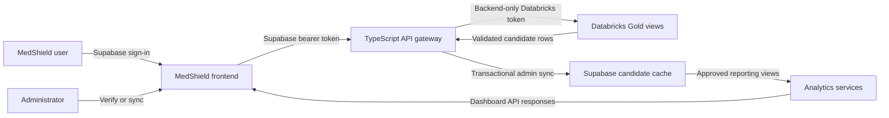

# MedShield Databricks-to-System Connection Walkthrough

Last updated: 2026-09-01

## Purpose

This is the click-by-click guide for connecting the validated MedShield Databricks Gold layer to the MedShield application without exposing credentials or making the dashboard depend on a slow live Databricks query for every page load.

The recommended production-style flow for this capstone is:

1. Supabase Auth signs the user into MedShield.
2. The MedShield TypeScript gateway verifies the user's token and role.
3. Only the backend uses the Databricks token.
4. An administrator manually synchronizes validated Gold candidate data into a protected Supabase cache.
5. The dashboard continues reading governed Supabase views.

## Figure 1 — Safe Connection Flow



Security boundary: the browser must never receive `DATABRICKS_TOKEN`, the SQL warehouse ID, authorization headers, or dynamically supplied SQL. Databricks does not authenticate MedShield users; Supabase Auth remains responsible for user identity.

## Current Checkpoint

The project has already completed these items:

- Databricks Bronze, Silver, quarantine, Gold dimensions, Gold fact, and aggregate-mart validation.
- Gold fact count: **40,086** analysis-ready transactions.
- Available years: **2017–2025**.
- Gold dashboard candidate views:
  - Monthly: **108 rows**
  - Yearly: **9 rows**
  - Area-year: **180 rows**
  - Product-year: **7,893 rows**
  - Quality rules: **37 rows / 8,236 occurrences**
  - Exclusions: **26 rows / 4,867 excluded records**
- Backend Databricks environment variables have been added to `backend/.env`.
- The backend can query the approved yearly Gold view.
- An administrator-only **Verify Gold Connection** control has been added to MedShield's **View Sales Data** page.
- The protected Supabase migration, strict server-only sync client, administrator-only sync endpoint, and **Sync Yearly Gold Data** button are implemented in the repository.
- Backend and frontend production builds pass.
- A read-only live extraction check passed for 9 rows, 2017–2025, 40,086 reconciled transactions, and candidate-only financial definitions.

The remaining activation steps are to apply migrations `013_databricks_yearly_candidate_sync.sql` and `014_databricks_yearly_candidate_permissions.sql` in the MedShield Supabase project, restart the backend, and run the button once.

---

# Part A — Your Next Click Right Now

The immediate objective is to confirm that the signed-in MedShield application can reach Databricks through the backend.

## Step 1 — Save the Backend Environment File

In VS Code:

1. Select the open `backend/.env` tab.
2. Press **Ctrl+S**.
3. Confirm that the file contains values for these names:

```dotenv
DATABRICKS_HOST=
DATABRICKS_TOKEN=
DATABRICKS_SQL_WAREHOUSE_ID=
DATABRICKS_CATALOG=workspace
DATABRICKS_SCHEMA=medshield_gold
```

Do not paste the actual values into screenshots, chat, Git, or documentation.

Important distinction:

- `DATABRICKS_SQL_WAREHOUSE_ID` contains only the ID after `/sql/1.0/warehouses/`.
- It must not contain the complete HTTP path.
- `DATABRICKS_HOST` may be entered with or without `https://`; the backend normalizes it to HTTPS.

## Step 2 — Start the Correct Backend

`backend/app.py` is a legacy compatibility file. For the Databricks connection, start the TypeScript gateway from `backend/src/server.ts` through the npm script.

In VS Code:

1. On the top menu, click **Terminal**.
2. Click **New Terminal**.
3. Paste the following command and press **Enter**:

```powershell
cd C:\Users\Adrian\projects\capstone_lockin\backend
```

4. Paste the following command and press **Enter**:

```powershell
npm run dev
```

Expected terminal message:

```text
MedShield TypeScript API listening on port 5000
```

Leave this terminal running.

## Step 3 — Start the Frontend in a Second Terminal

In the VS Code terminal panel:

1. Click the small **+** button to create another terminal.
2. Paste the following command and press **Enter**:

```powershell
cd C:\Users\Adrian\projects\capstone_lockin\frontend
```

3. Paste the following command and press **Enter**:

```powershell
npm run dev
```

Expected result:

```text
Local: http://localhost:3000
```

Leave this second terminal running too.

## Step 4 — Open and Sign In to MedShield

1. Open your browser.
2. Go to `http://localhost:3000`.
3. Sign in using a MedShield account with the **admin** role.
4. If the dashboard was already open before the code change, press **Ctrl+Shift+R** for a hard refresh.

The Databricks control is intentionally hidden from non-administrator accounts. The backend also enforces the administrator role, so hiding the control is not the only security measure.

## Step 5 — Open the Databricks Connection Control

Inside MedShield:

1. Look at the left sidebar.
2. Click **View Sales Data**.
3. At the top of the **Cleaned Sales Transactions** page, locate the card named **Databricks Gold connection**.
4. Confirm that the badge initially says **Not Checked**.
5. Click **Verify Gold Connection** once.
6. Do not click repeatedly while it says **Checking...**.

Free Edition may take several seconds to wake its SQL warehouse, so a brief delay is normal.

## Step 6 — Confirm the Expected Result

The successful result should show:

```text
Connected
workspace.medshield_gold.vw_dashboard_yearly_sales_candidate
2017–2025
9 years
9 yearly rows
```

This proves the following path works:

```text
Admin browser session
  → Supabase authentication token
  → MedShield TypeScript gateway
  → backend-only Databricks token
  → approved Gold yearly view
```

It does **not** yet mean the Databricks rows have been copied into Supabase or published to the main dashboard.

## Gate A — Stop or Continue

Continue to the yearly pilot sync only when all of these are true:

- Badge says **Connected**.
- Minimum year is **2017**.
- Maximum year is **2025**.
- Year count is **9**.
- Row count is **9**.

If any value differs, stop and save a screenshot of the result before changing code or data.

## Connection Troubleshooting

| What you see | Meaning | What to do |
|---|---|---|
| The connection card is missing | The signed-in account is not an admin, or the old frontend is cached. | Confirm the user's MedShield role, then press **Ctrl+Shift+R**. |
| `401 Unauthorized` | No valid Supabase session reached the backend. | Sign out, sign in again, and retry. |
| `403 Forbidden` | The account does not have the MedShield admin role. | Use an approved admin account; do not weaken the endpoint authorization. |
| `503 Databricks is not configured` | One or more Databricks variables are blank in `backend/.env`, or the backend was not restarted. | Save `.env`, stop the backend with **Ctrl+C**, then run `npm run dev` again. |
| `502 ... could not reach ... Gold view` | Host, token, warehouse ID, view permission, or warehouse availability failed. | Recheck the three private values, confirm the SQL warehouse is available, and retry once. |
| It stays on **Checking...** for a while | Free Edition compute may be waking or under quota pressure. | Wait for the request to finish; do not repeatedly click the button. |

---

# Part B — Activate the 9-Row Yearly Pilot

After Gate A passes, the next development task is to build a controlled shadow sync for:

```text
workspace.medshield_gold.vw_dashboard_yearly_sales_candidate
```

The first sync intentionally uses only 9 rows. It is small enough to reconcile easily and proves the complete path before moving thousands of product rows.

## Files Now Implemented

The repository now contains:

1. `supabase/migrations/013_databricks_yearly_candidate_sync.sql`
2. The typed 47-column extraction and validation contract in `backend/src/databricks.ts`
3. The strict server-only client in `backend/src/supabaseWarehouse.ts`
4. The atomic orchestration service in `backend/src/databricksYearlySync.ts`
5. This administrator-only endpoint:

```text
POST /api/integrations/databricks/sync/yearly
```

6. A **Sync Yearly Gold Data** button in the MedShield admin data page.

Do not manually invent the table in Table Editor. Apply the version-controlled migration as one SQL script.

## What the Migration Will Create

The pilot cache is:

```text
medshield_sales.databricks_yearly_sales_candidate
```

It must:

- use `calendar_year` as the primary key;
- preserve every Databricks `*_candidate` name;
- retain nulls instead of silently replacing missing financial values;
- store pipeline run and source-extract lineage;
- store a row checksum and sync timestamp;
- enable Row Level Security;
- reject direct `anon` and `authenticated` access;
- allow only the server-side service role to write;
- never store the Databricks token, hostname credential, or warehouse ID.

The migration will also reuse:

- `medshield_etl.dim_source_system`
- `medshield_etl.etl_pipeline_run`
- `medshield_etl.etl_source_extract`

## Before Step 7 — Confirm the Server-Only Supabase Secret

In VS Code, open `backend/.env`. Confirm that these names exist and have values:

```dotenv
SUPABASE_URL=
SUPABASE_ANON_KEY=
SUPABASE_SECRET_KEY=
```

If your project uses the older JWT-style key, `SUPABASE_SERVICE_ROLE_KEY=` may be used instead of `SUPABASE_SECRET_KEY=`. Do not place either server secret in `frontend/.env.local`, do not prefix it with `NEXT_PUBLIC_`, and do not commit `backend/.env`.

## Step 7 — Apply Migration 013 in Supabase

The migration changes the remote database, so you must run this step in the correct Supabase project:

1. Open the Supabase dashboard.
2. Select the project used by MedShield.
3. In the left navigation, click **SQL Editor**.
4. Click **New Query**.
5. In VS Code, open `supabase/migrations/013_databricks_yearly_candidate_sync.sql`.
6. Press **Ctrl+A**, then **Ctrl+C** inside that migration file.
7. Return to the Supabase SQL Editor.
8. Paste the migration.
9. Review that no token or secret is present.
10. Click **Run**, or press **Ctrl+Enter**.
11. Wait for a successful completion message.

If Supabase reports an error, do not run random portions. Copy the complete error so the version-controlled migration can be corrected first.

## Step 7A — Confirm the Protected Objects Exist

Still in **SQL Editor**:

1. Click **New Query**.
2. Paste this query.
3. Click **Run**.

```sql
select
  to_regclass('medshield_sales.databricks_yearly_sales_candidate') as candidate_table,
  to_regprocedure(
    'public.sync_databricks_yearly_sales_candidate(jsonb,text,timestamptz,text)'
  ) as sync_function,
  has_function_privilege(
    'anon',
    'public.sync_databricks_yearly_sales_candidate(jsonb,text,timestamptz,text)',
    'execute'
  ) as anon_can_execute,
  has_function_privilege(
    'authenticated',
    'public.sync_databricks_yearly_sales_candidate(jsonb,text,timestamptz,text)',
    'execute'
  ) as authenticated_can_execute;
```

Expected:

- `candidate_table` contains the table name.
- `sync_function` contains the function name and signature.
- `anon_can_execute` is `false`.
- `authenticated_can_execute` is `false`.

## Step 8 — Restart the Backend After the Migration

Return to the backend terminal:

1. Press **Ctrl+C** once.
2. Run:

```powershell
npm run dev
```

This reloads the synchronization endpoint and environment configuration.

## Step 9 — Run the Yearly Sync From MedShield

1. Open `http://localhost:3000`.
2. Sign in as an admin.
3. Click **View Sales Data**.
4. Click **Verify Gold Connection**.
5. Confirm the badge is **Connected**.
6. The **Sync Yearly Gold Data** button should now become enabled.
7. Click it once.
8. While it says **Syncing...**, do not click **Verify Again** and do not refresh the page.
9. Wait for the **Synchronized** badge.

Expected synchronization summary:

```text
Extracted rows: 9
Loaded rows: 9
Years: 2017–2025
Transaction reconciliation: 40,086
Status: Candidate cache synchronized
```

The UI disables the button while a synchronization is active, and the backend also rejects concurrent runs.

## Step 10 — Validate the Supabase Cache

In Supabase:

1. Click **SQL Editor**.
2. Click **New Query**.
3. Paste and run:

```sql
select
  count(*) as row_count,
  min(calendar_year) as minimum_year,
  max(calendar_year) as maximum_year,
  count(distinct calendar_year) as distinct_year_count,
  sum(transaction_count) as transaction_count
from medshield_sales.databricks_yearly_sales_candidate;
```

Expected result:

| Check | Expected |
|---|---:|
| `row_count` | 9 |
| `minimum_year` | 2017 |
| `maximum_year` | 2025 |
| `distinct_year_count` | 9 |
| `transaction_count` | 40,086 |

## Step 11 — Test Idempotency

Run **Sync Yearly Gold Data** a second time after the first run has finished.

Then rerun the validation query. The table must still contain exactly 9 rows—not 18. A repeat run should update the controlled snapshot and lineage rather than append duplicate years.

## Gate B — Do Not Publish Financial KPIs Yet

The financial fields are still candidates. Preserve these mappings for later approval:

| MedShield meaning | Databricks field | Current status |
|---|---|---|
| Demand units | `total_quantity_candidate` | Analysis candidate |
| Net sales revenue | `net_sales_candidate` | Approved 2026-09-02 |
| Total acquisition cost | `transfer_value_candidate` | Approved 2026-09-02 |
| Transaction gross margin | `gross_margin_candidate` | Approved 2026-09-02; never company net income |

Map `net_sales_candidate` to dashboard revenue. Treat `transfer_value_candidate` as total acquisition cost. Do not label `gross_margin_candidate` as company net income.

The yearly cache should first be shown as an administrator preview. It should replace the existing `/api/year_summary` dashboard source only after reconciliation and explicit approval.

## Yearly Sync Troubleshooting

| What you see | Meaning | Correct action |
|---|---|---|
| Sync button stays disabled | The Gold connection has not passed the exact 9-row, 2017–2025 gate. | Click **Verify Gold Connection** and correct the connection result first. |
| `YEARLY_SYNC_NOT_CONFIGURED` | A Databricks variable or server-only Supabase secret is missing, or the backend was not restarted. | Save `backend/.env`, restart `npm run dev`, then verify again. |
| Message says migration 013 is not applied | The protected RPC is not visible to the Supabase Data API. | Apply all of migration 013, wait a few seconds for schema reload, and retry once. |
| `422` validation failure | Row count, years, schema, transaction total, candidate label, checksum, or calendar scaffold failed. | Do not bypass the gate. Inspect the Gold validation output; the previous cache remains intact. |
| `409` already running | A sync is already active. | Wait for it to finish; do not start a second backend. |
| `401` or `403` | The browser session is absent or the user is not a MedShield admin. | Sign in with an approved admin account. |
| Free Edition is slow | The SQL warehouse is waking. | Wait for the single request. Do not repeatedly click. |

---

# Part C — Expansion Order After the Yearly Pilot

Do not load every view at once. Expand in this order:

1. **Yearly — 9 rows**
   - Proves authentication, extraction, validation, Supabase writing, and idempotency.
2. **Monthly — 108 rows**
   - Supports year/month trends and seasonality.
3. **Area-year — 180 rows**
   - Supports geographic and business-area comparisons.
4. **Product-year — 7,893 rows**
   - Supports product ranking and later ABC classification.
5. **Quality rules — 37 rows**
   - Administrator data-quality reporting only.
6. **Exclusions — 26 rows**
   - Administrator exclusion and quarantine reporting only.
7. **Transaction-level Gold view — future requirement**
   - Required before the **View Sales Data** ledger itself can use Databricks rows, because aggregate views do not contain DR number, delivery date, source row, and transaction-level quality details.

The main summary KPIs should switch last because they depend on yearly, area, and product publication being mutually consistent.

---

# Suggested One-Week Work Plan

| Day | Focus | Completion evidence |
|---|---|---|
| Day 1 | Apply migration 013 and verify the protected table/RPC permissions. | SQL Editor shows both objects; `anon_can_execute` and `authenticated_can_execute` are false. |
| Day 2 | Restart the applications, verify Gold, run the first yearly sync, and validate the table. | 9 rows, 2017–2025, 40,086 transactions, synchronized badge. |
| Day 3 | Run the sync again to prove idempotency and capture ETL lineage evidence. | Table remains at 9 rows; a completed pipeline run and source extract exist. |
| Day 4 | Review candidate definitions with the Finance/business owner. | Written decision for `transfer_value_candidate` and `gross_margin_candidate`; no premature publication. |
| Day 5 | Add an admin candidate preview and prepare the monthly-view expansion plan. | Capstone screenshots, limitations, and approval status are documented. |

Do not begin the monthly or product sync until the Day 4 yearly reconciliation passes.

---

# What You Should Do Now

1. Open `supabase/migrations/013_databricks_yearly_candidate_sync.sql` in VS Code.
2. Apply the complete file through **Supabase → SQL Editor → New Query → Run**.
3. Run the Step 7A permission check.
4. Restart the backend with `npm run dev`.
5. Open MedShield as an admin, then click **View Sales Data → Verify Gold Connection → Sync Yearly Gold Data**.
6. Run the Step 10 reconciliation query and save a screenshot for your capstone evidence.

## Official References

- [Databricks Free Edition limitations](https://docs.databricks.com/aws/en/getting-started/free-edition-limitations)
- [Databricks SQL Statement Execution API tutorial](https://docs.databricks.com/aws/en/dev-tools/sql-execution-tutorial)
- [Supabase database functions and SQL Editor workflow](https://supabase.com/docs/guides/database/functions)
- [Supabase database overview](https://supabase.com/docs/guides/database/overview)
