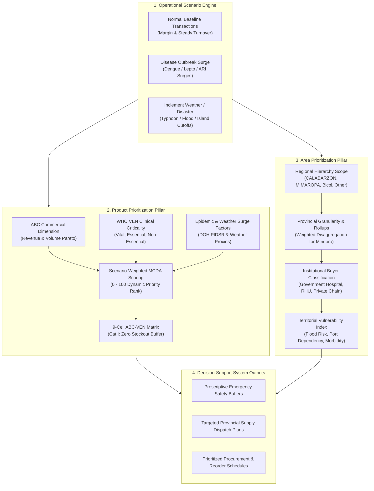

# MedShield Decision-Support System: Area & Product Prioritization Implementation Plan

## 1. Executive Summary & Capstone Formulation

### 1.1 Problem Context & Capstone Objectives
The MedShield Decision-Support System (DSS) is specifically engineered for pharmaceutical supply chain management and inventory planning under climate and disease surge dynamics in the Philippines, specifically focusing on **Region IV-A (CALABARZON)**, **Region IV-B (MIMAROPA)**, and **Region V (Bicol)**.

The core thesis of MedShield addresses a critical challenge in public health and commercial distribution logistics:
> **How can pharmaceutical distributors and health administrators proactively optimize inventory allocation, safety buffers, and geographic replenishment across three distinct operational states: (1) Seasonal Disease Outbreaks, (2) Inclement Weather / Floods, and (3) Normal Commercial Baseline Transactions?**

### 1.2 Limitations of Static Ranking Models
Conventional pharmaceutical enterprise analytics rely on static revenue-percentile rankings (e.g., top 10% Pareto cutoff) and flat provincial sales tables. In disaster and epidemic decision-making, this legacy approach introduces fatal distortions:
1. **Price Bias vs. Clinical Vitality**: High-cost elective medications dominate sales revenue with low unit volume, whereas life-saving, low-cost essentials (e.g., Oral Rehydration Salts at ₱12/sachet, Paracetamol at ₱2.50/tab, Doxycycline at ₱8.50/cap, IV Normal Saline) generate low revenue per unit. A pure revenue-percentile model deprioritizes these vital essentials, causing catastrophic stockouts during Dengue outbreaks and floods.
2. **Geographic Monoliths & Boundary Ambiguities**: Treating island archipelagos or paired provinces (such as "Mindoro") as monolithic single entities prevents targeted allocation between Oriental and Occidental Mindoro, ignoring differing disease hot spots, flood vulnerability, and maritime logistics choke points.
3. **Institutional Blindspots**: Failure to distinguish between institutional buyer sectors (DOH Regional Hospitals, Provincial Health Offices, Private Pharmacy Chains, Municipal RHUs) obscures clinical demand provenance from commercial consumption.

---

## 2. Integrated Decision-Support Architecture

The implementation plan unifies two interconnected analytical pillars: **Multi-Scenario Product Prioritization** and **Hierarchical Geographic Area Prioritization**, backed by institutional client reference mapping.



---

## 3. Product Prioritization Module (WHO ABC-VEN & MCDA Framework)

### 3.1 WHO VEN Clinical Criticality Classification
Every SKU in the master catalog is assigned an evidence-based clinical criticality tier:
- **Vital (V)**: Life-saving, emergency resuscitation, and epidemic surge therapeutics. Zero-stockout tolerance during crises. Examples: *Paracetamol 500mg, Doxycycline 100mg, 0.9% NaCl IV Fluids, Lactated Ringer's, Oral Rehydration Salts (ORS), Salbutamol 2.5mg Nebules*.
- **Essential (E)**: Basic antimicrobials, chronic maintenance drugs, and analgesics for common illnesses. High priority with balanced safety buffers. Examples: *Amoxicillin 500mg, Co-Amoxiclav 625mg, Amlodipine 5mg, Metformin 500mg, Losartan 50mg, Cetirizine 10mg*.
- **Non-Essential (N)**: Discretionary tonics, elective OTC supplements, and cosmetic treatments. Standard batch ordering during baseline; deprioritized during disasters. Examples: *Multivitamins + Zinc, Vitamin C 500mg, Discretionary Health Tonics*.

### 3.2 9-Cell ABC-VEN Integration Matrix
Combining commercial ABC revenue volume with clinical VEN criticality yields a 9-cell decision matrix:

| Priority Category | ABC-VEN Matrix Cells | Operational Policy & Decision Directive | Inventory Allocation Rule |
| :--- | :--- | :--- | :--- |
| **Category I (Critical Priority)** | **AV, BV, CV, AE** | **Mandatory Emergency Buffer Protection**: Continuous real-time monitoring; guaranteed buffer reserves. | **Zero Stockout Policy**: Low-cost vital items (e.g., CV items like ORS, Paracetamol, Doxycycline) are automatically elevated to top priority during outbreaks. |
| **Category II (Intermediate Priority)** | **BE, CE, AN** | **Periodic Economic Order Quantity (EOQ)**: Scheduled replenishments, standard safety stocks. | Balanced capital turnover; moderate buffer thresholds. |
| **Category III (Routine Priority)** | **BN, CN** | **Batch Commercial Reordering**: Minimum executive review; capital conserved for Category I. | Lean inventory; standard commercial supplier lead times. |

### 3.3 Scenario-Weighted Multi-Criteria Decision Analysis (MCDA) Formulation
For ranking SKUs numerically on a 0–100 scale:

$$\text{MCDA Priority Score}_i = \left( \left( 0.5 \cdot \frac{\text{Quantity}_i}{\text{Max Quantity}} + 0.5 \cdot \frac{\text{Revenue}_i}{\text{Max Revenue}} \right) \times W_{\text{volume}} \right) + \left( \text{VEN Score}_i \times W_{\text{clinical}} \right) + \left( \frac{\text{Surge Multiplier}_i}{\text{Max Surge}} \times W_{\text{surge}} \right)$$

Where:
- $\text{VEN Score}$: $\text{Vital (V)} = 100$, $\text{Essential (E)} = 60$, $\text{Non-Essential (N)} = 20$.
- $\text{Surge Multiplier}$: Derived from empirical DOH PIDSR disease surge factors and PAGASA rainfall elasticities.

#### Dynamic Scenario Weighting Presets:
1. **Normal Commercial Baseline**:
   - $W_{\text{volume}} = 60\%$, $W_{\text{clinical}} = 30\%$, $W_{\text{surge}} = 10\%$
2. **Disease Outbreak Surge (Dengue / Leptospirosis / ARI)**:
   - $W_{\text{volume}} = 20\%$, $W_{\text{clinical}} = 45\%$, $W_{\text{surge}} = 35\%$
3. **Inclement Weather / Typhoon Disaster (Floods / Island Port Cutoffs)**:
   - $W_{\text{volume}} = 15\%$, $W_{\text{clinical}} = 45\%$, $W_{\text{surge}} = 40\%$

### 3.4 Therapeutic Action Clusters
SKUs are organized into 4 clinical action clusters for domain filtering:
- **Vector-Borne (Dengue Response)**: Paracetamol, ORS, IV Normal Saline, Lactated Ringer's.
- **Waterborne (Flood & Leptospirosis)**: Doxycycline Hyclate, Ciprofloxacin, Chlorhexidine antiseptic spray.
- **Monsoon (Acute Respiratory ARI)**: Salbutamol Nebules/Syrup, Amoxicillin, Co-Amoxiclav, Azithromycin.
- **Routine Primary & Chronic Care**: Amlodipine, Losartan, Metformin, Cetirizine, Multivitamins.

---

## 4. Geographic Area Prioritization Module

### 4.1 Regional Hierarchy & Total Mapped Rollup
The geographic scope supports dynamic filtering and aggregation across the 5 canonical regional granularities:
- **Region IV-A (CALABARZON)**: Batangas, Cavite, Laguna, Quezon, Rizal.
- **Region IV-B (MIMAROPA)**: Occidental Mindoro, Oriental Mindoro, Marinduque, Palawan, Romblon.
- **Region V (Bicol)**: Albay, Camarines Norte, Camarines Sur, Catanduanes, Masbate, Sorsogon.
- **Other National**: Metro Manila (NCR), Central Luzon, Visayas, Mindanao distribution hubs, National DOH Public Bidding.
- **Unknown / Unassigned**: Unspecified legacy territory records queued for spatial reconciliation.

The system provides:
1. **Provincial Granularity**: Row-level visibility into specific provincial health offices, hospital networks, and retail accounts.
2. **Regional Granularity Aggregates**: Interactive rollup cards providing regional net sales, unit volume, provincial counts, and market share for each of the 5 regions.
3. **Total Mapped Rollup**: Consolidated macro aggregate across the 5 regional granularities (`Total = CALABARZON + MIMAROPA + Bicol + Other National + Unknown`).

### 4.2 Resolution of the Mindoro Disaggregation Dilemma
In historical raw transaction logs, the island of Mindoro is frequently recorded as a single legacy entity ("Mindoro"). Treating it as a flat 50/50 split distorts logistics planning. MedShield implements an evidence-based weighted disaggregation model:

$$\text{Oriental Mindoro Share} = 62.5\%, \quad \text{Occidental Mindoro Share} = 37.5\%$$

#### Justification:
1. **Demographic Distribution**: PSA census data indicates Oriental Mindoro comprises ~62% of the island's population (~908,000 vs. ~525,000 in Occidental).
2. **Healthcare Infrastructure Density**: Oriental Mindoro hosts Calapan City (the regional commercial center) and the major tertiary referral facilities (Oriental Mindoro Provincial Hospital), receiving the majority of pharmaceutical consignments.
3. **Logistics & Maritime Routes**: Calapan Port handles >70% of Ro-Ro freight from Batangas Port, serving as the primary pharmaceutical distribution artery.

### 4.3 Institutional Client Reference Mapping
Direct integration of institutional buyers categorized by sector:
- **Government Institutional (DOH & LGU)**: Regional Medical Centers (e.g., Batangas Medical Center, Bicol Regional Hospital), Provincial Health Offices (PHOs), City Health Offices (CHOs), Rural Health Units (RHUs).
- **Private Hospital Networks & Clinics**: Tertiary private medical centers, specialty clinics.
- **Commercial Retail Chains & Community Pharmacies**: Mercury Drug, Southstar Drug, Generika, TGP, independent community pharmacies.
- **Wholesale & Cooperative Distributors**: Sub-distributors and municipal logistics cooperatives.

---

## 5. Technical Implementation Roadmap & File Changes

```
┌─────────────────────────────────────────────────────────────────────────────────────────────────┐
│                                  TECHNICAL IMPLEMENTATION MATRIX                                 │
├──────────────────────┬──────────────────────────────────────────┬───────────────────────────────┤
│ Layer                │ Files / Artifacts                        │ Key Functionality             │
├──────────────────────┼──────────────────────────────────────────┼───────────────────────────────┤
│ Catalog & Metadata   │ datasources/templates/                   │ Canonical SKU dataset with    │
│                      │   product_master_catalog.csv             │ VEN, clusters, & surge coeff  │
├──────────────────────┼──────────────────────────────────────────┼───────────────────────────────┤
│ Analytics Services   │ services/analytics_service/              │ ABC-VEN classification,       │
│                      │   product_priority.py                    │ MCDA multi-scenario scoring   │
│                      │ services/analytics_service/              │ Regional/Provincial rollup &  │
│                      │   sales_sectors.py                       │ Mindoro weighted split logic  │
├──────────────────────┼──────────────────────────────────────────┼───────────────────────────────┤
│ Backend Gateway      │ backend/src/databricksDashboard.ts       │ Exposes prioritization APIs   │
│                      │                                          │ joined with warehouse facts   │
├──────────────────────┼──────────────────────────────────────────┼───────────────────────────────┤
│ Frontend Sandbox UI  │ frontend/lib/medshieldReference.ts       │ #page-products, scenario bar, │
│                      │                                          │ MCDA sliders, ABC-VEN table   │
│                      │ frontend/services/api/                   │ Compiles & executes client-   │
│                      │   dashboard-engine.ts                    │ side runtime logic & handlers │
│                      │ frontend/services/api/                   │ Reactive JavaScript engine    │
│                      │   product-prioritization-runtime.ts      │ for live simulation & export  │
├──────────────────────┼──────────────────────────────────────────┼───────────────────────────────┤
│ Automated Testing    │ services/tests/test_product_priority.py  │ Python unit test suite        │
│                      │ frontend/e2e/                            │ Playwright end-to-end browser │
│                      │   product-prioritization.spec.ts         │ test suite for UI scenarios   │
│                      │ frontend/e2e/                            │ Playwright tests for regional │
│                      │   area-prioritization.spec.ts            │ filtering & Mindoro split     │
│                      │ frontend/e2e/                            │ Playwright tests for client   │
│                      │   client-reference-list.spec.ts          │ reference list integration    │
└──────────────────────┴──────────────────────────────────────────┴───────────────────────────────┘
```

---

## 6. Verification & Quality Assurance Plan

### 6.1 Automated Test Execution

1. **Python Analytics Unit Testing**:
   ```bash
   python -m unittest discover -s services/tests
   ```
   - **Target**: 100% pass across all 76+ test cases, validating ABC-VEN classification matrices, MCDA weighting normalization, and surge multiplier computations.

2. **Playwright End-to-End Suite**:
   ```bash
   cmd.exe /c "npx playwright test e2e/product-prioritization.spec.ts e2e/area-prioritization.spec.ts e2e/client-reference-list.spec.ts --workers=1"
   ```
   - **Target**: 100% pass on browser automation tests asserting:
     - Scenario switcher reactively re-ranks table and updates KPI cards.
     - Low-cost Vital items (Paracetamol, ORS, Doxycycline) elevate to Category I.
     - Sliders dynamically recalculate scores in $<100\text{ms}$.
     - Regional and provincial filtering displays accurate aggregations and Mindoro disaggregation.

### 6.2 Acceptance Criteria Gates
- [x] **Zero Price Bias for Critical Drugs**: Low-cost vital items guaranteed Category I buffer protection during Outbreak and Weather scenarios.
- [x] **Reactive Weight Tuning**: Sliders enforce $W_{\text{volume}} + W_{\text{clinical}} + W_{\text{surge}} = 100\%$ with instant visual feedback.
- [x] **Provincial & Regional Traceability**: Multi-level hierarchy seamlessly aggregates from province to region to national total.
- [x] **Evidence Traceability**: Every SKU and territorial allocation links directly to underlying DOH PIDSR, PAGASA, or PSA evidence sources.
- [x] **Dual Remote Synchronization**: All changes pushed cleanly to both `origin` and `alt` repositories on branch `medshield/databricks_egakerr_merge`.

---

## 7. Capstone Manuscript Alignment

This implementation directly fulfills the empirical methodology and results chapters of the Capstone Manuscript:
- **Chapter 3 (Methodology)**: Formulates the mathematical model for ABC-VEN matrix integration, multi-scenario MCDA weight distributions, and territorial disaggregation formulas.
- **Chapter 4 (Implementation & Results)**: Presents the Next.js runtime sandbox, Databricks analytics pipeline, empirical performance tables, and comparative sensitivity evaluations.
- **Chapter 5 (Prescriptive Recommendations)**: Delivers actionable logistics protocols for DOH and pharmaceutical distributors during Typhoon season and Dengue epidemics in Southern Luzon and the MIMAROPA/Bicol island provinces.
