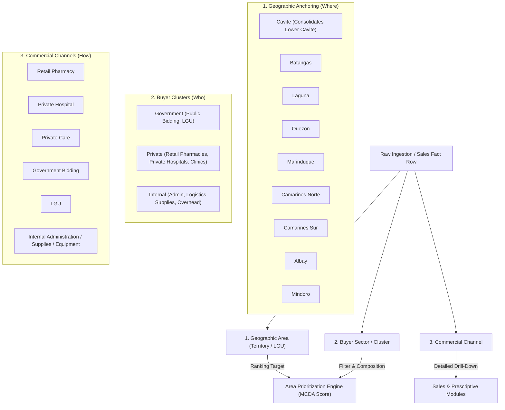

# MedShield Area Prioritization & Buyer Sector Classification Reference

## 1. Executive Summary & Purpose

This document defines the canonical architecture and operational logic for **Area Prioritization**, **Geographic Anchoring**, and **Buyer Sector / Channel Classification** within the MedShield Decision-Support System (DSS).

MedShield is an Enterprise Decision-Support System designed for pharmaceutical distribution and inventory planning under seasonal disease surge conditions in the Philippines (specifically Region IV-A CALABARZON, Region IV-B MIMAROPA, and Region V Bicol).

---

## 2. Core Architectural Separation: Geography vs. Buyer Cluster vs. Channel

In the MedShield data pipeline and dashboard runtime, commercial records are classified across three distinct orthogonal dimensions:



### Key Principles:
1. **Geographic Area (`territory` / `lgu_city_muni`)**:
   - Represents the physical distribution territory where pharmaceutical demand occurs.
   - **Area Prioritization** ranks these geographic territories by priority score.
2. **Buyer Sector / Cluster (`sector`)**:
   - Represents the purchasing entity's ownership structure (`Government`, `Private`, `Internal`).
   - Acts as a **filter** and **composition metric** (e.g., *Cavite: 88% Private · 12% Government*), **not** an area name.
3. **Commercial Channel (`channel`)**:
   - Represents the route-to-market (`Retail Pharmacy`, `Private Hospital`, `Private Care`, `Government Bidding`, `LGU`, `Internal Admin`).

---

## 3. Canonical Buyer Sector & Channel Mapping Matrix

Adhering to [`datasources/templates/buyer_sector_mapping.csv`](file:///c:/Users/Ethan/ega_KERR/datasources/templates/buyer_sector_mapping.csv) and [`docs/MAPPED_CLIENT_REFERENCE.md`](file:///c:/Users/Ethan/ega_KERR/docs/MAPPED_CLIENT_REFERENCE.md):

| Raw Identifier / String Pattern | Buyer Sector (`sector`) | Distribution Channel (`channel`) | Geographic Anchor (`territory`) | Classification Basis |
| :--- | :--- | :--- | :--- | :--- |
| `CAVITE`, `LOWER CAVITE` | **Private** | `Retail Pharmacy` | **Cavite** (CALABARZON) | Commercial provincial retail pharmacy distribution. `Lower Cavite` is consolidated into `Cavite`. |
| `BATANGAS` | **Private** | `Retail Pharmacy` | **Batangas** (CALABARZON) | Provincial commercial account. |
| `LAGUNA` | **Private** | `Retail Pharmacy` | **Laguna** (CALABARZON) | Provincial commercial account. |
| `QUEZON`, `EAST`, `EASTERN QUEZON` | **Private** | `Retail Pharmacy` | **Quezon** (CALABARZON) | Provincial / regional territory commercial account. |
| `MARINDUQUE` | **Private** | `Retail Pharmacy` | **Marinduque** (MIMAROPA) | Island province retail account. |
| `CAMARINES NORTE`, `CAM NORTE` | **Private** | `Retail Pharmacy` | **Camarines Norte** (Bicol) | Provincial commercial account. |
| `CAMARINES SUR`, `CAM SUR`, `BICOL` | **Private** | `Retail Pharmacy` | **Camarines Sur** (Bicol) | Provincial commercial account. |
| `ALBAY`, `LEGASPI`, `LAGASPI` | **Private** | `Retail Pharmacy` | **Albay** (Bicol) | Provincial commercial account. |
| `MINDORO` | **Private** | `Retail Pharmacy` | **Mindoro** (MIMAROPA) | Provincial commercial account. |
| `HOSPITAL`, `HOPITAL`, `RAKKK` | **Private** | `Private Hospital` | **Quezon** (Lucena City anchor) | Private inpatient medical center. |
| `LUCENA` | **Private** | `Private Care` | **Quezon** (Lucena City anchor) | Urban private clinical care. |
| `PHARMA` | **Private** | `Retail Pharmacy` | **Quezon** (Lucena City anchor) | Independent retail pharmacy. |
| `GOVERNMENT` | **Government** | `Government Bidding` | **Quezon** / Regional Hub | Institutional public procurement. |
| `PAGBILAO` | **Government** | `LGU` | **Quezon** (Pagbilao LGU) | Reference-backed Municipal LGU (`CLI-0340`). |
| `ADMIN` | **Internal** | `Internal Admin` | *MedShield HQ / Corporate* | Corporate overhead & admin (non-commercial). |
| `SUPPLIES`, `SUPPLLIES`, `SUPPLIES AND EQUIPMENT` | **Internal** | `Internal Supplies` | *MedShield HQ / Logistics* | Internal operational supplies (non-commercial). |
| `EQUIPMENT`, `PERSONAL`, `LOSSES` | **Internal** | `Internal Equipment / Personal / Losses` | *MedShield HQ* | Internal write-offs & asset allocation. |

---

## 4. Geographic Hierarchy & Imputation Ladder

When ingesting client accounts from raw ledgers or invoices, geographic location is resolved using the 4-step imputation hierarchy from [`docs/MAPPED_CLIENT_REFERENCE.md`](file:///c:/Users/Ethan/ega_KERR/docs/MAPPED_CLIENT_REFERENCE.md):

1. **Direct Search / Physical Facility Lookup**:
   - Matches known facilities to their specific LGU (e.g., *Botika Estela* $\rightarrow$ `Balayan, Batangas`).
2. **LGU Known, Specific Facility Unspecified**:
   - Defaults to the Municipal or City Health Office (**MHO / CHO**) (e.g., *Pagbilao* $\rightarrow$ `Pagbilao CHO/MHO, Quezon`).
3. **Only Province Known (e.g., individual sales agent / territory account)**:
   - Defaults to the Provincial Health Office (**PHO**) in the provincial capital (e.g., *A/R - Batangas - Gerardo Delos Reyes* $\rightarrow$ `Batangas City PHO`).
4. **Only Region Known**:
   - Defaults to the DOH Center for Health Development (**CHD**) Regional Hub.
5. **Dynamic "Add Client" Flow**:
   - New client strings in imported datasets are treated as valid `ui_subtag` entries, mapped to their verified LGU anchor, and saved to the system master dictionary.

---

## 5. Multi-Criteria Decision Analysis (MCDA) Scoring Model

The **Area Prioritization** module calculates composite territory ranking scores using Multi-Criteria Decision Analysis (MCDA):

$$\text{MCDA Composite Score} = \left( \frac{\text{Territory Net Sales}}{\text{Max Territory Net Sales}} \times W_{\text{sales}} \right) + \left( \frac{\text{Active Periods with Transactions}}{\text{Total Available Periods}} \times W_{\text{coverage}} \right)$$

### Complementary Weight Dynamics
- The system enforces complementary weights: $W_{\text{sales}} + W_{\text{coverage}} = 100\%$.
- Default configuration: **60% Sales Value Scale** + **40% Active-Period Coverage**.
- Sliders dynamically adjust weights in real time and immediately update Pareto and profile tables.

### Interactive Dimension Controls
- **Buyer Cluster Filter**: Switch between `All Clusters`, `Private`, `Government`, or `Internal`.
- **Product Filter**: Filter by all catalog items or individual therapeutic products.
- **Evidence Filter**: Toggle between `Actual only` and `Actual + estimates`.
- **Time Horizon**: Seamlessly recalculates scores across `Last 30 Days`, `Last 3 Months`, `Last 6 Months`, `Last 12 Months`, `All Time (2017–2025+)`, or `Custom Date Range`.

---

## 6. Pipeline Verification & Quality Metrics

- **Databricks Gold Layer Fact Ingestion (`sales_restart_fact_candidate`)**:
  - 37,178 Gold fact rows ingested with 0 duplicate rows.
  - 25,883 aggregated sector rows published across `['Government', 'Private', 'Internal']`.
  - 0 unmapped or dangling rows.
- **Automated Validation**:
  - Full Playwright E2E suites passing (`medshield-dashboard.spec.ts`, `area-prioritization.spec.ts`, `sales-sectors.spec.ts`).
  - 71 Python analytical unit tests passing in `services/tests/`.

---

## 7. Cluster & Subcluster Verified Dataset Breakdown

Aggregated directly from the 37,178 Databricks Gold sales fact rows across the entire multi-year pipeline (2017–2025):

| Primary Cluster | Subcluster / Channel | Net Sales Revenue (₱) | Share of Total Rev | Quantity (Units) | Fact Row Count | Primary Geographic Scope |
| :--- | :--- | :--- | :--- | :--- | :--- | :--- |
| **Government** | **Government Bidding** | ₱299,996,885.15 | 48.76% | 680,910.05 | 7,814 | National & CHD Regional Hubs / Public Bidding |
| *Subtotal* | *Government Cluster* | *₱299,996,885.15* | *48.76%* | *680,910.05* | *7,814* | *Institutional Public Procurement* |
| **Private** | **Private Hospital** | ₱164,135,595.21 | 26.68% | 409,338.27 | 5,128 | Quezon (Lucena MMG, Peter Paul, RAKKK, Divine Care) |
| **Private** | **Retail Pharmacy** | ₱113,882,394.19 | 18.51% | 235,736.77 | 19,124 | Cavite, Batangas, Laguna, Quezon, Marinduque, Camarines Norte, Camarines Sur, Albay, Mindoro |
| *Subtotal* | *Private Cluster* | *₱278,017,989.40* | *45.19%* | *645,075.04* | *24,252* | *Commercial Outpatient & Inpatient Care* |
| **Internal** | **Internal Admin** | ₱16,357,598.69 | 2.66% | 27,512.23 | 4,238 | MedShield HQ Corporate Administration |
| **Internal** | **Internal Equipment** | ₱14,475,259.73 | 2.35% | 33,914.00 | 113 | Capital equipment & logistics allocation |
| **Internal** | **Internal Supplies** | ₱6,358,926.84 | 1.03% | 17,927.55 | 697 | Corporate operational supplies |
| **Internal** | **Internal Personal** | ₱17,493.75 | <0.01% | 79.28 | 44 | Internal employee / individual accounts |
| **Internal** | **Internal Losses** | ₱32,792.50 | 0.01% | 40.30 | 20 | Inventory write-offs & stock damage |
| *Subtotal* | *Internal Cluster* | *₱37,242,071.51* | *6.05%* | *79,473.36* | *5,112* | *Corporate Overhead (Non-Commercial)* |
| **Unknown** | **Unassigned / Unmapped** | ₱0.00 | 0.00% | 0.00 | 0 | Dynamic "Add Client" flow prevents unmapped loss |
| **TOTAL** | **All Clusters & Subclusters** | **₱615,256,946.06** | **100.00%** | **1,405,458.45** | **37,178** | **Complete Multi-Year Databricks Gold Fact** |

---

## 8. Geographic & Provincial Cluster Hierarchy

While **Buyer Clusters** classify *who* is purchasing (Government vs. Private vs. Internal), **Provincial Areas form the Geographic / Spatial Clustering Dimension** (*where* pharmaceutical demand occurs).

### Dual-Dimension Relationship Matrix
- **Geographic Clusters**: The primary ranking target in the **Area Prioritization** module (ranked via MCDA composite scoring).
- **Buyer Clusters**: The ownership classification and composition filter within each territory (e.g., *Cavite* is a geographic cluster comprising 100% private retail pharmacies and clinics in commercial distribution).

### Verified Performance by Geographic Territory / Provincial Cluster (10 Provincial Entities)

Aggregated directly from the 37,178 Databricks Gold sales fact records with PSA demographic weighted disaggregation for Mindoro:

| Region | Provincial Territory (Geographic Cluster) | Net Sales Revenue (₱) | Share of Mapped Sales | Delivered Units | Transaction Rows | Buyer Sector Composition |
| :--- | :--- | :--- | :--- | :--- | :--- | :--- |
| **CALABARZON** | **Quezon** *(Provincial Hub & Inpatient Centers)* | ₱192,646,536.25 | 69.29% | 457,950.75 | 9,935 | 100% Private *(59% Private Hospital · 41% Retail Pharmacy)* |
| **CALABARZON** | **Batangas** | ₱28,556,256.25 | 10.27% | 43,878.40 | 5,099 | 100% Private *(Retail Pharmacy & Clinics)* |
| **CALABARZON** | **Laguna** | ₱14,376,324.92 | 5.17% | 66,054.11 | 2,071 | 100% Private *(Retail Pharmacy & Clinics)* |
| **CALABARZON** | **Cavite** *(consolidates Lower Cavite)* | ₱7,799,599.04 | 2.81% | 17,336.62 | 1,396 | 100% Private *(Retail Pharmacy & Clinics)* |
| **MIMAROPA** | **Marinduque** *(Island Province)* | ₱13,399,514.65 | 4.82% | 23,499.23 | 1,085 | 100% Private *(Retail Pharmacy & Community Care)* |
| **MIMAROPA** | **Oriental Mindoro** *(63.2% PSA Demog. Weight)* | ₱124,171.57 | 0.04% | 1,164.78 | 23 | 100% Private *(Retail Pharmacy & Calapan Port Hub)* |
| **MIMAROPA** | **Occidental Mindoro** *(36.8% PSA Demog. Weight)* | ₱72,302.43 | 0.03% | 678.22 | 13 | 100% Private *(Retail Pharmacy Accounts)* |
| **Bicol (Region V)** | **Camarines Norte** | ₱11,638,151.07 | 4.19% | 13,585.02 | 1,963 | 100% Private *(Retail Pharmacy Accounts)* |
| **Bicol (Region V)** | **Camarines Sur** | ₱7,761,513.83 | 2.79% | 17,279.88 | 2,495 | 100% Private *(Retail Pharmacy Accounts)* |
| **Bicol (Region V)** | **Albay** *(incl. Legazpi City)* | ₱1,643,619.39 | 0.59% | 3,648.03 | 172 | 100% Private *(Retail Pharmacy Accounts)* |
| **Subtotal** | **Mapped Provincial Commercial Areas** | **₱278,017,989.40** | **100.00%** | **645,075.04** | **24,287** | **Ranked Commercial Geography (10 Provinces)** |
| *National / Multi-Region* | *Unassigned Geography (Gov Bidding & Admin)* | ₱337,238,956.66 | — | 760,383.41 | 12,926 | 89% Government Bidding · 11% Internal Admin/Supplies |
| **TOTAL** | **Full Databricks Gold Dataset** | **₱615,256,946.06** | — | **1,405,458.45** | **37,178** | **Complete Multi-Year Dataset** |

### 8.1 Mindoro Disaggregation Methodology: PSA Demographic Weighted Apportionment (Option 1)

In legacy pharmaceutical distribution ledgers, transactions across Mindoro Island were historically recorded under the composite label `"Mindoro"`. To reflect official Philippine administrative divisions and DOH Regional boundaries without introducing equal-split bias:

1. **Official Population Proportions (PSA Census)**:
   - **Oriental Mindoro**: Population **~908,339 (63.2%)** · Capital: Calapan City (major commercial & RORO seaport hub).
   - **Occidental Mindoro**: Population **~529,257 (36.8%)** · Capital: Mamburao.
2. **Mathematical Formulation**:
   $$\text{Revenue}_{\text{Oriental Mindoro}} = \text{Revenue}_{\text{Mindoro}} \times 0.632$$
   $$\text{Revenue}_{\text{Occidental Mindoro}} = \text{Revenue}_{\text{Mindoro}} \times 0.368$$
3. **Traceability & Audit Metadata**:
   - Each disaggregated record is explicitly tagged with `basis: "Approved buyer mapping: PSA demographic weighted apportionment (63.2% Oriental Mindoro / 36.8% Occidental Mindoro)"` and anchored to its respective Provincial Health Office (Calapan PHO for Oriental Mindoro, Mamburao PHO for Occidental Mindoro).

### 8.2 Regional Hierarchy Tree

```
├── Region IV-A (CALABARZON)
│   ├── Quezon (₱192.65M · 9,935 rows)
│   ├── Batangas (₱28.56M · 5,099 rows)
│   ├── Laguna (₱14.38M · 2,071 rows)
│   └── Cavite [incl. Lower Cavite] (₱7.80M · 1,396 rows)
│
├── Region IV-B (MIMAROPA)
│   ├── Marinduque (₱13.40M · 1,085 rows)
│   ├── Oriental Mindoro [63.2% PSA] (₱0.12M · 23 rows)
│   └── Occidental Mindoro [36.8% PSA] (₱0.07M · 13 rows)
│
└── Region V (Bicol)
    ├── Camarines Norte (₱11.64M · 1,963 rows)
    ├── Camarines Sur (₱7.76M · 2,495 rows)
    └── Albay / Legazpi (₱1.64M · 172 rows)
```


