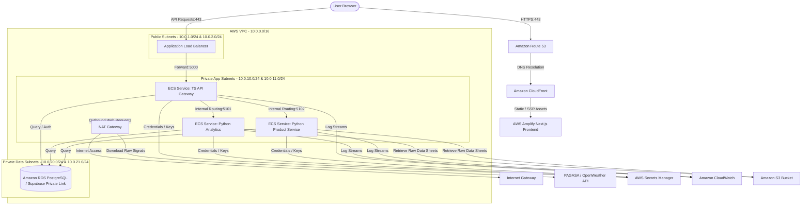

# AWS Integration Plan

This document outlines the cloud integration and deployment plan for migrating the MedShield decision-support system from a local containerized environment to Amazon Web Services (AWS). It establishes target services, network security boundaries, data integration strategies, and a step-by-step migration roadmap.

---

## 1. Executive Summary

MedShield is a multi-tier clinical and sales decision-support application built with a Next.js frontend, a TypeScript API Gateway, Python Flask analytics/product services, and a PostgreSQL database layer (Supabase). 

To support institutional deployment, production stability, and secure scaling, this plan details how to host each runtime boundary on AWS. The design prioritizes:
- **Zero-Trust Network Topology:** Restricting all backend microservices and databases to private subnets.
- **Resource Continuity:** Direct transition from existing Docker images to AWS container services without application rewrite.
- **Operational Auditing:** Integration of centralized logging, container health monitoring, and security credential management.

---

## 2. Current Architecture vs. AWS Target Architecture

The current local deployment relies on Docker Compose to run four services alongside a Supabase PostgreSQL database. The AWS Target Architecture maps these components to managed AWS services.

| Local Service | Port | AWS Target Service | Rationale |
|---|---|---|---|
| **Frontend** (`frontend/`) | `3000` | **AWS Amplify** or **ECS Fargate (Frontend Container)** | AWS Amplify handles Next.js SSR seamlessly with global CDN caching. Alternatively, ECS Fargate can host the containerized frontend behind an ALB. |
| **API Gateway** (`backend/`) | `5000` | **Amazon ECS Fargate (Private)** | Hosts the TypeScript API Gateway which manages session routing, local fallback logic, and auth orchestration. |
| **Analytics Service** (`services/analytics_service/`) | `5101` | **Amazon ECS Fargate (Private)** | Isolation of Python Flask analytics engine (Prophet, XGBoost, K-Means computations). |
| **Product Service** (`services/product_service/`) | `5102` | **Amazon ECS Fargate (Private)** | Isolation of Python product catalog and inventory optimization logic (EOQ/ROP). |
| **Database** (`supabase/`) | - | **Supabase Hosted** or **Amazon RDS PostgreSQL** | Production Supabase database for schema migrations, row-level security (RLS), and transaction tables. |
| **Local Data Store** (`data/`) | - | **Amazon S3 (Simple Storage Service)** | Persistent storage for raw Excel uploads, PAGASA weather csv files, and DOH external signal files. |

---

## 3. Detailed Cloud Topology



### 3.1. Network Security (VPC & Subnets)
- **VPC Range:** `10.0.0.0/16` split across two Availability Zones (AZs) for high availability.
- **Public Subnets:** Hosts the Application Load Balancer (ALB). Access is restricted to HTTP (80) and HTTPS (443) from the public internet.
- **Private App Subnets:** Hosts the three ECS Fargate services. Inbound traffic is only allowed from the ALB Security Group on the respective service ports (`5000`, `5101`, `5102`).
- **Private Data Subnets:** Hosts RDS database instances. Security groups only allow inbound traffic from the Private App Subnets on port `5432` (PostgreSQL).
- **Outbound Connectivity:** Containers in private subnets access the internet (for Supabase APIs, external weather/health data signals) via a NAT Gateway deployed in the public subnet.

### 3.2. Secret Management
Hardcoded variables in `.env` are replaced with IAM-integrated secret retrieval:
- **AWS Secrets Manager** stores the database connection string, `SUPABASE_SERVICE_ROLE_KEY`, `SESSION_SECRET`, and external API tokens.
- Fargate task definitions reference these secrets directly, injecting them as environment variables into the containers at runtime, preventing plaintext exposure in task definitions or Git.

---

## 4. Integration Options & Tradeoffs

```
  +-------------------------------------------------------------------------------+
  |                      AWS Deployment Architecture Tradeoffs                     |
  +-------------------------------------------------------------------------------+
  | Dimension            | Option A: Multi-Service Fargate | Option B: Hybrid App Runner  |
  +----------------------+---------------------------------+------------------------------+
  | Deployment Complexity| Medium-High (Requires VPC, ALB) | Low (Managed container host) |
  | Operational Overhead | Medium                          | Low                          |
  | Fine-grained Scaling | Yes (Each microservice scales)   | Yes (Instances auto-scale)   |
  | Network Isolation    | High (Strict Private VPC)       | Medium (Public endpoints)    |
  | Cost (Idle State)    | High (~$80-$150/mo for ALB+NAT) | Low (~$15-$30/mo)            |
  +-------------------------------------------------------------------------------+
```

### Recommended Approach: Option B (Hybrid App Runner + S3 + Hosted Supabase)
For capstone and pilot environments, **AWS App Runner** is recommended to host the Docker containers. It abstracts VPC, ALB, and certificate provisioning while maintaining container boundaries.
For enterprise/hospital deployments with strict HIPAA or local compliance requirements, **Option A (ECS Fargate inside a private VPC)** remains the standard.

---

## 5. Data Pipeline & S3 Integration

The Python microservices rely on loading historical sales transaction files and weather variables. In the cloud, local directories are replaced by an S3-backed flow:

1. **Storage Bucket:** `medshield-data-lake` with sub-folders `/raw/sales/`, `/raw/pagasa/`, and `/model-outputs/`.
2. **Read Access:** The analytics and product containers use the `boto3` SDK to fetch data files from the S3 bucket.
3. **Execution Trigger:** A night-time scheduled job (AWS EventBridge rule) triggers the ETL script via a temporary ECS Task run, which:
   - Downloads updated sales data.
   - Computes forecasts (Prophet) and safety stock levels (EOQ).
   - Writes the structured predictions back to the database.
   - Archives the raw inputs in S3 with versioning enabled.

---

## 6. CI/CD Deployment Workflow

```
[Developer Push] 
       │
       ▼
┌──────────────┐
│ GitHub Push  │ Triggers Workflow on 'main' or 'release/*'
└──────────────┘
       │
       ▼
┌──────────────┐
│  Code Lints  │ Runs TypeScript and Python unit tests
└──────────────┘
       │
       ▼
┌──────────────┐
│ Build Images │ Builds Frontend, Gateway, and Python Service images
└──────────────┘
       │
       ▼
┌──────────────┐
│ Push to ECR  │ Pushes tagged Docker images to Amazon Elastic Container Registry
└──────────────┘
       │
       ▼
┌──────────────┐
│  ECS Deploy  │ Updates Fargate services with rolling deployments (zero downtime)
└──────────────┘
```

---

## 7. Operational Readiness Checklist

Before initiating the migration, the following resources must be configured:

- [ ] **AWS IAM User/Role:** A deployment role with permissions for ECR, ECS, App Runner, S3, and Secrets Manager.
- [ ] **SSL Certificate:** Provisioned via AWS Certificate Manager (ACM) matching the custom domain (e.g., `dashboard.medshield.com`).
- [ ] **S3 Bucket Configuration:** Create the data bucket, block public access, and enable server-side encryption (SSE-S3).
- [ ] **Supabase/RDS Connection Security:** Ensure database access control lists (ACLs) permit inbound traffic from the cloud host IPs.
- [ ] **Health Check Verification:** Verify that `/api/health` and `/health` return HTTP 200 responses to satisfy ALB and App Runner container health monitors.

---

## 8. Migration Roadmap (Phased Execution)

### Phase 1: Preparation & Container Registry Setup (Weeks 1-2)
- Configure AWS Command Line Interface (CLI) locally.
- Create repositories in Amazon Elastic Container Registry (ECR) for the gateway, analytics-service, and product-service.
- Tag and push local Docker images to test ECR connectivity:
  ```powershell
  aws ecr get-login-password --region <region> | docker login --username AWS --password-stdin <aws_account_id>.dkr.ecr.<region>.amazonaws.com
  docker tag medshield-backend:latest <aws_account_id>.dkr.ecr.<region>.amazonaws.com/medshield-backend:latest
  docker push <aws_account_id>.dkr.ecr.<region>.amazonaws.com/medshield-backend:latest
  ```

### Phase 2: Database Migration & Cloud Schema Sync (Week 3)
- Provision AWS RDS PostgreSQL instance (or prepare production Supabase instance).
- Execute SQL initialization scripts (`supabase_complete_schema_and_seed.sql` followed by DSS updates).
- Verify connection latency and test table structure from a local container pointing to the cloud instance.

### Phase 3: Deployment of Backend Services & Gateway (Week 4)
- Deploy AWS App Runner or ECS Fargate tasks for the backend gateway, analytics service, and product service.
- Configure service discovery or target group mapping so the Gateway can route queries to `http://analytics-service.local:5101` and `http://product-service.local:5102`.
- Store service API keys and database links in AWS Secrets Manager.

### Phase 4: Frontend Deployment & Custom Domain Routing (Week 5)
- Deploy Next.js frontend to AWS Amplify or ECS Fargate.
- Map the environment variable `NEXT_PUBLIC_API_BASE_URL` to point to the ALB/App Runner URL of the TypeScript API Gateway.
- Associate custom domains using Route 53 and provision SSL certificates via ACM.
- Conduct End-to-End integration testing and verify fallback modes.
