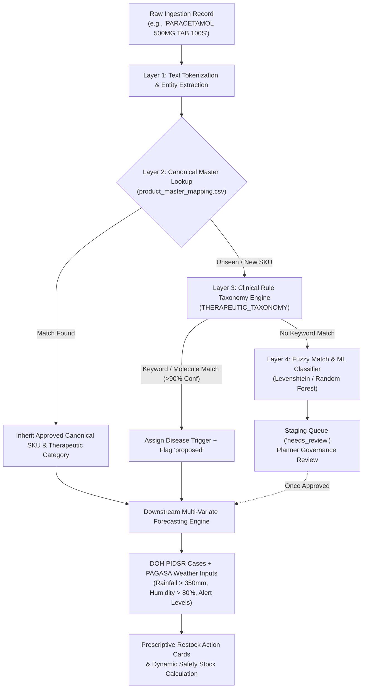

# Product Disease Classification & Therapeutic Mapping Architecture

**System:** MedShield Decision Support System (DSS)  
**Document Version:** 1.0.0  
**Status:** Canonical System Specification (Chapter 3 Methodology & Architecture)  
**Target Module:** Data Ingestion, Product Master Reconciliation, and Prescriptive Climate-Disease Engine  

---

## 1. Executive Summary

In the **MedShield Decision Support System (DSS)**, sales and inventory datasets collected from pharmaceutical distribution in Philippine epidemic hot zones (such as CALABARZON, MIMAROPA, and Bicol) require automated classification to determine which specific seasonal diseases (e.g., **Dengue**, **Leptospirosis**, **Influenza-like Illness [ILI]**, **Acute Gastroenteritis**) each incoming medicine treats.

Because raw incoming records (ERP invoices, delivery receipts, billing lines) contain unstandardized product descriptions, spelling variations, dosages, and packaging formats, MedShield executes a **4-tier hierarchical classification and entity resolution pipeline**:



---

## 2. The 4-Layer Classification Pipeline

### Layer 1: Raw String Normalization & Tokenization
When an invoice line is uploaded to `/api/sales/upload` or processed during data synchronization, the system isolates clinical entities from noise:
1. **Case & Whitespace Normalization:** Converts to standard uppercase ASCII, removing punctuation anomalies (`-`, `()`, `/`, `BP`, `USP`).
2. **Entity Isolation:**
   - **Dosage Strength:** Extracted via regex pattern `\b\d+(\.\d+)?\s*(MG|G|MCG|ML|%)\b` (e.g., `500MG`, `100MG`, `2%`).
   - **Dosage Form:** Extracted via standard formulation tokens (`TAB`, `CAP`, `SYRUP`, `SUSP`, `NEBULE`, `INJ`, `SPRAY`, `VIAL`).
   - **Pack Size:** Extracted via unit patterns `\b\d+['’]?[S]?\b` (e.g., `100'S`, `25S`, `60ML`).
   - **Active Molecule Token:** The remaining leading substring is isolated as the candidate brand or generic molecule.

---

### Layer 2: Canonical Master Lookup (`product_master_mapping.csv`)
The tokenized string is matched against the pre-approved Product Master table (`datasources/templates/product_master_mapping.csv`).

| `raw_product` | `canonical_sku` | `brand_name` | `generic_name` | `strength` | `product_category` | `is_medicine` | `forecast_eligible` | `mapping_status` |
|---|---|---|---|---|---|---|---|---|
| `PARACETAMOL 500MG TAB` | `PARACETAMOL 500MG TAB` | `GENERIC` | `PARACETAMOL` | `500MG` | `Antipyretics & Analgesics` | `true` | `true` | `approved` |
| `DOLO-JAGA 500MG/50MG/100MG` | `DOLO JAGA 500MG/50MG/100MG` | `DOLO JAGA` | `PARACETAMOL+VITAMINS` | `500MG/50MG` | `Antipyretics & Analgesics` | `true` | `true` | `approved` |
| `DENGUE NS1 AG RAPID TEST` | `DENGUE NS1 RAPID TEST KIT` | `STANDARD Q` | `DENGUE NS1 RAPID AG` | `N/A` | `Diagnostic Test Kits` | `false` | `true` | `approved` |
| `DOXYCYCLINE 100MG CAP` | `DOXYCYCLINE 100MG CAP` | `GENERIC` | `DOXYCYCLINE` | `100MG` | `Flood Prophylactics` | `true` | `true` | `approved` |

* **Deterministic Re-use:** If the exact raw string or known alias exists with status `approved`, the record immediately inherits its canonical attributes without invoking machine learning models.

---

### Layer 3: Clinical Rule-Based Taxonomy & Disease Triggers
If the product is not in the canonical master table, the backend product service (`services/product_service/app.py`) evaluates the molecule tokens against the **MedShield Clinical Therapeutic Taxonomy (`THERAPEUTIC_TAXONOMY`)**:

```python
THERAPEUTIC_TAXONOMY = {
    "Antipyretics & Analgesics (High Fever & Pain)": {
        "keywords": ["PARACETAMOL", "DOLO", "ANALGESIC", "BUPIVACAINE", "PAIN"],
        "indication": "High fever, Dengue fever, body aches, ILI symptom management",
        "disease_triggers": ["Dengue", "ILI", "COVID-19"],
        "weather_triggers": ["Heat Spikes", "Monsoon Season"]
    },
    "Flood Prophylactics & Anti-Leptospiral": {
        "keywords": ["DOXYCYCLINE", "PROPHYLAXIS", "LEPTO"],
        "indication": "Post-flood Leptospirosis exposure prophylaxis",
        "disease_triggers": ["Leptospirosis"],
        "weather_triggers": ["Typhoons", "Extreme Rainfall (>150mm)"]
    },
    "Respiratory & Antitussives (Coughs & Colds)": {
        "keywords": ["SALBUTAMOL", "CARBOCISTEINE", "CETIRIZINE", "COUGH", "COLD", "NEBULE", "ASTHMA"],
        "indication": "Coughs, colds, upper respiratory congestion, asthma flare-ups",
        "disease_triggers": ["ILI", "SARI", "COVID-19"],
        "weather_triggers": ["High Humidity", "Monsoon Rains"]
    },
    "Antibiotics & Anti-Infectives": {
        "keywords": ["AMOXICLAV", "CEFUROXIME", "CEFRADINE", "AZITHROMYCIN", "CIPROFLOXACIN", "CLOXACILLIN"],
        "indication": "Bacterial respiratory infections, hospital infection control",
        "disease_triggers": ["SARI", "Pneumonia", "Bacterial Outbreaks"],
        "weather_triggers": ["Cold Spikes", "Monsoon Rains"]
    },
    "Gastrointestinal & Rehydration": {
        "keywords": ["REHYDRATION", "ORS", "METRONIDAZOLE", "OMEPRAZOLE", "DIARRHEA", "TYPHOID"],
        "indication": "Dehydration, Acute Bloody Diarrhea (ABD), Typhoid fever",
        "disease_triggers": ["Typhoid", "ABD", "Cholera"],
        "weather_triggers": ["Urban Flooding", "Water Contamination"]
    }
}
```

#### Clinical Protocol & Contraindication Rules
- **Dengue Protocol Protection:** Philippine Department of Health (DOH) clinical management guidelines strictly forbid the administration of Non-Steroidal Anti-Inflammatory Drugs (NSAIDs such as Aspirin, Mefenamic Acid, and Ibuprofen) for Dengue patients due to platelet aggregation inhibition and hemorrhagic risk. 
- The rule engine specifically maps **Paracetamol** as the safe primary antipyretic for Dengue surge weighting, while routing NSAID analgesics to non-Dengue general pain management.

---

### Layer 4: Fuzzy String Matching & Machine Learning Fallback
For unmapped proprietary brand names or new formulations:
1. **Fuzzy String Distance (Levenshtein & Token Cosine Similarity):** Matches against the Philippine Food and Drug Administration (FDA) registered drug directory and DOH Essential Medicines List (EML).
2. **Prescriptive ML Classifier (`scripts/train_prescriptive_classifier.py`):** Utilizes a Random Forest classifier trained on seasonal dispensing frequencies, chemical sub-classes, and weather co-occurrences.
3. **Human-in-the-Loop Governance Queue:**
   - The product is marked with `mapping_status = "proposed"` or `"needs_review"`.
   - Planners must approve the mapping in the MedShield administration portal before the item's historical volumes are included in automated disease forecasting (`forecast_eligible = true`).
   - Non-medical supplies (stationery, personal protective equipment, admin fees) are classified as `is_medicine = false` and excluded from disease demand models.

---

## 3. Downstream Multi-Variate Decision Support (DSS) Integration

Once a product is classified under a disease category (e.g., **Dengue**), the system links the SKU to external epidemiological and meteorological signals:

### 1. Epidemiological Case Lagging
MedShield joins historical Department of Health (DOH) PIDSR disease case counts for the matched territory with a **1-to-2 month lag** ($\text{Cases}_{t-1}, \text{Cases}_{t-2}$), reflecting the epidemiological lead time between initial mosquito vector spikes, diagnosis, and bulk hospital inventory replenishment.

### 2. Meteorological Covariates
The analytics engine (`services/analytics_service/medshield_engine.py`) monitors environmental thresholds from PAGASA:
- **Rainfall $> 350\text{ mm}$** (Peak Habagat monsoon triggering mosquito breeding sites).
- **Relative Humidity $> 80\%$** (Vector lifespan and virus replication acceleration).

### 3. Surge Multiplier & Dynamic Safety Stock Formula
$$\text{Adjusted Safety Stock} = \text{Base Safety Stock} \times (1 + \text{Surge Multiplier})$$

Where:
$$\text{Surge Multiplier} = \min\left(1.0,\; M_{\text{rainfall}} + M_{\text{humidity}} + M_{\text{alert\_level}}\right)$$
- $M_{\text{rainfall}} = +0.15$ if Monthly Rainfall $> 350\text{mm}$
- $M_{\text{humidity}} = +0.10$ if Relative Humidity $> 80\%$
- $M_{\text{alert\_level}} = +0.20$ if DOH Epidemic Threshold $\ge \text{Level 3}$

### 4. Prescriptive Restock Action Cards
The classified items are aggregated into high-priority seasonal restock cards displayed on the Executive Dashboard:
- *"CALABARZON Dengue Surge (Q3 Monsoon): Buffer Paracetamol 500mg by +22% (18,450 Units recommended)."*
- *"Bicol Flooding Alert (Habagat): Buffer Doxycycline 100mg by +25% for post-flood Leptospirosis exposure."*

---

## 4. End-to-End Classification Scenarios

### Scenario A: Ingestion of Paracetamol 500mg
1. **Raw Input:** `"PARACETAMOL 500MG TABLET 100'S (DOH PO #2024-88)"`
2. **Tokenization:** Generic: `PARACETAMOL`, Strength: `500MG`, Form: `TABLET`, Pack: `100S`.
3. **Master Matching:** Canonical SKU resolves to `PARACETAMOL 500MG TAB`.
4. **Therapeutic Linkage:** `Antipyretics & Analgesics` $\to$ Disease: `["Dengue", "ILI"]`.
5. **DSS Outcome:** Tagged as Dengue Essential Medicine; safety stock automatically scales with monsoon rainfall and DOH Dengue alert levels.

### Scenario B: Ingestion of Doxycycline 100mg
1. **Raw Input:** `"DOXYCYCLINE HYCLATE 100MG CAP 50X10"`
2. **Tokenization:** Generic: `DOXYCYCLINE`, Strength: `100MG`, Form: `CAP`.
3. **Master Matching:** Resolves to `DOXYCYCLINE 100MG CAP`.
4. **Therapeutic Linkage:** `Flood Prophylactics & Anti-Leptospiral` $\to$ Disease: `["Leptospirosis"]`.
5. **DSS Outcome:** Restock trigger linked to typhoon warnings and precipitation $>150\text{mm}$.

### Scenario C: Ingestion of Rapid Diagnostic Test Kit
1. **Raw Input:** `"STANDARD Q DENGUE NS1 AG RAPID TEST 25'S"`
2. **Tokenization:** Keyword `DENGUE NS1`, Form: `RAPID TEST KIT`.
3. **Therapeutic Linkage:** `Diagnostic Test Kits` $\to$ Disease: `["Dengue"]`.
4. **DSS Outcome:** Flagged as `is_medicine = false`, but `forecast_eligible = true`, allowing hospital diagnostic preparedness modeling.

---

## 5. Thesis Methodology Formulation (Chapter 3 Academic Text)

> *The following text may be used directly in Capstone Chapter 3 (System Architecture & Methodology):*
>
> "To address nomenclature variability in pharmaceutical supply chain records, the MedShield Decision Support System incorporates an automated, multi-tiered therapeutic classification and entity resolution pipeline. Raw sales line items are parsed through regular-expression tokenization to extract active pharmaceutical ingredients (APIs), dosage strengths, forms, and packaging units.
>
> Extracted entities are cross-referenced against a canonical product master catalog and an expert-defined clinical taxonomy rooted in Department of Health (DOH) Philippine Integrated Disease Surveillance and Response (PIDSR) protocols. Medications are systematically mapped to seasonal disease triggers (such as Dengue, Leptospirosis, Influenza-like Illness, and Acute Gastroenteritis) while enforcing clinical contraindications (e.g., isolation of Paracetamol from NSAIDs in Dengue hemorrhagic fever protocols). Unmatched formulations undergo fuzzy string matching and machine-learning classification, requiring planner validation before inclusion in predictive multi-variate regression and dynamic safety stock optimization."

---

## 6. Relevant System File References

- **Canonical Product Master Mapping:** [`datasources/templates/product_master_mapping.csv`](file:///c:/Users/Ethan/needfixing/datasources/templates/product_master_mapping.csv)
- **Therapeutic Taxonomy & Classification Endpoint:** [`services/product_service/app.py`](file:///c:/Users/Ethan/needfixing/services/product_service/app.py)
- **Surge Multiplier & Safety Stock Engine:** [`services/analytics_service/medshield_engine.py`](file:///c:/Users/Ethan/needfixing/services/analytics_service/medshield_engine.py)
- **Prescriptive Machine Learning Pipeline:** [`scripts/train_prescriptive_classifier.py`](file:///c:/Users/Ethan/needfixing/scripts/train_prescriptive_classifier.py)
- **API Gateway Classification Router:** [`backend/src/server.ts`](file:///c:/Users/Ethan/needfixing/backend/src/server.ts)
