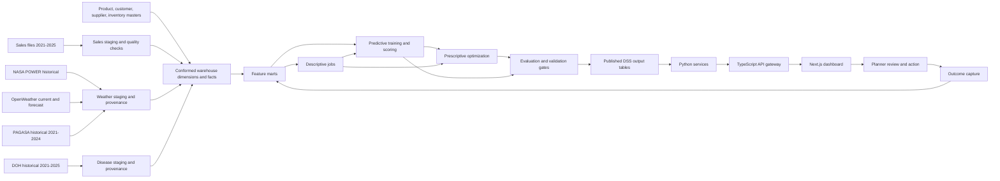
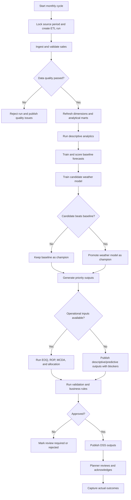

# MedShield North Star Analytics Execution Blueprint

## Document Status

| Field | Value |
|---|---|
| Status | Proposed for team review |
| Scope | Business analysis, data design, model execution, system workflow, validation, and operating model |
| Implementation status | No model or application code is implemented by this document |
| North Star reference | `references/NStar.md` |
| Capstone reference | `references/PRIVATE_SUMMER_CAPSTONE_2 - GROUP9_ISB.pdf` |
| Prepared from repository state | June 15, 2026 |

## 1. Purpose

This document defines how MedShield should execute the descriptive, predictive, and prescriptive methods in the North Star Diagram using:

- MedShield historical sales data from 2021 through 2025.
- Historical DOH disease data from 2021 through 2025.
- Historical PAGASA weather data from 2021 through 2024.
- The existing Next.js frontend, TypeScript API gateway, Python services, and Supabase warehouse.
- NASA POWER historical weather data for weather backfill and comparison.
- A planned OpenWeather integration.

The intended business outcome is not merely to display model outputs. The system must convert trusted historical data into reviewed inventory decisions:

1. What happened?
2. What is likely to happen?
3. What should MedShield do?
4. How reliable is the recommendation?

## 2. Executive Recommendation

MedShield should implement the North Star as a governed monthly decision cycle, not as a collection of models executed directly from dashboard requests.

The recommended sequence is:

1. Establish trusted sales, product, territory, customer, inventory, and supplier data.
2. Produce descriptive outputs and validate the business definitions.
3. Train a sales-only forecast as the mandatory baseline.
4. Add a weather-adjusted forecast only when it improves the baseline on held-out data.
5. Add disease- and weather-adjusted historical model variants only after the DOH and PAGASA files are loaded, mapped, and validated.
6. Generate prescriptive outputs only when the required operational inputs exist.
7. Store all model outputs, evaluation metrics, assumptions, and lineage in Supabase.
8. Publish recommendations to the dashboard only after automated checks and business review.

The system must support a recommendation lifecycle:

`generated -> validated -> reviewed -> published -> acknowledged -> measured`

## 3. Current-State Assessment

### 3.1 Confirmed Dataset Coverage

| Dataset | Confirmed period | Role | Current workspace status |
|---|---|---|---|
| MedShield sales | 2021-2025 | Historical demand, revenue, product, customer, and territory analysis | Present |
| DOH | 2021-2025 | Historical disease intensity, disease-adjusted model training, and alert backtesting | Period confirmed; files are not yet present |
| PAGASA | 2021-2024 | Historical official weather features, rainfall-risk analysis, and typhoon-rule backtesting | Period confirmed; files are not yet present |
| NASA POWER | 2021-2025 target backfill | Historical weather proxy and 2025 weather-model evaluation | API integration present |
| OpenWeather | Current and forward-looking short horizon | Operational weather context and provider alerts | Planned; not implemented |

The source periods create different evaluation windows:

- Sales-only and DOH-adjusted models can use 2021-2024 for training and 2025 for holdout evaluation, subject to complete 2025 sales and DOH coverage.
- An official PAGASA model cannot use 2025 as a holdout because PAGASA ends in 2024. It must use rolling validation within 2021-2024 or use 2021-2023 for training and 2024 for holdout evaluation.
- A NASA weather-proxy model can use 2021-2024 for training and 2025 for holdout evaluation after a complete 2021-2025 NASA backfill.
- A combined DOH plus official PAGASA model is limited to their common 2021-2024 period and cannot be evaluated on 2025 using the same official feature set.

All transformations used during evaluation must be fitted only on the training period. For example, a DII baseline used to evaluate 2025 must be calculated from 2021-2024, not from the full 2021-2025 dataset.

### 3.2 What Already Exists

The repository already provides important foundations:

| Capability | Current state |
|---|---|
| Sales ingestion | Implemented for `.xlsx` and `.csv` |
| Sales cleaning | Implemented for 13 canonical transaction columns |
| Local processed data | Implemented under `data/medshield/processed/` |
| Supabase warehouse | Dimensions, facts, ETL lineage, and DSS output tables are defined |
| Weather history | NASA POWER ingestion is implemented |
| Secondary weather source | Open-Meteo historical ingestion is implemented |
| DOH historical data | Period confirmed as 2021-2025; files are not yet loaded |
| PAGASA historical data | Period confirmed as 2021-2024; files are not yet loaded |
| OpenWeather | Not currently implemented |
| TypeScript gateway | Implemented and exposes DSS endpoint contracts |
| Python services | Implemented as read/service shells, but not as model-training pipelines |
| Dashboard model views | Implemented |
| Real trained DSS outputs | Not yet implemented |
| Demo/fallback DSS outputs | Present in `frontend/public/data/sales_data.json` |

The existing DSS tables and API endpoints are a storage and delivery foundation. Their presence does not prove that Prophet, XGBoost, EOQ, ROP, MCDA, linear programming, or collaborative filtering have been trained or executed from the 2021-2025 source data.

### 3.3 Current Sales Data Profile

The current processed artifact reports:

| Metric | Current value |
|---|---:|
| Extracted rows | 20,418 |
| Accepted rows | 16,686 |
| Rejected rows | 3,732 |
| Warning rows | 65 |
| Exact duplicates flagged | 35 |
| Unique product strings | 3,303 |
| Unique DR numbers | 5,726 |
| Source date range | January 2, 2021 to December 31, 2025 |
| Months containing accepted transactions | 55 of 60 |

Accepted rows by year:

| Year | Accepted rows |
|---|---:|
| 2021 | 3,415 |
| 2022 | 4,007 |
| 2023 | 5,387 |
| 2024 | 2,836 |
| 2025 | 1,041 |

The current processed artifact has no accepted records in:

- January 2025
- March 2025
- April 2025
- July 2025
- October 2025

This must be resolved before 2025 can be treated as a complete holdout year.

### 3.4 Forecasting Readiness

Current monthly history is extremely sparse at SKU level:

| Series grain | Total series | At least 12 months | At least 24 months | At least 36 months |
|---|---:|---:|---:|---:|
| Product | 3,303 | 189 | 40 | 3 |
| Product-area | 4,917 | 167 | 26 | 0 |

The median product appears in only one distinct month.

Therefore:

- Prophet must not be trained independently for every SKU.
- Product-area Prophet models are not currently defensible.
- Aggregate and territory forecasts can be attempted after territory cleanup.
- SKU forecasting requires eligibility rules and hierarchical fallback methods.
- Sparse and intermittent products need separate treatment.

### 3.5 Critical Data Semantics Issue

The current `area` field mixes different business concepts:

- Geographic territories: Batangas, Quezon, Marinduque, Cavite, Laguna, Camarines Norte, Camarines Sur, and Albay.
- Customer/channel types: Government, Hospital, and Pharma.
- Internal or business classifications: Admin, Supplies, Equipment, Personal, and Losses.
- Possible sub-territory: Lower Cavite.

Only 6,175 accepted rows currently map to configured geographic weather territories. The remaining 10,511 rows use non-geographic labels.

The system must separate:

- `territory`
- `customer_type`
- `business_line`
- `customer/account`

Weather, regional forecasting, MCDA, and allocation cannot safely use a field that mixes all four meanings.

### 3.6 Missing Data Required by the Paper

The current sales files do not provide all inputs required by the capstone methodology:

| Missing or incomplete input | Models affected |
|---|---|
| Customer ID and customer name | Customer concentration, institutional 80/20, customer-level collaborative filtering |
| Reliable customer type | Industry encoding, customer segmentation |
| Canonical SKU/product master | All product models |
| Therapeutic category | Disease/weather feature mapping, XGBoost, contingency rules |
| Supplier and purchase order history | EOQ, lead-time analysis, supplier performance |
| Ordering cost | EOQ |
| Holding cost | EOQ |
| Current stock/on-hand inventory | Stock gap, ROP action, allocation, dead stock |
| Supplier lead time | ROP and safety stock |
| Warehouse capacity | Linear programming |
| Procurement budget | Linear programming |
| Expiry dates and stock age | Wastage and dead-stock validation |
| DOH files not yet loaded, mapped, or quality-checked | DII, disease-adjusted Prophet, and historical outbreak-alert evaluation |
| PAGASA files not yet loaded, mapped, or quality-checked | Paper-defined RSI model and historical typhoon-rule evaluation |
| Post-2025 DOH signal | Live disease adjustment and live disease alerts |
| Post-2024 PAGASA signal | 2025 official PAGASA holdout, future official RSI, and live PAGASA typhoon alerts |
| Decision outcomes | Recommendation effectiveness and operational model evaluation |

## 4. Required Business Decisions Before Modeling

The team must approve the following definitions before training models:

1. **Demand unit**
   - Recommended: `quantity_sold`.
   - Revenue forecasts should be separate from unit-demand forecasts.

2. **Revenue field**
   - The current system treats `net_cost` as revenue.
   - The source also contains total trade price, total cost, and net income.
   - Finance must confirm which field represents invoiced sales revenue.

3. **SKU identity**
   - Product text is not a durable SKU key.
   - Product aliases, spelling variations, dosage, pack size, and formulation must map to one canonical SKU.

4. **Territory identity**
   - Territory must be geographic and must not contain Government, Hospital, Admin, or other non-geographic labels.

5. **Customer identity**
   - A DR number is a transaction document number, not automatically a customer identifier.
   - Customer concentration requires a customer master or a defensible DR-to-customer mapping.

6. **Forecast horizon**
   - Recommended operational horizon: rolling 12 months.
   - Recommended procurement horizon: lead time plus review period.

7. **Service level**
   - The business must approve target service levels by ABC class.
   - Example policy for review: A = 97%, B = 95%, C = 90%.

8. **Recommendation authority**
   - Initial releases must be decision support only.
   - The system must not automatically place orders or stop purchasing without human approval.

## 5. Target Analytics Architecture

### 5.1 Execution Boundary

Models should run in scheduled Python jobs or controlled administrative runs.

The dashboard request path should only:

1. Authenticate the user.
2. Read the latest published model run.
3. Show the recommendation, reason, confidence, data period, and status.

The dashboard must not train models synchronously.

### 5.2 Recommended Cadence

| Process | Recommended cadence |
|---|---|
| Sales ingestion and validation | On upload |
| DOH historical ingestion | One-time initial load, then corrected-file reloads |
| PAGASA historical ingestion | One-time initial load, then corrected-file reloads |
| NASA historical backfill | One-time, then controlled refresh |
| OpenWeather current/forecast ingestion | Every 3 to 6 hours during normal operation |
| Severe-weather watch refresh | Every 30 to 60 minutes during elevated risk |
| Descriptive aggregates | After every accepted sales load |
| Forecast scoring | Monthly |
| Forecast retraining | Monthly or quarterly, depending on drift |
| ABC/Pareto refresh | Monthly |
| EOQ/ROP/safety stock | Monthly and after material forecast changes |
| MCDA and allocation | Monthly or when constrained supply changes |
| Stock and OpenWeather provider alerts | Daily or event-driven |
| DOH/PAGASA historical alerts | Backtesting and scenario evaluation only |
| Model evaluation | Every run |

## 6. Canonical Data Design

### 6.1 Required Analytical Grains

| Dataset | Required grain | Main use |
|---|---|---|
| Sales transactions | Delivery line | Source of unit, value, product, date, customer, and territory demand |
| Monthly product demand | Month x SKU | Product forecasting and ABC |
| Monthly territory demand | Month x territory | Territory forecast, weather join, MCDA |
| Monthly product-territory demand | Month x SKU x territory | Allocation and product-region matching |
| Weather observations | Day/month x territory x provider | Historical PAGASA, NASA, and validation features |
| Weather forecast | Forecast issue time x target time x territory x provider | Operational weather watch |
| Disease observations | Week/month x disease x region | Historical DII, disease-model training, and alert backtesting |
| Inventory snapshot | Date x SKU x warehouse/territory | Stock gap, ROP, allocation, dead stock |
| Supplier performance | PO/receipt x SKU x supplier | Lead time and ordering cost |
| Recommendation outcome | Recommendation x actual result | Business and model evaluation |

### 6.2 Data Quality Gates

A model run must stop or downgrade its status when:

- Required months are missing from the evaluation period.
- Territory mapping coverage is below the approved threshold.
- Product master mapping is incomplete.
- Duplicate or rejected rows exceed an approved tolerance.
- Demand units are missing or negative without an approved business reason.
- External data does not cover the same territory and period as the target.
- A model requiring external regressors is presented as a point forecast even though future regressor values are unavailable.
- Model output cannot beat its required baseline.

### 6.3 Recommended Statuses

| Status | Meaning |
|---|---|
| `draft` | Output generated but not validated |
| `validated` | Automated quality and metric gates passed |
| `review_required` | Output is usable only with explicit human review |
| `published` | Approved for dashboard consumption |
| `rejected` | Failed data, method, or business validation |
| `superseded` | Replaced by a newer approved run |

## 7. Historical and Operational Weather Strategy

### 7.1 Provider Roles

The weather sources must have separate responsibilities:

| Provider | Recommended role |
|---|---|
| NASA POWER | Historical 2021-2025 weather backfill for model training |
| OpenWeather | Current weather, forecast weather, and provider alerts for operational monitoring |
| Open-Meteo | Existing secondary historical validation/fallback |
| PAGASA | Official historical weather input for 2021-2024 and historical rule evaluation |

NASA POWER provides daily historical meteorological data. OpenWeather One Call provides historical, current, forecast, and alert capabilities, subject to subscription and call limits.

### 7.2 Important Methodological Boundary

The capstone paper defines RSI as the probability of above-normal rainfall. The 2021-2024 PAGASA dataset should be used to calculate the paper-defined official historical weather feature when its fields support that definition.

The current NASA/Open-Meteo implementation calculates a separate weighted weather severity proxy from:

- Rainfall amount
- Rainy days
- Wind speed
- Temperature deviation

These are not the same variable.

The implementation must:

- Name the NASA/Open-Meteo derived feature `weather_severity_proxy`, not `PAGASA_RSI`.
- Store official PAGASA features and provider proxies in separate fields.
- Store the provider and formula version.
- Treat any uplift as an estimated planning association.
- Do not fill missing 2025 or future PAGASA values with NASA/OpenWeather values under the PAGASA name.
- Do not claim causal impact unless a defensible causal design is completed.

### 7.3 Historical Weather Workflow

1. Resolve each approved territory to a representative coordinate or set of coordinates.
2. Load PAGASA historical records for 2021-2024 and preserve their official fields and source metadata.
3. Fetch daily NASA POWER data for January 1, 2021 through December 31, 2025.
4. Retrieve precipitation, temperature, relative humidity, and wind.
5. Retain raw provider values and request/extract metadata.
6. Aggregate each provider independently to territory-month.
7. Join each weather source to sales on canonical territory and month.
8. Check missingness, geographic mapping, units, and provider coverage.
9. Compare overlapping 2021-2024 PAGASA, NASA, and Open-Meteo patterns for reasonableness.
10. Compute versioned proxy features only after raw values are stored.

For a stronger province representation, use multiple coordinates per large province and aggregate them. A single centroid is easier but introduces spatial approximation risk.

### 7.4 Weather Model Evaluation Windows

Weather models must be evaluated separately:

| Model variant | Training window | Evaluation window | Purpose |
|---|---|---|---|
| Official PAGASA historical model | 2021-2023 | 2024 | Test official historical weather value |
| Official PAGASA rolling validation | Expanding windows within 2021-2024 | Later historical folds | Increase validation evidence |
| NASA weather-proxy model | 2021-2024 | 2025 | Test a consistent proxy source through the sales holdout |
| Sales-only baseline | 2021-2024 | 2025 | Required comparison |
| Combined DOH plus official PAGASA | Common periods within 2021-2024 | Rolling historical folds | Academic historical analysis only |

The official PAGASA model must not claim 2025 holdout performance because no 2025 PAGASA data exists.

### 7.5 OpenWeather Workflow

OpenWeather is not currently wired into the repository. The planned integration should:

1. Use server-side calls only.
2. Store the API key in server-side secret storage.
3. Retrieve current, hourly/daily forecast, precipitation, humidity, wind, and alerts.
4. Preserve provider timestamps, timezone, alert sender, event, validity period, and raw payload checksum.
5. Convert provider units into the canonical warehouse units.
6. Store OpenWeather separately from NASA rather than overwriting NASA observations.
7. Use OpenWeather forecasts for short-horizon planning.
8. Use NASA historical data or climatology scenarios for periods beyond a reliable weather forecast horizon.

OpenWeather's official documentation currently recommends One Call API 4.0 for new integrations. Subscription, pagination, and request limits must be confirmed before implementation.

### 7.6 Future Weather Forecast Behavior

PAGASA 2021-2024 is historical and cannot supply actual weather inputs for a 2026 forecast.

For forecasting after the historical period:

- Publish the sales-only forecast as the primary 12-month point forecast.
- Publish low/base/high weather scenarios using historical weather distributions or climatology.
- Use OpenWeather only for the short horizon covered by its forecast product.
- Re-score near-term demand when new OpenWeather forecasts arrive.
- Label scenario outputs as scenarios, not observed future weather.

### 7.7 Typhoon and Severe-Weather Rule

The system must distinguish:

- `provider_weather_watch`: derived from OpenWeather/NASA conditions.
- `official_weather_alert`: directly received from a named official alert source.
- `pagasa_typhoon_signal_historical`: populated only from the 2021-2024 authoritative PAGASA source.
- `pagasa_typhoon_signal_live`: unavailable unless a separate current PAGASA feed is added.

The system must not infer "PAGASA Signal No. 2" solely from wind or rainfall thresholds.

For current operations without a live PAGASA feed, the dashboard may show:

- High rainfall watch
- High wind watch
- Severe weather watch
- Logistics disruption risk

It must not show a current official PAGASA signal. Historical PAGASA signals may be used to backtest whether the contingency rules would have activated appropriately.

## 8. Historical DOH Disease Strategy

The paper's Disease Intensity Indicator requires:

`DII(region, disease, period) = cases / historical average cases`

The confirmed DOH dataset covers 2021-2025. Once the files are available in the workspace:

1. Load disease, region, period, case count, incidence, and source metadata.
2. Map DOH regions to MedShield territories through an approved bridge.
3. Calculate the historical disease-region baseline.
4. Calculate DII and lagged DII.
5. Map diseases to therapeutic categories through a clinically reviewed mapping.
6. Test multiple lags without using future information.
7. Train on 2021-2024 and compare the disease-adjusted model against 2025 sales and DOH actuals.
8. Publish the disease-adjusted model only if it improves held-out performance.

For the 2025 holdout, the DII denominator and lag-selection process must use 2021-2024 only. After evaluation is complete, the selected model may be refitted on the full 2021-2025 history for scenario forecasting.

The DOH dataset is historical only. It cannot provide actual 2026 disease values.

For forecasts after 2025:

- Publish the sales-only forecast as the primary point forecast.
- Publish normal/elevated/severe disease scenarios based on historical DII distributions.
- Do not publish a disease-adjusted point forecast unless the future DII input is an explicitly approved scenario.
- Do not generate live disease alerts without a current DOH or equivalent surveillance feed.
- Use the 2021-2025 DOH records to backtest alert precision and recall.

The North Star transcription uses `DLI`; the paper uses `DII`, or Disease Intensity Indicator. `DII` should be the canonical term.

## 9. North Star Model Execution

## 9.1 Descriptive Path

### 9.1.1 2A - Product, Territory, and Customer Grouping

**Business question:** How are products, territories, and customers grouped by behavior?

**Execution design:**

1. Separate the mixed `area` field into territory, customer type, and business line.
2. Map free-text products to a canonical product master.
3. Map accounts to Government, Hospital, or Pharmaceutical using a customer master.
4. Validate that every accepted transaction maps to approved dimensions.
5. Aggregate quantity, revenue, income, frequency, and product mix by segment.

**Output:**

- Territory mapping completeness
- Customer type mapping completeness
- Product master mapping completeness
- Segment behavior profile
- Unmapped-value exception list

**Readiness:** Blocked until the mixed area field and missing customer/product masters are resolved.

### 9.1.2 3A - STL Seasonal Decomposition

**Business question:** What seasonal demand cycles exist in 2021-2025?

**Recommended first release:**

- Use monthly demand with a seasonal period of 12.
- Run at overall and eligible territory level.
- Use quantity as the primary demand target.
- Run revenue as a separate financial series.

**Why monthly first:**

- Only 55 of 60 months currently contain accepted records.
- Daily delivery data has irregular transaction days.
- SKU-level history is highly sparse.

**Execution:**

1. Build a complete monthly calendar.
2. Distinguish true zero demand from missing source data.
3. Impute only after a documented missing-data decision.
4. Decompose observed demand into trend, seasonality, and residual.
5. Store all three components.
6. Inspect residuals for data anomalies and unmodeled events.

**Evaluation:**

- Complete time index
- Stable seasonal pattern
- Residual review
- Business interpretation of peak and low-demand months

**Readiness:** Ready after missing-month and territory corrections.

### 9.1.3 4A - Revenue Contribution and 80/20 Ranking

**Business question:** Which products, territories, and account types produce the most value?

**Execution:**

1. Confirm the revenue definition with Finance.
2. Aggregate confirmed revenue by product, territory, and customer type.
3. Sort descending.
4. Calculate individual and cumulative contribution.
5. Assign descriptive contribution bands: 0-80%, 80-95%, and 95-100%.

**Output:**

- Rank
- Revenue and net income
- Contribution percentage
- Cumulative contribution percentage
- Concentration band

**Readiness:** Product ranking is possible after revenue and product identity validation. Territory and account-type ranking require dimensional cleanup.

### 9.1.4 5A - Year-over-Year Growth

**Business question:** How is demand changing across total, territory, account type, and product levels?

**Execution:**

1. Aggregate comparable annual or monthly periods.
2. Calculate quantity, revenue, net income, transaction, and active-account growth.
3. Separate growth caused by new products/accounts from like-for-like growth.
4. Flag incomplete years or months.

**Output:**

- Current value
- Prior comparable value
- Absolute change
- Percentage change
- Data completeness flag

**Readiness:** Overall growth is possible. Segmented growth requires corrected dimensions. Current 2025 completeness must be resolved.

### 9.1.5 6A - Territory Revenue and Net Income Ranking

**Execution:**

1. Use only canonical geographic territory values.
2. Calculate revenue, quantity, net income, margin, and growth.
3. Rank areas using separate commercial measures.
4. Do not rank Government or Hospital as territories.

**Readiness:** Blocked by the mixed area field.

### 9.1.6 7A - High-Value Institutional Clients

**Execution:**

1. Obtain a stable customer/account key and customer name.
2. Map customer type.
3. Aggregate revenue and transaction frequency per customer.
4. Apply cumulative concentration ranking.
5. Identify dependency risk where a small number of customers dominate revenue.

**Readiness:** Blocked. DR numbers alone are not sufficient proof of customer identity.

## 9.2 Predictive Path

### 9.2.1 2B - Monthly Demand Forecasting

**Business question:** How much of each product will MedShield need per month?

**Training and evaluation strategy:**

| Variant | Train | Evaluate | Forward use |
|---|---|---|---|
| Sales-only baseline | 2021-2024 | 2025 | Primary 2026 point forecast |
| DOH-adjusted | Sales and DOH 2021-2024 | Sales and DOH 2025 | 2026 disease scenarios only |
| Official PAGASA-adjusted | Sales and PAGASA 2021-2023 | Sales and PAGASA 2024 | Historical evidence and 2026 weather scenarios |
| NASA proxy-adjusted | Sales and NASA 2021-2024 | Sales and NASA 2025 | Scenario design and short-horizon bridge |
| DOH plus official PAGASA | Common 2021-2024 history | Rolling folds ending in 2024 | Historical comparison only |

The 2025 sales holdout should be used only after 2025 sales completeness is proven. The official PAGASA variant cannot use a 2025 holdout because PAGASA ends in 2024.

After model selection:

- Refit the selected sales-only model on the full trusted 2021-2025 sales history for the 2026 baseline.
- Refit the selected disease model on sales and DOH 2021-2025, then apply approved future DII scenarios.
- Refit the selected NASA proxy model on sales and NASA 2021-2025, then apply weather scenarios or short-horizon OpenWeather values.
- Keep the official PAGASA model limited to 2021-2024 unless a later PAGASA dataset is acquired.

**Recommended forecast hierarchy:**

| Level | Method |
|---|---|
| Company total | Prophet baseline |
| Eligible territory | Prophet baseline |
| Product category | Prophet when category history is complete |
| High-history A SKU | Product-level Prophet candidate |
| Sparse/intermittent SKU | Seasonal naive, intermittent-demand method, or hierarchical allocation |
| Product-territory | Use only when sufficient history exists; otherwise allocate from higher-level forecasts |

**Eligibility rules for direct SKU forecasting:**

- Canonical SKU mapping completed.
- At least 24 observed monthly periods for an experimental model.
- Prefer at least 36 monthly periods for a published seasonal SKU model.
- Sufficient non-zero demand observations.
- No unresolved source gaps in the evaluation period.

**Baseline requirement:**

Every model must be compared with:

- Last observed value
- Seasonal naive forecast
- Sales-only Prophet

Complexity is accepted only when it improves the approved baseline.

### 9.2.2 3B - Forecast Accuracy

**Paper metrics:**

- MAE
- RMSE
- MAPE

**Additional controls:**

- Use WAPE or sMAPE when zero demand makes MAPE unstable.
- Report metrics by overall, territory, product category, and eligible SKU.
- Use rolling-origin validation within each model's common source period.
- Use 2025 as a holdout only for variants whose complete feature set exists in 2025.
- Inspect residual trend and seasonality.
- Track forecast bias to prevent systematic overstocking or understocking.

**Promotion gate:**

A model is publishable only when:

- It passes data quality checks.
- It beats seasonal naive on the agreed primary metric.
- Any external-regressor version improves the sales-only baseline.
- Forecast intervals and failure conditions are stored.

### 9.2.3 4B - Disease-Adjusted Forecast

**Paper design:**

- Prophet plus lagged DII.
- Disease-region-period intensity.
- Therapeutic-category mapping.

**Current execution status:** The historical period is confirmed as 2021-2025, but execution remains blocked until the DOH files and product therapeutic categories are loaded and mapped.

**Historical execution:**

1. Train the lagged-DII model on 2021-2024.
2. Evaluate it against 2025 sales and DOH actuals.
3. Compare it with the sales-only 2025 holdout result.
4. Backtest disease threshold alerts across 2021-2025.

**Forward execution after 2025:** Use normal/elevated/severe DII scenarios. Do not present a 2026 disease-adjusted point forecast as observed or known future disease activity.

### 9.2.4 5B - Weather-Adjusted Forecast

**Execution:**

1. Build a sales-only Prophet baseline.
2. Load and map official PAGASA 2021-2024 records.
3. Join historical NASA 2021-2025 weather to territory-month sales.
4. Engineer provider-specific and provider-neutral features:
   - Monthly rainfall
   - Rainy days
   - Temperature
   - Humidity
   - Wind
   - Official PAGASA rainfall/RSI field where available
   - Weather severity proxy
5. Test lags because weather and demand may not move in the same month.
6. Train the official PAGASA candidate using only the 2021-2024 common period.
7. Evaluate the official PAGASA candidate using a 2024 holdout or rolling historical folds.
8. Train the NASA proxy candidate on 2021-2024.
9. Compare the NASA proxy candidate with the sales-only baseline on 2025 actuals.
10. Publish a model variant only if it improves its valid comparison baseline.

Weather normalization, lag selection, and feature selection must be fitted inside each training window. Holdout weather values must not influence the training-period thresholds.

**Future weather values:**

- Short horizon: use OpenWeather forecast values.
- Longer horizon: use historical monthly climatology and low/base/high PAGASA/NASA weather scenarios.
- Do not carry the last 2024 PAGASA value forward as if it were a 2026 observation.
- Do not use actual future weather when backtesting.

**Output:**

- Baseline forecast
- Weather-adjusted forecast
- Difference and percentage uplift
- Provider and feature version
- Confidence interval
- Evaluation against baseline
- Scenario label for periods after the historical source ends

### 9.2.5 6B - XGBoost Demand Urgency

The paper describes urgency scoring, but urgency must have a measurable target.

**Recommended target design:**

Train XGBoost to predict next-period demand or demand-surge probability. Then calculate an operational urgency score from:

- Predicted demand
- Forecast growth
- Demand variability
- ABC class
- Forecast uncertainty
- Current stock and lead time, when available

Without current stock and lead time, the output must be called `demand priority`, not `inventory urgency`.

**Candidate features:**

- Lagged quantity
- Rolling average and standard deviation
- Revenue contribution
- Margin
- Demand coefficient of variation
- Product category
- Territory
- Month and season
- Weather features
- Historical lagged DII for model training
- Scenario DII for forecasts after 2025

**Evaluation:**

- Regression target: MAE, RMSE, MAPE/WAPE
- Surge classification target: precision, recall, F1, and probability calibration

**Readiness:** Experimental after product cleanup. True inventory urgency is blocked by inventory and lead-time data.

### 9.2.6 7B - Future ABC Classification

For existing SKUs with sufficient actual sales, ABC should be assigned directly from cumulative revenue contribution. XGBoost is not needed to reproduce a deterministic rule.

XGBoost is justified only for:

- New SKUs
- Low-history SKUs
- Early provisional classification before enough revenue history exists

The classifier requires a product master and meaningful features. Current product text and sales values alone are insufficient for a defensible new-product classifier.

**Recommended output:**

- `actual_abc`: deterministic from observed revenue
- `predicted_abc`: model estimate for low-history/new products
- `classification_confidence`
- `review_required`

## 9.3 Prescriptive Path

### 9.3.1 2C - EOQ and Cost-Minimizing Reorder Quantity

**Paper formula:**

`EOQ = sqrt((2 x annual demand x ordering cost) / annual holding cost per unit)`

**Required inputs:**

- Forecast annual demand
- Ordering cost per purchase order
- Holding cost per unit per year
- Unit conversion and pack size

**Execution:**

1. Use the approved demand forecast.
2. Calculate ordering cost from procurement process records.
3. Calculate holding cost from capital, storage, insurance, shrinkage, and expiry assumptions.
4. Compute EOQ by SKU.
5. Apply supplier minimum order quantity and pack-size rounding.
6. Flag scenario-based values separately from actual cost-based values.

**Readiness:** Blocked pending procurement cost data. Illustrative assumptions may be used only if prominently labeled as scenarios.

### 9.3.2 3C - ROP and Safety Stock

**Paper formulas:**

`ROP = average daily demand x lead time + safety stock`

`Safety stock = service factor x demand standard deviation x sqrt(lead time)`

**Required inputs:**

- Daily demand or approved daily disaggregation
- Supplier lead time
- Service-level policy
- Demand variability
- Current stock for actionable alerts

**Readiness:** Blocked pending supplier lead time, service policy, and current inventory.

### 9.3.3 4C - Disease Emergency Alert

**Paper threshold:**

`cases > historical mean + 2 x historical standard deviation`

**Historical execution:** Once the DOH 2021-2025 files are loaded, calculate the threshold by disease-region pair and backtest alert precision and recall across the historical period.

**Live execution status:** Blocked because the confirmed DOH data ends in 2025. The system must not treat missing post-2025 disease data as normal disease activity or generate a live disease alert without a current surveillance source.

### 9.3.4 5C - Typhoon Emergency Stock Response

**Required design:**

1. Detect an official alert or a clearly labeled provider weather watch.
2. Identify affected geographic territories.
3. Apply a business-approved emergency product-category matrix.
4. Apply temporary minimum-stock or demand-scenario overrides.
5. Require planner acknowledgement.
6. Record the trigger, rule version, start time, expiration time, and action taken.

**Blocked inputs:**

- Live official PAGASA signal or a separately validated current alert source
- Product therapeutic/emergency category
- Current inventory
- Approved contingency multipliers

PAGASA 2021-2024 may be used to backtest the contingency logic. OpenWeather may support a current provider weather watch, but it must not be presented as an official PAGASA signal unless the alert payload identifies the authoritative source.

### 9.3.5 6C - MCDA Regional Priority

**Paper criteria:**

- Revenue rank
- Demand growth
- Outbreak risk

**Historical/scenario execution:**

- Use DOH 2021-2025 to calculate historical outbreak-risk features and evaluate historical regional rankings.
- For post-2025 planning, use an explicitly selected disease-risk scenario or omit outbreak risk.
- If outbreak risk is omitted, renormalize revenue and growth weights and label the result `commercial_priority_only`.
- If a historical-risk scenario is used, label the result `scenario_regional_priority`.

**Full execution:**

1. Normalize each criterion to a common scale.
2. Apply approved weights that sum to 1.
3. Produce the score and rank.
4. Run sensitivity analysis by varying weights.
5. Explain the contribution of each criterion.

**Readiness:** Historical full evaluation is possible after the DOH files and territory mapping are loaded. A live outbreak-risk ranking remains blocked without post-2025 surveillance data.

### 9.3.6 6C - Linear Programming Allocation

**Required inputs:**

- Available stock
- Forecast demand by product and territory
- MCDA weights
- Safety stock minimums
- Product cost
- Budget
- Warehouse or distribution capacity
- Supplier and pack constraints

**Objective:**

Maximize priority-weighted demand fulfillment while respecting supply, budget, safety stock, capacity, and non-negativity constraints.

**Output:**

- Recommended quantity by SKU and territory
- Fulfilled and unmet demand
- Binding constraints
- Objective value
- Optimization gap
- Scenario name

**Readiness:** Blocked pending inventory, budget, capacity, and policy inputs.

### 9.3.7 7C - Product-Region Matching

**Execution:**

1. Build a monthly SKU-by-territory demand matrix.
2. Remove non-geographic area labels.
3. Require minimum activity and overlap.
4. Calculate cosine similarity between territory/product demand vectors.
5. Recommend products not currently active in a territory but similar to successful products or territories.
6. Exclude regulatory, supplier, and formulary-ineligible products.

**Evaluation:**

- Hold out known product-territory activity.
- Measure coverage, precision at K, and relevance.
- Require business review before expansion.

**Readiness:** Territory-level experimentation is possible after dimension and product cleanup. Customer-level matching is blocked by customer identity data.

### 9.3.8 8C - Stop-Purchasing and Dead-Stock Flag

No-sales movement is not the same as dead stock.

A valid dead-stock rule requires:

- Current on-hand quantity
- Last sale date
- Last purchase date
- Stock age
- Expiry date
- Open purchase orders
- Strategic or emergency-stock designation

With sales data alone, the system may produce:

- `low_or_no_sales_movement_candidate`

It must not produce:

- `stop_purchasing_approved`
- `dead_stock_confirmed`

Final stop-purchase decisions require planner approval and inventory evidence.

## 10. Monthly Model Execution Workflow

### 10.1 Run Artifacts

Every run should retain:

- Source period
- Source checksums
- Row counts and quality summary
- Feature version
- Model version
- Training and evaluation periods
- Parameters
- Metrics
- Champion/challenger decision
- Business-rule version
- Output status
- Reviewer and approval time

## 11. Database Impact

### 11.1 Existing Structures to Reuse

The existing schema already defines:

- `dim_source_system`
- `dim_model`
- `fact_sales_transactions`
- `fact_weather_signal`
- `fact_disease_signal`
- `fact_forecast_run`
- `fact_demand_forecast`
- `fact_product_priority`
- `fact_regional_priority`
- `fact_inventory_recommendation`
- `fact_allocation_recommendation`
- `fact_product_region_match`
- `fact_decision_alert`
- `fact_model_evaluation`
- ETL run and source extract tables

### 11.2 Planned Data Model Gaps

The design review should consider adding or extending:

- Canonical territory dimension
- Customer/account dimension
- Customer type dimension or controlled field
- Product alias mapping
- Therapeutic category and emergency category
- Supplier dimension
- Purchase order and receipt facts
- Inventory snapshot fact
- Expiry/batch inventory fact
- Weather observation and weather forecast distinction
- Alert source and official/proxy classification
- Recommendation approval and outcome fact
- Model publication status

No migration should be created until these grains and ownership rules are approved.

## 12. Service and API Workflow

### 12.1 Python Analytics Service

Planned ownership:

- Feature preparation
- STL
- Pareto/ABC calculation
- Forecast training and scoring
- XGBoost training and scoring
- Model evaluation
- Weather and disease feature generation
- MCDA
- Alert rule evaluation

### 12.2 Python Product Service

Planned ownership:

- EOQ
- ROP
- Safety stock
- Allocation optimization
- Product-region matching
- Dead-stock candidate rules

### 12.3 TypeScript Gateway

Planned ownership:

- Authentication and authorization
- Job request validation
- Administrative run initiation
- Run-status exposure
- Published-output APIs
- Stable frontend contracts
- Failure and fallback handling

### 12.4 Dashboard

Every model output should display:

- Recommendation
- Reason
- Model and version
- Data period
- Confidence or evaluation metric
- Baseline comparison
- Provider/source
- Limitation or blocker
- Review status
- Last refreshed timestamp

Demo/fallback values must be visibly labeled and must not appear as trained production outputs.

## 13. Security and Governance

1. Keep NASA and OpenWeather calls server-side.
2. Store API keys only in environment secrets.
3. Do not log secrets or complete provider payloads containing credentials.
4. Allowlist external provider hosts.
5. Apply request timeouts, retries, rate limits, and last-known-good fallback.
6. Record provider, source URL, extraction time, coverage, checksum, and formula version.
7. Restrict raw sales, customer, supplier, inventory, and model-run data to authorized roles.
8. Require approval for published procurement recommendations.
9. Record who generated, approved, acknowledged, and closed each decision.
10. Never represent proxy weather signals as official PAGASA data.

## 14. Validation and Testing Strategy

### 14.1 Data Tests

- Required columns
- Date parsing and period completeness
- Product mapping coverage
- Territory mapping coverage
- Customer mapping coverage
- Duplicate detection
- Numeric range checks
- Quantity and value reconciliation
- Weather territory and date coverage
- No future leakage

### 14.2 Model Tests

| Model | Required validation |
|---|---|
| Rule encoding | 100% mapping completeness or approved exceptions |
| STL | Calendar completeness and residual review |
| Pareto/ABC | Reproducible rank and 80/95/100 thresholds |
| Prophet | MAE, RMSE, MAPE/WAPE, bias, baseline comparison |
| PAGASA Prophet | Must improve the sales-only baseline within 2021-2024 validation; no 2025 claim |
| NASA proxy Prophet | Must improve the sales-only baseline on the 2025 holdout |
| Disease Prophet | Must improve the sales-only baseline on the 2025 holdout |
| XGBoost demand | Holdout metrics, calibration, feature leakage checks |
| XGBoost ABC | Per-class precision, recall, and F1 |
| EOQ/ROP | Formula tests and scenario checks |
| MCDA | Weight sum, normalization, and sensitivity |
| Linear programming | Constraint feasibility and optimization gap |
| Collaborative filtering | Coverage and held-out relevance |
| Alerts | Precision, recall, false-positive review |

### 14.3 System Tests

- Model run can fail without corrupting the last published run.
- API returns only published outputs to normal users.
- DOH/PAGASA files not yet loaded produce an explicit unavailable state.
- Post-2025 DOH and post-2024 PAGASA values are never silently carried forward.
- Scenario regressors are labeled as scenarios and are not displayed as observed values.
- External API outage uses last-known-good data with a stale indicator.
- Dashboard clearly distinguishes actual, forecast, scenario, and proxy values.
- Recommendation acknowledgement is auditable.

## 15. Delivery Plan

### Phase 0 - Data Contract and Governance

Deliver:

- Revenue definition
- Demand unit definition
- Territory mapping
- Customer mapping plan
- Product master and alias rules
- 2025 completeness reconciliation
- External provider policy
- Model publication policy

Exit criteria:

- No unresolved ambiguity in analytical dimensions.
- 2025 is complete or explicitly excluded as a full holdout.

### Phase 1 - Trusted Descriptive Layer

Deliver:

- Correct territory/customer encoding
- Monthly demand marts
- STL at overall and eligible territory levels
- Pareto ranking
- Actual ABC classification
- YoY analysis
- Territory and customer concentration outputs where data permits

Exit criteria:

- Outputs reconcile to approved sales totals.
- Mapping and quality exceptions are visible.

### Phase 2 - Baseline Forecast and Weather Candidate

Deliver:

- Seasonal naive benchmark
- Sales-only Prophet
- NASA historical weather backfill
- PAGASA 2021-2024 ingestion and official historical feature mapping
- Official PAGASA historical candidate with 2024/rolling validation
- NASA proxy candidate with 2025 holdout validation
- Planned OpenWeather current/forecast integration
- Champion/challenger evaluation

Exit criteria:

- Published model beats the approved benchmark.
- Each weather model is evaluated only within periods covered by its provider.
- Weather adjustment is published only if it improves the valid comparison baseline.

### Phase 3 - Product Prioritization

Deliver:

- Demand-priority target definition
- XGBoost demand candidate
- Low-history SKU policy
- Predicted ABC only for justified cases
- Model explainability and evaluation

Exit criteria:

- No output is labeled inventory urgency without inventory context.

### Phase 4 - Prescriptive Inventory and Allocation

Prerequisites:

- Inventory snapshot
- Supplier lead time
- Ordering and holding cost
- Budget and capacity
- Service-level policy

Deliver:

- EOQ
- ROP
- Safety stock
- MCDA
- Linear programming allocation
- Product-region matching
- Low/no-movement candidate review

Exit criteria:

- Recommendations are feasible, traceable, and approved by planners.

### Phase 5 - Historical DOH Integration and External-Signal Scenarios

Deliver:

- DOH 2021-2025 ingestion and DII
- Disease-adjusted Prophet with 2025 holdout evaluation
- Historical disease threshold alert backtesting
- PAGASA 2021-2024 historical alert/RSI validation completed in Phase 2
- Normal/elevated/severe disease scenarios for post-2025 forecasts
- Low/base/high weather scenarios for post-2024 PAGASA forecasts
- Historical official-signal comparison against NASA/OpenWeather proxies

Exit criteria:

- Official and proxy values remain separately labeled and traceable.
- Historical observations and future scenarios are not mixed.
- No live DOH or PAGASA claim is made without a separate current feed.

## 16. Acceptance Criteria for the North Star Program

The North Star implementation is acceptable when:

1. Every displayed recommendation is tied to a source period and model run.
2. The system separates territory, customer type, customer, and business line.
3. Revenue and demand definitions are approved and consistent.
4. Baseline models are retained and visible.
5. External regressors are promoted only when they improve held-out performance.
6. Unloaded DOH/PAGASA files and out-of-period DOH/PAGASA values are displayed as unavailable.
7. NASA/OpenWeather signals are labeled as provider weather data or proxies.
8. Prescriptive outputs use real operational constraints or are labeled scenarios.
9. Model metrics and limitations are visible to reviewers.
10. The dashboard supports human review rather than unapproved automated procurement.
11. Actual outcomes are captured so recommendations can be evaluated.
12. Demo fallback data is never presented as trained live output.

## 17. Decisions Required From the Team

The review should resolve these questions before implementation:

1. Which source field is the official revenue measure?
2. Can MedShield provide a customer master and DR-to-customer relationship?
3. Can MedShield provide a canonical SKU and therapeutic-category master?
4. Why does the current processed data contain only 1,041 accepted 2025 rows and five missing months?
5. Which labels in `Area` are territories, customer types, departments, or business lines?
6. Can MedShield provide current stock, expiry, purchase orders, supplier lead times, ordering cost, and holding cost?
7. What service level should apply to A, B, and C products?
8. Which weather provider and OpenWeather plan will be approved?
9. Will Open-Meteo remain as a validation fallback?
10. Which recommendations require manager approval?
11. What constitutes an acceptable forecast error for aggregate, territory, and product levels?
12. Which product categories are included in disease and weather contingency rules?
13. What are the exact DOH file grain, disease definitions, and geographic levels for 2021-2025?
14. What are the exact PAGASA fields, grain, station/area coverage, and warning definitions for 2021-2024?
15. Which disease and weather scenario values should be approved for forecasts after the historical datasets end?

## 18. References

- MedShield North Star Diagram transcription: `references/NStar.md`
- MedShield Capstone Paper: `references/PRIVATE_SUMMER_CAPSTONE_2 - GROUP9_ISB.pdf`
- Current analytics guidance: `docs/ANALYTICS.md`
- Current architecture: `docs/ARCHITECTURE.md`
- Current implementation: `docs/IMPLEMENTATION.md`
- Current database design: `docs/DATABASE.md`
- NASA POWER Daily API: <https://power.larc.nasa.gov/docs/services/api/temporal/daily/>
- OpenWeather One Call API 4.0: <https://openweathermap.org/api/one-call-4>
