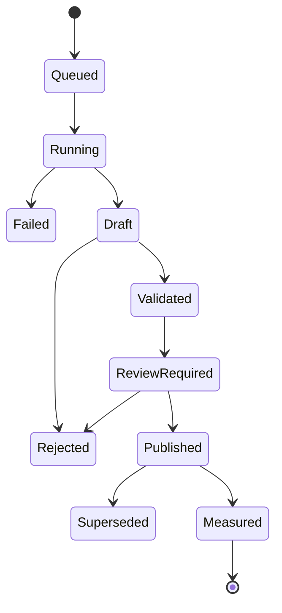

# How to Execute the MedShield North Star

## Document Purpose

This document answers one question:

**How will the MedShield team execute the models in `references/NStar.md` using the current system and the 2021-2025 datasets?**

This is an execution playbook, not implementation code. It converts the design in `docs/NORTH_STAR_EXECUTION_BLUEPRINT.md` into an ordered delivery and operating procedure.

## 1. Execution Strategy

Do not build and run every model at once.

Execute the North Star as a dependency chain:

```text
Business definitions
  -> Data correction and master data
  -> Descriptive analytics
  -> Baseline forecasting
  -> Weather-adjusted forecasting
  -> Product prioritization
  -> Inventory calculations
  -> Regional allocation
  -> Alerts and recommendations
  -> Human review
  -> Outcome measurement
```

A downstream model must not run when its required upstream data or approved output is missing.

## 2. What We Can Execute Now

| Capability | Can start now? | Condition |
|---|---|---|
| Sales cleaning and aggregation | Yes | Already supported by the system |
| Overall monthly trends | Yes | Resolve missing-month treatment |
| Product Pareto ranking | Yes | Approve the revenue field and product cleanup |
| Actual ABC classification | Yes | Use deterministic 80/95/100 bands |
| Overall STL decomposition | Yes | Create a complete monthly calendar |
| Overall baseline forecast | Yes | Reconcile incomplete 2025 data |
| Territory analysis | Not yet | Separate territories from customer/channel labels |
| Weather history backfill | Yes | Use NASA POWER by territory |
| Weather-adjusted forecast | Later in first implementation cycle | Requires territory cleanup and baseline comparison |
| OpenWeather operational monitoring | Not yet | Add provider integration and approve subscription |
| Disease-adjusted forecast | No | Requires official DOH case data |
| Disease alerts | No | Requires official DOH case data |
| EOQ | No | Requires ordering and holding costs |
| ROP and safety stock | No | Requires lead time, service level, and inventory |
| Linear programming allocation | No | Requires stock, budget, capacity, and constraints |
| Confirmed dead-stock flag | No | Requires on-hand inventory, aging, expiry, and purchase history |

## 3. Execution Owners

| Workstream | Accountable owner | Supporting roles |
|---|---|---|
| Business definitions | Business Analyst | Finance, Supply Planner, Data Analyst |
| Data profiling and features | Data Analyst | Database Engineer, Business Analyst |
| Architecture and boundaries | Architect | Backend, Database, Security |
| Warehouse and data contracts | Database Engineer | Data Analyst, Backend |
| Model development | Analytics Engineer | Data Analyst, QA |
| Optimization | Analytics/Product Engineer | Supply Planner, Data Analyst |
| APIs and scheduling | Backend Engineer | DevOps, Security |
| Dashboard presentation | BI Specialist and Frontend Engineer | Business Analyst, QA |
| Validation | QA Engineer | Data Analyst, model owner |
| Approval and operating policy | Supply Planning Manager | Business owner, Service Manager |
| Documentation | Technical Writer | All owning workers |

## 4. Step 1 - Freeze the Business Definitions

Before model development, conduct a business-definition workshop.

### Decisions to Approve

1. Demand is measured in `quantity_sold`.
2. Revenue uses one approved source field.
3. Net income uses one approved source field.
4. A canonical SKU represents one product, strength, form, and pack size.
5. Territory is a geographic delivery area.
6. Customer type is separate from territory.
7. Customer/account has a stable ID.
8. ABC policy uses:
   - A: cumulative contribution from 0% through 80%.
   - B: above 80% through 95%.
   - C: above 95% through 100%.
9. Forecast horizon is the next 12 months.
10. Model recommendations require human approval.

### Required Output

Create an approved business glossary containing:

- Metric name
- Business meaning
- Formula
- Source column
- Grain
- Owner
- Allowed null behavior
- Display label

### Exit Gate

Do not proceed until Finance and Supply Planning agree on demand, revenue, cost, margin, SKU, territory, and customer definitions.

## 5. Step 2 - Correct and Conform the 2021-2025 Data

### 5.1 Reconcile the Year Files

Use:

- `2021s.csv`
- `2022s.csv`
- `2023s.csv`
- `2024s.csv`
- `2025s.csv`
- `Sales Report.xlsx`

Perform the following:

1. Compare row counts by source and year.
2. Reconcile accepted and rejected records.
3. Investigate why the processed 2025 data has only 1,041 accepted rows.
4. Resolve the five missing 2025 months.
5. Determine whether rejected rows are invalid records or parsing defects.
6. Confirm that duplicate handling matches the business rule.
7. Rebuild the canonical processed history after corrections.

### 5.2 Create Master Mappings

Prepare controlled mapping files or master tables:

| Mapping | Example source | Required target |
|---|---|---|
| Product aliases | `SANOMAX-FA`, `SANOMAX - FA` | Canonical SKU |
| Geographic areas | `Lower Cavite` | Approved territory |
| Customer types | Government, Hospital, Pharma | Approved customer type |
| Internal labels | Admin, Supplies, Equipment | Approved business-line classification |
| Customer records | Transaction source reference | Stable customer/account ID |
| Product category | Product master | Therapeutic and emergency category |

### 5.3 Separate the Current Area Field

Each accepted transaction must produce separate values:

```text
territory
customer_type
business_line
customer_id
```

Do not pass the raw `area` field directly into weather, territory forecasting, MCDA, or allocation.

### 5.4 Build a Complete Time Calendar

Create daily and monthly calendars for January 1, 2021 through December 31, 2025.

For every missing product/territory/period combination, classify the absence as:

- True zero demand
- Missing source data
- Product not yet introduced
- Product discontinued
- Territory not served
- Unknown

Never convert unknown missing periods to zero automatically.

### Exit Gate

The data is ready when:

- 2025 completeness is understood.
- Geographic mapping is approved.
- Product mapping coverage meets the approved threshold.
- Source totals reconcile.
- Missing periods have explicit statuses.

## 6. Step 3 - Build the Analytical Datasets

Create reusable analytical datasets instead of letting each model query raw transactions differently.

### Dataset A - Monthly Company Demand

Grain:

`month`

Fields:

- Quantity
- Approved revenue
- Net income
- Transactions
- Active products
- Active customers
- Data completeness flag

Used by:

- STL
- Overall Prophet
- YoY analysis

### Dataset B - Monthly Territory Demand

Grain:

`month x territory`

Used by:

- Territory trends
- Territory Prophet
- Weather joins
- MCDA

### Dataset C - Monthly Product Demand

Grain:

`month x SKU`

Used by:

- Pareto/ABC
- Product eligibility
- Product forecasting
- XGBoost features
- EOQ demand

### Dataset D - Monthly Product-Territory Demand

Grain:

`month x SKU x territory`

Used by:

- Allocation
- Product-region matching
- Territory-specific demand planning

### Dataset E - Product Feature Snapshot

Grain:

`snapshot month x SKU`

Fields:

- Lagged demand
- Rolling demand
- Demand variability
- Revenue contribution
- Margin
- ABC class
- Product category
- Territory coverage
- Weather exposure
- Future disease features when available

Used by:

- XGBoost
- Priority scoring

### Dataset F - Inventory Planning Snapshot

Grain:

`snapshot date x SKU x warehouse/territory`

Fields:

- On-hand stock
- Available stock
- Reserved stock
- Open purchase orders
- Lead time
- Ordering cost
- Holding cost
- Expiry
- Pack size
- Minimum order quantity

Used by:

- EOQ
- ROP
- Safety stock
- Allocation
- Dead-stock review

### Exit Gate

Every dataset must have:

- One documented grain.
- One owner.
- Reconciliation totals.
- Data period.
- Quality status.
- Version or checksum.

## 7. Step 4 - Execute the Descriptive Models

Run descriptive models first because they produce the dimensions and reference outputs required by later models.

## 7.1 Rule-Based Encoding

### Procedure

1. Read accepted transactions.
2. Apply approved product, territory, customer-type, and business-line mappings.
3. Write conformed dimension keys.
4. Produce an exception list for unmapped values.
5. Stop downstream territory models when geographic mapping is missing.

### Output

- Mapping coverage
- Unmapped values
- Counts and values by segment

### Pass Condition

100% of records used by a model must have the dimensions required by that model.

## 7.2 STL Decomposition

### Procedure

1. Start with monthly company demand.
2. Reindex to all 60 months.
3. Resolve missing periods.
4. Use a seasonal period of 12.
5. Extract trend, seasonal, and residual components.
6. Repeat for eligible territories.
7. Review peaks, troughs, and residual anomalies with the business.

### Output

- Observed demand
- Trend
- Seasonal component
- Residual
- Peak-month interpretation

### Use Downstream

- Prophet configuration
- Seasonal naive benchmark
- Inventory planning calendar

## 7.3 Pareto and Actual ABC

### Procedure

1. Aggregate approved revenue by SKU.
2. Sort products from highest to lowest revenue.
3. Calculate contribution and cumulative contribution.
4. Assign A, B, and C using the approved thresholds.
5. Repeat for customers after a customer master exists.

### Important Rule

Observed ABC is calculated directly. XGBoost does not replace deterministic ABC for products with sufficient actual history.

### Output

- Product rank
- Revenue share
- Cumulative share
- Actual ABC class

## 7.4 YoY and Territory Rankings

### Procedure

1. Compare equivalent periods only.
2. Flag incomplete periods.
3. Calculate quantity, revenue, income, and transaction growth.
4. Separate territory ranking from customer-type ranking.
5. Publish both value and completeness.

### Descriptive Completion Gate

Proceed to predictive work only when:

- Model inputs reconcile to the approved sales totals.
- Seasonality is interpretable.
- Territory mapping is valid.
- Pareto and ABC outputs are reproducible.

## 8. Step 5 - Execute the Baseline Forecast

The baseline is mandatory. Weather and disease models are challengers.

## 8.1 Prepare the Split

Paper-aligned split:

- Training: January 2021 through December 2024.
- Testing: January 2025 through December 2025.
- Forecasting: next 12 months after the latest trusted actual.

If 2025 remains incomplete:

1. Do not report it as a complete holdout year.
2. Use rolling-origin validation inside the trusted history.
3. Use the available 2025 periods as a partial secondary test.
4. Document the limitation.

## 8.2 Run Benchmarks

Run these before Prophet:

1. Last-value forecast.
2. Seasonal naive forecast using the same month from the prior year.
3. Moving-average forecast where useful.

## 8.3 Run Sales-Only Prophet

Run in this order:

1. Company-level monthly quantity.
2. Eligible territory-level monthly quantity.
3. Eligible product category.
4. Only high-history SKUs.

Do not run Prophet for all 3,303 product strings.

### SKU Eligibility

Direct product Prophet requires:

- Canonical SKU.
- At least 24 observed months for experimentation.
- Preferably at least 36 months for publication.
- Sufficient non-zero demand.
- No unresolved missing-data periods.

Products that fail eligibility use:

- Seasonal naive.
- Intermittent-demand methods.
- Category forecast allocated by historical share.
- Manual review for new products.

## 8.4 Evaluate

Calculate:

- MAE
- RMSE
- MAPE
- WAPE or sMAPE
- Forecast bias

Store metrics by:

- Overall
- Territory
- Product category
- Eligible SKU

### Promotion Gate

Prophet becomes the champion only when it beats the approved simple benchmark and passes bias and data-quality checks.

## 9. Step 6 - Execute the Historical Weather Pipeline

## 9.1 NASA POWER Backfill

For each approved geographic territory:

1. Confirm representative latitude and longitude.
2. Fetch January 1, 2021 through December 31, 2025.
3. Retrieve precipitation, temperature, humidity, and wind.
4. Store raw daily observations.
5. Retain provider, request period, coordinate, fetch time, and checksum.
6. Aggregate to monthly territory weather.
7. Match weather to territory-month sales.

### Quality Checks

- Expected day count
- Missing provider days
- Extreme values
- Unit conversion
- Territory coverage
- Duplicate provider records

## 9.2 Compare With Existing Open-Meteo Data

Use Open-Meteo as a secondary check:

1. Compare monthly rainfall direction.
2. Compare temperature and wind ranges.
3. Investigate material differences.
4. Do not average providers without an approved method.

## 9.3 Build the Weather Severity Proxy

The current proxy may be retained as an experimental feature, but it must be versioned.

Store:

- Formula version
- Component values
- Final score
- Provider
- Territory
- Period

Label it:

`weather_severity_proxy`

Do not label it:

`PAGASA_RSI`

## 10. Step 7 - Execute the Weather-Adjusted Forecast

### Procedure

1. Start from the approved sales-only Prophet.
2. Join NASA monthly weather features to territory-month demand.
3. Test current-month and lagged weather features.
4. Remove features that leak future information.
5. Train a weather-adjusted candidate.
6. Evaluate on the same periods and metrics as the baseline.
7. Compare error by territory and season.

### Champion Rule

Use the weather model only if it improves the sales-only baseline.

If it does not improve:

- Keep the sales-only model.
- Continue showing weather as contextual information.
- Do not force weather into the forecast.

### Output

- Baseline forecast
- Weather-adjusted forecast
- Weather contribution
- Error difference
- Selected model
- Provider and feature version

## 11. Step 8 - Add OpenWeather

OpenWeather serves a different purpose from NASA.

### NASA Role

- Historical training and backfill.

### OpenWeather Role

- Current conditions.
- Near-term forecast.
- Severe-weather watch.
- Provider alert ingestion.

### Integration Procedure

1. Approve the OpenWeather One Call plan.
2. Configure a server-side API key.
3. Register every territory coordinate.
4. Fetch current and forecast weather.
5. Store raw provider data and normalized values.
6. Store alert source, event, start, end, and description.
7. Refresh on an approved schedule.
8. Use last-known-good data if the provider is unavailable.
9. Mark stale data clearly.

### Usage

- Use OpenWeather forecast data for short-term operational scenarios.
- Use historical climatology scenarios for months outside the reliable weather forecast horizon.
- Do not convert an OpenWeather-derived rule into an official PAGASA signal.

## 12. Step 9 - Execute XGBoost Product Prioritization

## 12.1 Define the Target First

Recommended target:

- Next-month quantity, or
- Probability of a material next-month demand surge.

Do not train an undefined "urgency score."

## 12.2 Build Features

Use only information available before the prediction date:

- Demand lags
- Rolling demand
- Demand variability
- Revenue share
- Margin
- Actual ABC
- Product category
- Month and season
- Territory coverage
- Historical weather
- Future DII only when DOH exists

## 12.3 Train and Evaluate

1. Train using 2021-2024.
2. Test on trusted 2025 periods.
3. Use time-based validation.
4. Compare against a simple ranking baseline.
5. Review feature importance and failure cases.

## 12.4 Convert Prediction to Priority

Before inventory data exists:

`demand_priority = predicted demand + growth + variability + ABC importance`

After inventory data exists:

`inventory_urgency = demand priority + stock gap + lead-time risk`

The dashboard must use the correct name.

## 12.5 Predicted ABC

Use XGBoost ABC only for low-history or new products.

For established products:

- Use actual cumulative-revenue ABC.

For low-history products:

- Predict provisional ABC.
- Display confidence.
- Require review.

## 13. Step 10 - Acquire Inventory and Procurement Inputs

Before prescriptive execution, request these files or integrations:

| Input | Minimum fields |
|---|---|
| Inventory snapshot | SKU, location, on-hand, reserved, available, snapshot date |
| Purchase orders | PO, supplier, SKU, ordered date, quantity, cost |
| Receipts | PO, SKU, received date, received quantity |
| Supplier master | Supplier, lead-time policy, minimum order, pack size |
| Expiry/batches | SKU, batch, quantity, expiry date |
| Cost policy | Ordering cost and annual holding-cost method |
| Budget | Period, available procurement budget |
| Capacity | Warehouse/location capacity |
| Service policy | Target service level by ABC class |

### Lead-Time Calculation

Calculate actual supplier lead time from:

`receipt date - purchase order date`

Use supplier/SKU distributions rather than one company-wide assumption where history supports it.

### Exit Gate

Prescriptive outputs remain scenarios until actual inventory and procurement inputs are approved.

## 14. Step 11 - Execute EOQ, ROP, and Safety Stock

## 14.1 EOQ

For every eligible SKU:

1. Read approved annual forecast demand.
2. Read ordering cost.
3. Read annual holding cost per unit.
4. Calculate EOQ.
5. Round to pack size and minimum order quantity.
6. Apply business constraints.

## 14.2 Safety Stock

1. Select service level by ABC policy.
2. Calculate demand variability.
3. Calculate or read lead-time variability.
4. Calculate safety stock.
5. Review expiry and wastage risk.

## 14.3 Reorder Point

1. Calculate expected demand during lead time.
2. Add safety stock.
3. Compare ROP with current available stock.
4. Calculate stock gap.
5. Generate a reorder candidate.

### Output

- EOQ
- Safety stock
- ROP
- Available stock
- Stock gap
- Risk
- Recommended action
- Assumptions

### Approval Gate

A planner reviews the recommendation before an order is raised.

## 15. Step 12 - Execute MCDA

## 15.1 Interim MCDA Without DOH

Use:

- Revenue score
- Demand growth score

Set outbreak risk to unavailable and renormalize the active weights.

Label the output:

`commercial_priority_only`

## 15.2 Full MCDA With DOH

Use:

- Revenue score
- Demand growth score
- Outbreak risk score

### Procedure

1. Normalize each criterion to 0-1.
2. Approve weights.
3. Confirm weights sum to 1.
4. Calculate composite score.
5. Rank territories.
6. Run weight sensitivity scenarios.
7. Explain why each territory received its rank.

### Output

- Criterion values
- Normalized values
- Weights
- Contributions
- Final score
- Rank
- Scenario name

## 16. Step 13 - Execute Linear Programming Allocation

Run only when inventory constraints exist.

### Inputs

- Available stock by SKU
- Forecast demand by SKU and territory
- MCDA priority weights
- Safety-stock minimums
- Unit costs
- Budget
- Capacity
- Pack and minimum-order constraints

### Procedure

1. Create decision variables for quantity allocated by SKU and territory.
2. Maximize priority-weighted fulfillment.
3. Apply supply constraints.
4. Apply budget constraints.
5. Apply safety-stock constraints.
6. Apply capacity and pack constraints.
7. Solve.
8. Validate feasibility.
9. Explain binding constraints.

### Output

- Recommended allocation
- Fulfilled demand
- Unmet demand
- Binding constraints
- Objective value
- Optimization gap
- Scenario comparison

### Failure Behavior

If no feasible solution exists:

- Do not publish a recommendation.
- Identify conflicting constraints.
- Return the model to planner review.

## 17. Step 14 - Execute Product-Region Matching

### Procedure

1. Build monthly product-territory vectors.
2. Remove non-geographic labels.
3. Require a minimum number of active periods.
4. Normalize demand where appropriate.
5. Calculate cosine similarity.
6. Find products successful in similar territories.
7. Exclude products already active in the target territory.
8. Apply product-category, regulatory, supplier, and capacity filters.
9. Rank expansion candidates.

### Validation

Hide known product-territory activity and test whether the method recommends it.

Measure:

- Coverage
- Precision at K
- Relevance
- Business acceptance

### Output

- Target territory
- Recommended SKU
- Similar reference territory/product
- Similarity
- Evidence
- Review status

## 18. Step 15 - Execute Alerts

## 18.1 Stock Alerts

Trigger when:

- Available stock is at or below ROP.
- Forecast stock gap is positive.
- Supply cannot satisfy safety stock.

## 18.2 Weather Watch

Until official PAGASA integration:

- Trigger provider weather watches from rainfall, wind, and alerts.
- Label the source.
- Apply only approved scenario rules.

## 18.3 Disease Alert

Do not execute until official DOH data is available.

When available:

1. Calculate historical mean and standard deviation.
2. Trigger when cases exceed mean plus two standard deviations.
3. Map disease to approved product categories.
4. Apply an approved temporary multiplier.
5. Expire the override according to policy.

## 18.4 Dead-Stock Candidate

Trigger a review candidate only when:

- On-hand inventory is positive.
- No movement exceeds the approved period.
- No open demand or strategic-stock exception exists.
- Expiry and stock age support the finding.

Never automate a stop-purchase decision from historical sales alone.

## 19. Step 16 - Publish Through the Existing System

### Model Execution

Models run in controlled Python jobs.

### Storage

Write validated outputs to the existing DSS fact tables:

- Forecasts
- Product priorities
- Regional priorities
- Inventory recommendations
- Allocation recommendations
- Product-region matches
- Alerts
- Model evaluation

### Python Services

Read the latest published output from Supabase.

### TypeScript Gateway

Expose authenticated API responses.

### Dashboard

Display:

- Recommendation
- Reason
- Model version
- Data period
- Metric
- Confidence
- Source/provider
- Status
- Limitation
- Review action

### Important Rule

Replace demo fallback output with real model output only after validation. Until then, label fallback data as demonstration data.

## 20. Step 17 - Operate the Monthly Cycle

### Day 1 - Data Close

1. Close the prior month.
2. Upload sales and inventory data.
3. Fetch external data.
4. Run quality checks.

### Day 2 - Descriptive Refresh

1. Refresh dimensions.
2. Recompute Pareto and actual ABC.
3. Recompute seasonality and growth.
4. Review exceptions.

### Day 3 - Predictive Run

1. Score benchmarks.
2. Score champion forecast.
3. Score challengers.
4. Evaluate drift and error.
5. Select the approved forecast.

### Day 4 - Prescriptive Run

1. Calculate EOQ, ROP, and safety stock.
2. Calculate MCDA.
3. Solve allocation.
4. Generate matches and alerts.

### Day 5 - Business Review

1. Supply Planner reviews recommendations.
2. Finance reviews cost-sensitive outputs.
3. Manager approves publication.
4. Dashboard publishes the approved run.

### During the Month

- Refresh operational weather.
- Monitor stock and alerts.
- Record acknowledgements.
- Record orders, stockouts, fulfillment, expiry, and overrides.

## 21. Model Run State Machine



Only `Published` outputs should appear as current recommendations.

## 22. Implementation Work Packages

## WP1 - Data Definition and Repair

Deliver:

- Approved glossary
- Corrected 2021-2025 history
- Territory/customer separation
- Product alias mapping

Completion evidence:

- Reconciliation report
- Mapping report
- 2025 completeness decision

## WP2 - Analytical Marts

Deliver:

- Company-month
- Territory-month
- Product-month
- Product-territory-month
- Product feature snapshot

Completion evidence:

- Grain tests
- Totals reconciliation
- Missing-period report

## WP3 - Descriptive Models

Deliver:

- Encodings
- STL
- Pareto
- Actual ABC
- YoY
- Territory ranking

Completion evidence:

- Reproducible outputs
- Business sign-off

## WP4 - Forecast Baseline

Deliver:

- Naive benchmarks
- Sales-only Prophet
- Eligibility policy
- Model evaluation

Completion evidence:

- Holdout/rolling metrics
- Champion selection

## WP5 - Weather

Deliver:

- NASA 2021-2025 backfill
- Provider comparison
- Weather proxy
- Weather Prophet challenger
- OpenWeather current/forecast integration

Completion evidence:

- Coverage report
- Baseline comparison
- Provider failure test

## WP6 - Product Prioritization

Deliver:

- XGBoost target
- Demand-priority model
- Provisional ABC for low-history products

Completion evidence:

- Time-based metrics
- Explainability review

## WP7 - Inventory Foundation

Deliver:

- Inventory snapshots
- Supplier and PO data
- Lead time
- Cost policy
- Service levels

Completion evidence:

- Inventory reconciliation
- Policy approval

## WP8 - Prescriptive Models

Deliver:

- EOQ
- ROP
- Safety stock
- MCDA
- Allocation
- Matching
- Alerts

Completion evidence:

- Formula tests
- Feasibility tests
- Planner approval

## WP9 - Publication and Operations

Deliver:

- Job orchestration
- Published-run APIs
- Dashboard statuses
- Approval audit
- Outcome capture

Completion evidence:

- End-to-end monthly rehearsal
- Failure/recovery test
- Operating sign-off

## 23. Recommended Build Order

Execute work packages in this order:

```text
WP1
  -> WP2
  -> WP3
  -> WP4
  -> WP5
  -> WP6
  -> WP7
  -> WP8
  -> WP9
```

WP5 provider setup and WP7 business data acquisition may begin in parallel, but their model outputs must wait for preceding data gates.

## 24. Definition of Done

Execution is complete when:

1. The 2021-2025 source history is reconciled.
2. Territory, customer, and business-line concepts are separated.
3. Descriptive outputs reconcile to the source.
4. The forecast champion beats the approved benchmark.
5. Weather improves forecasting or remains contextual only.
6. Missing DOH/PAGASA inputs are not misrepresented.
7. Prescriptive outputs use approved operational inputs.
8. Every published output has lineage and evaluation metrics.
9. The dashboard clearly labels actual, forecast, proxy, scenario, and official data.
10. Recommendations require and record human review.
11. Outcomes are captured for later evaluation.
12. The team can complete one monthly cycle end to end.

## 25. Immediate Next Actions

The first review session should produce:

1. An approved revenue definition.
2. A decision on the incomplete 2025 dataset.
3. An approved territory/customer/business-line mapping.
4. A product master cleanup plan.
5. A list of inventory and procurement files MedShield can provide.
6. An OpenWeather subscription and integration decision.
7. A decision on whether Open-Meteo remains a fallback.
8. Approved forecast and service-level thresholds.

No model implementation should begin until items 1 through 4 are resolved.

