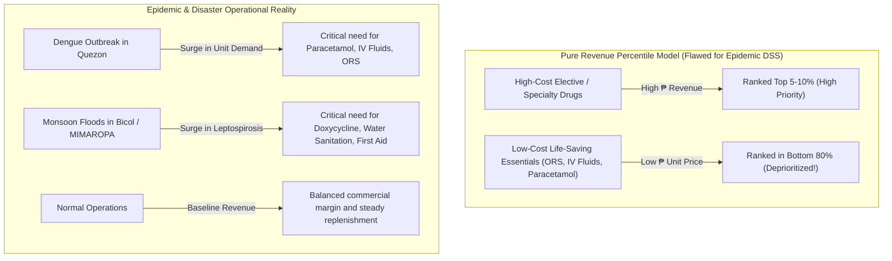
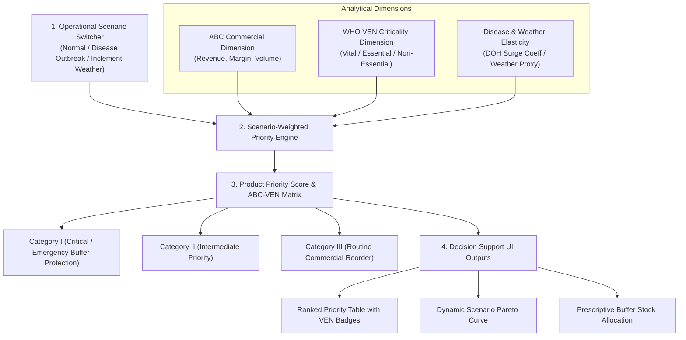

# MedShield Product Prioritization & Scenario-Driven Decision Support Plan

## 1. Executive Summary & Problem Formulation

### 1.1 Context & Capstone Scope
The MedShield Decision-Support System (DSS) is engineered for pharmaceutical distribution and inventory planning under three core operating conditions across the Philippines (specifically Region IV-A CALABARZON, Region IV-B MIMAROPA, and Region V Bicol):
1. **Normal Baseline Transactions**: Routine commercial procurement, chronic maintenance drugs, elective care, and standard hospital/pharmacy replenishment.
2. **Seasonal Disease Outbreaks**: Acute surges in infectious and vector-borne diseases (e.g., Dengue, Leptospirosis, Acute Gastroenteritis, and Pneumonia/ARI) tracked via DOH PIDSR surveillance.
3. **Inclement Weather Conditions**: Tropical cyclones/typhoons, heavy monsoon rainfall, flooding, and island maritime supply cutoffs (e.g., Marinduque and Mindoro sea routes) indexed via PAGASA/weather proxies.

### 1.2 Limitation of Pure Revenue-Percentile Ranking
In conventional retail analytics, products are often ranked purely by historical net sales revenue percentiles (e.g., top 5%, 10%, or 20% Pareto cohorts). **In disaster and epidemic decision-making, this pure revenue-percentile approach fails for three critical reasons:**

1. **Price Bias vs. Clinical Criticality**:
   - High-cost elective or chronic medications generate large peso revenues with low unit volume, dominating top revenue percentiles.
   - Low-cost, life-saving therapeutics (such as **Oral Rehydration Salts (ORS)** at ₱15/sachet, generic **Paracetamol 500mg** at ₱2/tablet, and **0.9% Normal Saline IV Fluids**) generate low revenue per unit, but experience massive volume surges during **Dengue outbreaks** or floods. A pure revenue percentile model would deprioritize them, creating severe stockout risks.
2. **Disaster Logistics vs. Routine Commerce**:
   - During a **Typhoon or Monsoon flood** in MIMAROPA or Bicol, logistics planners must prioritize **Leptospirosis prophylaxis (Doxycycline)**, **water purification**, **acute respiratory syrups**, and **wound care**, rather than routine commercial revenue earners.
3. **Scenario Agnosticism**:
   - A single static percentile does not answer the core decision question: *"What medicines must we stock and dispatch right now under a Level 3 Dengue surge in Quezon versus a Typhoon landfall in Albay versus normal monthly reordering?"*

---

## 2. Proposed Architecture: Multi-Scenario ABC-VEN & MCDA Framework

To resolve this limitation, MedShield enhances **Product Prioritization** by combining **Operations Research (ABC Inventory Analysis)**, **WHO Clinical Criticality (VEN Matrix)**, and **Multi-Criteria Decision Analysis (MCDA)** across dynamic operating scenarios.

---

## 3. Detailed Component Specifications

### 3.1 Dimension 1: Operational Scenario Modes
The Product Prioritization dashboard exposes an **Operating Scenario Switcher** (`#productScenarioSelect`):

1. **Mode A: Normal Transactions (Commercial Baseline)**:
   - Evaluates routine commercial performance, profit margin contribution, and steady inventory turnover.
   - Preserves classical ABC/Pareto 80/20 revenue concentration curves.
2. **Mode B: Disease Outbreak Surge (Epidemic Response)**:
   - Simulates epidemic conditions (Dengue, Leptospirosis, Acute Gastroenteritis, Pneumonia).
   - Automatically promotes all **Vital (V)** epidemic therapeutics to top priority regardless of unit price.
3. **Mode C: Inclement Weather / Disaster Response (Typhoon / Flood / Port Isolation)**:
   - Simulates tropical cyclone landfall, severe monsoon flooding, and maritime logistics disruptions in island provinces (Marinduque, Oriental & Occidental Mindoro).
   - Elevates waterborne disease treatments, prophylactic antibiotics, and emergency trauma/respiratory supplies.

---

### 3.2 Dimension 2: WHO VEN Clinical Criticality Classification
Every catalog SKU is assigned an evidence-backed VEN classification based on World Health Organization (WHO) and Philippine National Formulary (PNF) standards:

| VEN Class | Definition | Clinical & Operational Role | Representative MedShield Catalog Items |
| :--- | :--- | :--- | :--- |
| **V (Vital)** | Life-saving therapeutics, epidemic surge medicines, emergency rehydration, critical trauma/infectious disease countermeasures. | Mandatory buffer protection; zero tolerance for stockouts during outbreaks. | Paracetamol 500mg, Doxycycline 100mg, 0.9% NaCl IV Fluids, Lactated Ringer's, Oral Rehydration Salts (ORS), Salbutamol Nebules. |
| **E (Essential)** | Therapeutics for common illnesses, broad-spectrum antibiotics, basic analgesics, chronic disease control. | High priority; moderate safety stock buffers. | Amoxicillin 500mg, Cefalexin, Metformin, Amlodipine, Cetirizine, Co-Amoxiclav, Mefenamic Acid. |
| **N (Non-Essential)** | Discretionary items, vitamins, health supplements, elective over-the-counter (OTC) products. | Low priority during emergencies; standard reordering during normal operations. | Multivitamins + Zinc, Vitamin C, Topical Creams, Discretionary Health Supplements. |

---

### 3.3 Dimension 3: ABC-VEN Category Integration Matrix

Combining ABC (Revenue/Volume concentration) and VEN (Clinical criticality) produces a 9-cell decision matrix grouped into 3 operational priority categories:

| Category | Matrix Cells | Operational Action | Inventory Policy |
| :--- | :--- | :--- | :--- |
| **Category I (Critical Priority)** | **AV, BV, CV, AE** | Maximum executive focus, continuous stock monitoring, dedicated safety buffers. | **Zero Stockout Policy**: Low-cost vital items (e.g., CV items like ORS and Paracetamol) are guaranteed emergency reserves during outbreaks. |
| **Category II (Intermediate Priority)** | **BE, CE, AN** | Periodic review, standard EOQ replenishment, dynamic reorder points. | Balanced safety stocks; standard commercial lead times. |
| **Category III (Routine Priority)** | **BN, CN** | Minimum review, batch ordering, secondary supply allocation. | Low stockholding priority; buffer capital conserved for Category I. |

> **Key Takeaway for Panel / Defense**: In pure ABC analysis, **CV items (low revenue, low cost, high clinical criticality like Paracetamol or ORS)** are neglected in "Class C". Under the **ABC-VEN framework**, CV items are immediately elevated to **Category I Critical Priority** during epidemic and disaster conditions.

---

### 3.4 Dimension 4: Multi-Criteria Decision Analysis (MCDA) Scoring Formulation

To compute dynamic numerical ranks across all SKUs, MedShield implements a scenario-weighted MCDA priority score ($0 - 100$ scale):

$$\text{Product Priority Score} = \left( \frac{\text{Demand Volume}_i}{\text{Max Demand Volume}} \times W_{\text{volume}} \right) + \left( \text{VEN Score}_i \times W_{\text{clinical}} \right) + \left( \text{Surge Factor}_i \times W_{\text{surge}} \right)$$

Where:
- $\text{VEN Score}$: $\text{Vital} = 1.0$, $\text{Essential} = 0.6$, $\text{Non-Essential} = 0.2$.
- $\text{Surge Factor}$: Computed from historical DOH PIDSR disease surge correlation ($\beta_{\text{disease}}$) and PAGASA/weather rainfall elasticity ($\gamma_{\text{weather}}$).

#### Scenario Weighting Presets:

| Operational Scenario | Volume & Revenue Weight ($W_{\text{volume}}$) | Clinical Criticality Weight ($W_{\text{clinical}}$) | Epidemic / Weather Surge Weight ($W_{\text{surge}}$) |
| :--- | :---: | :---: | :---: |
| **Normal Commercial Baseline** | **60%** | **30%** | **10%** |
| **Disease Outbreak Surge (Dengue / Lepto)** | **20%** | **45%** | **35%** |
| **Inclement Weather / Typhoon Disaster** | **15%** | **45%** | **40%** |

---

### 3.5 Dimension 5: Therapeutic Action Clusters
SKUs are organized into 4 clinical disease/disaster action clusters to allow targeted filtering:
1. **Vector-Borne / Dengue Response Cluster**: Antipyretics (Non-NSAID Paracetamol), IV Fluids (0.9% NaCl, D5LRS), Oral Rehydration Salts, Diagnostic test supplies.
2. **Waterborne / Leptospirosis & Flood Cluster**: Doxycycline 100mg, Ciprofloxacin, Zinc supplements, Disinfectants, Antidiarrheals.
3. **Monsoon / Acute Respiratory Infection (ARI) Cluster**: Salbutamol, Amoxicillin, Azithromycin, Antitussives, Nebulizing solutions.
4. **Routine Primary & Chronic Care Cluster**: Antihypertensives (Amlodipine, Losartan), Antidiabetics (Metformin), Maintenance analgesics, Multivitamins.

---

## 4. Implementation Steps & Roadmap

### Phase 1: Analytical Modeling & Catalog Metadata Enrichment
1. **Catalog Metadata Schema**:
   - Create canonical catalog dataset mapping every SKU in `datasources/templates/product_master_catalog.csv` with `ven_class` (`V`, `E`, `N`), `therapeutic_cluster`, `dengue_surge_coeff`, `weather_surge_coeff`, and `lead_time_days`.
2. **Python Analytics Engine (`services/analytics_service/product_priority.py`)**:
   - Implement `calculate_product_priority(scenario, weights, period)` computing ABC-VEN classification, MCDA scores, and surge-adjusted demand.

### Phase 2: Backend API & Databricks Integration
1. **API Endpoints**:
   - Add `/api/products/prioritization` endpoint in `backend/src/databricksDashboard.ts` serving scenario-filtered product metrics.
2. **Gold Layer Aggregations**:
   - Ensure multi-year transaction facts join seamlessly with SKU VEN and therapeutic metadata.

### Phase 3: Interactive Dashboard UI & Runtime Sandbox
1. **UI Layout Updates in [`frontend/lib/medshieldReference.ts`](file:///c:/Users/Ethan/ega_KERR/frontend/lib/medshieldReference.ts)**:
   - **Scenario Control Bar**: Add `#productScenarioSelect` (`Normal`, `Disease Outbreak`, `Inclement Weather`) alongside period selectors.
   - **Category Summary Cards**: Real-time KPI cards for Category I (Critical SKUs count & value), Category II, and Category III.
   - **ABC-VEN Distribution Matrix Chart**: Interactive 3x3 heatmap or grouped bar chart displaying SKU counts and revenue shares across AV through CN.
   - **Product Performance & Decision Table**: Include columns for SKU Name, VEN Badge, Therapeutic Cluster, Net Sales (₱), Delivered Units, Epidemic Surge Multiplier, and MCDA Priority Score.
   - **MCDA Weight Sensitivity Controls**: Sliders for interactive simulation of volume vs. clinical vs. surge weights.
2. **Runtime Engine (`frontend/services/api/dashboard-engine.ts`)**:
   - Register global handlers `setProductScenario`, `setProductMCDAWeights`, and `filterProductCluster`.

### Phase 4: Automated Verification & Documentation
1. **Automated Test Suites**:
   - Python unit tests in `services/tests/test_product_priority.py` verifying ABC-VEN categorizations and MCDA calculations.
   - Playwright E2E tests in `frontend/e2e/product-prioritization.spec.ts` verifying scenario switches, table re-ranking, and chart reactivity.
2. **Paper & Manuscript Alignment**:
   - Update Chapter 1 (Objectives), Chapter 3 (Methodology), and Chapter 4 (Results) of the capstone report.

---

## 5. Verification & Acceptance Criteria

| Criteria | Target | Verification Method |
| :--- | :--- | :--- |
| **CV Item Elevation** | Low-cost vital items (e.g. Paracetamol, ORS) must rank in Category I during Outbreak mode. | Automated Unit & Playwright Test |
| **Scenario Switch Reactivity** | Switching scenarios updates priority scores, table order, and chart distributions in $<100\text{ms}$. | Playwright E2E Test |
| **Complementary Weights** | MCDA weights must enforce $W_{\text{volume}} + W_{\text{clinical}} + W_{\text{surge}} = 100\%$. | Model Validation Test |
| **Audit Traceability** | Every SKU displays transparent VEN classification basis and surge index lineage. | UI Inspection & CSV Export |
| **Git Synchronization** | Pushed to both `origin` and `alt` remotes on `medshield/databricks_egakerr_merge`. | Git Status Verification |
