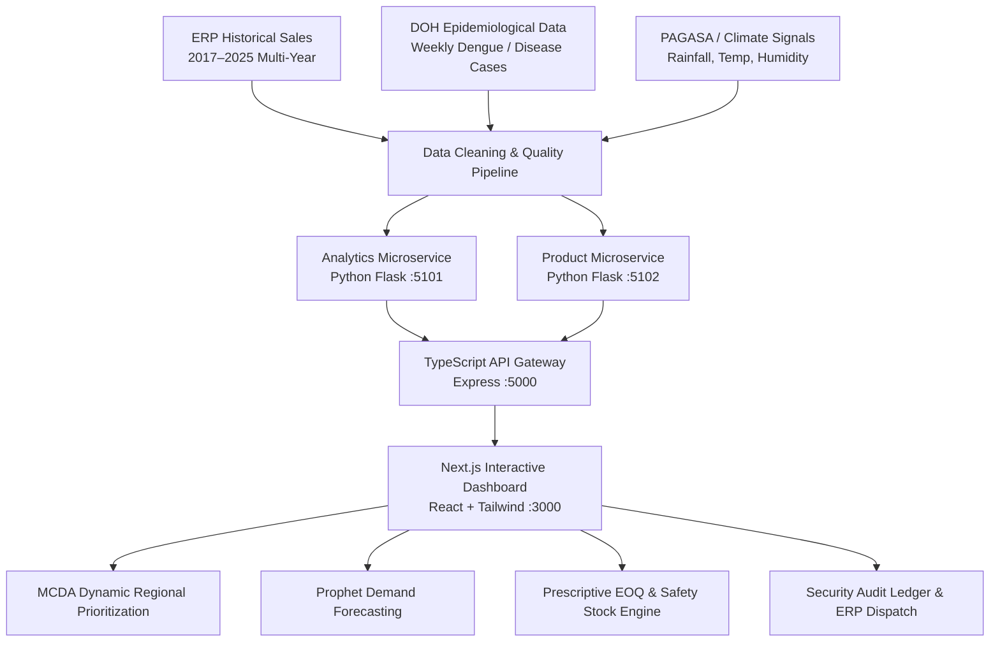

# 🛡️ MedShield: Pharmaceutical Supply Chain Decision-Support System (DSS)
## Capstone Technical & Operational Documentation

---

## 1. Executive Summary & System Overview

**MedShield** is an advanced enterprise **Decision-Support System (DSS)** designed for pharmaceutical distribution networks and regional supply chain management across the Philippines (CALABARZON, Bicol, and Metro Manila).

Unlike typical retail inventory trackers, MedShield operates as an **epidemiologically aware prescriptive planning engine**. It addresses the chronic challenge of stockouts and over-procurement during seasonal epidemics (e.g., Dengue surges, Typhoid, Waterborne Leptospirosis) by triangulating historical ERP transaction data with external public health surveillance (DOH-FOI) and climatic environmental signals (PAGASA / NASA POWER / Open-Meteo).

---

## 2. Core Mathematical & Analytical Models

### 2.1. Demand Forecasting: Facebook Prophet with Climate Regressors
Predicts monthly SKU-level and territorial demand by decomposing historical sales trends, annual seasonality, and exogenous environmental drivers:
\[
y(t) = g(t) + s(t) + h(t) + \sum_{i=1}^{k} \beta_i X_{i,t} + \varepsilon_t
\]
Where:
- \(g(t)\): Piecewise linear trend modeling baseline market growth.
- \(s(t)\): Fourier series modeling annual seasonality.
- \(h(t)\): Holiday / public health advisory effects.
- \(X_{i,t}\): Exogenous regressors including monthly rainfall anomalies, mean temperature, and lagged DOH Dengue incidence rates.
- \(\beta_i\): Regressor coefficients calibrated via Bayesian ridge optimization.

### 2.2. Prescriptive Inventory: Epidemic-Adjusted EOQ & Dynamic Safety Buffers
Calculates optimal batch procurement sizes and reorder thresholds under baseline and outbreak conditions:
\[
EOQ = \sqrt{\frac{2 \cdot D \cdot S}{H}}
\]
Where:
- \(D\): Annualized forecasted demand.
- \(S\): Ordering setup cost per purchase order batch (\(\approx ₱1,200\)).
- \(H\): Annual holding cost per unit (\(H = C_u \cdot i\), where \(C_u\) is unit cost and \(i = 15\%\) holding rate).

**Dynamic Outbreak Reorder Point (ROP):**
\[
ROP = (\bar{d} \cdot L) + SS_{epidemic}
\]
\[
SS_{epidemic} = Z \cdot \sigma_L \cdot (1 + \alpha_{surge} \cdot \theta_{season})
\]
- \(Z\): Service level factor (1.645 for 95% availability; 2.33 for critical anti-infectives at 99%).
- \(\sigma_L\): Standard deviation of lead-time demand.
- \(\alpha_{surge}\): Interactive Epidemic Surge Multiplier (\(0\%\) to \(+100\%\)).
- \(\theta_{season}\): Seasonal risk weight (Monsoon: 1.45, Pre-Monsoon: 1.25, Summer: 1.05, Amihan: 1.00).

### 2.3. Multi-Criteria Decision Analysis (MCDA): Regional Prioritization
Ranks territorial delivery urgency using an interactive Weighted Linear Combination (WLC):
\[
Vulnerability\_Score_j = W_1 \cdot Dengue\_Surge_j + W_2 \cdot Demand\_Scale_j + W_3 \cdot Lead\_Time\_Factor_j
\]
- **Live User Sliders:** Planners can adjust \(W_1\) (Disease Risk), \(W_2\) (Volume), and \(W_3\) (Logistics Friction) in real time to simulate emergency reallocation during disaster declarations.

### 2.4. Territory Clustering: K-Means Segmentation
Groups regional territories into 4 operational archetypes based on revenue volume, purchasing consistency, and stockout vulnerability:
- **Cluster A (Institutional / Government):** High volume, scheduled institutional replenishments.
- **Cluster B (Stable Commercial):** Consistent retail and distributor velocity (Batangas, Quezon).
- **Cluster C (Mid-Scale Mixed):** Variable commercial demand (Cavite, Laguna).
- **Cluster D (High Friction / Remote):** Low volume, extended lead times (Marinduque, Camarines Sur).

### 2.5. Product Classification: ABC / Pareto Analysis
Categorizes pharmaceutical inventory by cumulative annual revenue contribution:
- **Category A (Top 80% Revenue):** High-velocity antibiotics, IV fluids, antipyretics (Strict EOQ, 99% SLA).
- **Category B (Next 15% Revenue):** Secondary treatment courses (Bi-weekly monitoring).
- **Category C (Final 5% Revenue):** Low-volume specialty items (Periodic batch review).

---

## 3. System Architecture & Multi-Year Ingestion (2017–2025+)

1. **Frontend Application (Next.js 14 + Tailwind CSS + Vanilla CSS Tokens):**
   - Single-page dashboard architecture with responsive sidebar navigation.
   - Live chart rendering via Chart.js with dark/light mode token integration.
   - Comprehensive error boundaries and zero-dependency inline modal system.

2. **Backend API Gateway (Node.js Express + TypeScript :5000):**
   - Central reverse proxy orchestrating microservices, rate limiting, and session security.
   - Streaming multipart file upload pipeline with Excel (.xlsx) and CSV parsing.

3. **Analytics Microservice (Python Flask :5101):**
   - Statistical forecasting, Prophet inference, climate correlation engines, and live MCDA computation.

4. **Product Microservice (Python Flask :5102):**
   - SKU metadata, ABC segmentation, inventory buffers, and ERP order simulation.

5. **Multi-Year Data Engine:**
   - Ingestion pipelines dynamically standardize, map, and validate sales workbooks across **2017 to 2025+**.
   - Topbar `<select>` dropdowns automatically index available years and support arbitrary year-pair comparisons.

---

## 4. User Personas & Permissions

| Role | Target User | Capabilities |
|---|---|---|
| **Supply Planner (Level 2 - Write Access)** | Regional Logistics Manager, Procurement Officer | Adjust MCDA weights, simulate What-If surge scenarios, override model buffers, authorize batch purchase orders, export CSV schedules. |
| **Executive Viewer (Level 1 - Read-Only)** | VP of Operations, Medical Director, DOH Liaison | View high-level KPIs, analyze seasonal disease trends, inspect regional clusters, review audit ledger (cannot dispatch orders). |
