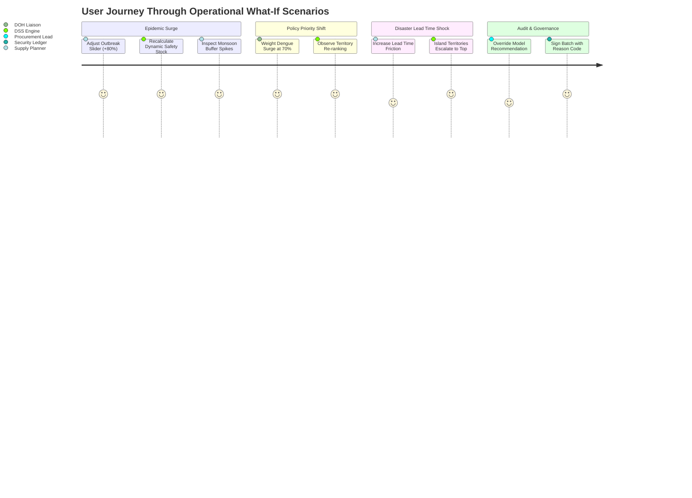

# 🧪 MedShield Quality Testing & Capstone Defense: "What-If" Scenarios Guide

This document outlines realistic operational scenarios, user action paths, expected system behaviors, and defense interview questions to thoroughly validate the MedShield Decision-Support System.

---

## 🎯 Scenario Matrix Overview

---

## 📋 Scenario 1: Sudden Monsoon Epidemic Surge (Dengue Outbreak)

### 🏥 Context:
It is August (Peak Monsoon season). The Department of Health issues an epidemic alert for CALABARZON with a projected 75% surge in acute febrile cases.

### 👤 User Persona:
**Supply Planner** (Role: Level 2 - Write Access).

### 🎬 Action Flow in MedShield:
1. Navigate to **Prescriptive Planning** tab.
2. Under the **"What-If" Epidemic Demand Surge Simulator**, drag the slider from `+45%` to `+85%`.
3. Click on the **Monsoon Season Card** (Jul–Oct).
4. Click **Recalibrate Model Safety Buffers**.
5. Click **Review EOQ Reorder** on Category A Anti-Infectives.
6. In the **Security & Audit Confirmation Modal**, review the batch summary, enter an operational note (*"Monsoon Dengue Red Alert Authorization"*), and click **Confirm & Execute Order**.

### ✅ Expected System Response & Verification:
- The **Active Buffer Multiplier** dynamically updates from `1.45x` to `1.85x`.
- Recommended batch EOQ and Reorder Point (ROP) for Paracetamol, IV Infusions, and Oral Rehydration Salts immediately scale up.
- The modal performs simulated cryptographic signing, shows a progress spinner (`Committing Batch PO...`), and logs a tamper-evident entry into the audit ledger.

---

## 📋 Scenario 2: Public Health Priority Shift (MCDA Sensitivity Testing)

### 🏥 Context:
During panel defense, an evaluator asks: *"What happens if executive leadership decides that Disease Outbreak Risk is twice as important as historical sales volume when prioritizing deliveries?"*

### 👤 User Persona:
**Executive Viewer / DOH Liaison**.

### 🎬 Action Flow in MedShield:
1. Navigate to **Area Prioritization** tab.
2. In the **Interactive MCDA Sensitivity Engine**, adjust the sliders:
   - **Dengue Outbreak Surge Weight (\(W_1\)):** Set to **70%**.
   - **Historical Demand Scale (\(W_2\)):** Set to **15%**.
   - **Lead Time Logistics Factor (\(W_3\)):** Set to **15%**.
3. Observe the **MCDA Regional Priority Ranking** table in real time.

### ✅ Expected System Response & Verification:
- Territories with severe outbreak incidence (e.g. Quezon, Camarines Sur) immediately move to Priority Rank #1 and #2, bypassing historically higher-volume commercial territories (such as Metro Manila or Cavite).
- Clicking **Reset to Calibrated Baseline (45/35/20)** restores default weights.

---

## 📋 Scenario 3: Typhoon Logistics Disruption (Island Lead Time Friction)

### 🏥 Context:
A signal #3 typhoon damages roll-on/roll-off (RORO) port infrastructure to Marinduque, doubling shipment lead times from 5 days to 14 days.

### 👤 User Persona:
**Supply Planner**.

### 🎬 Action Flow in MedShield:
1. Navigate to **Area Prioritization** tab.
2. Increase the **Lead Time Factor (\(W_3\))** to **50%** and reduce Demand Scale to **20%**.
3. Inspect the **Territory Revenue Segmentation** table (Cluster D - High Friction / Remote).

### ✅ Expected System Response & Verification:
- Island and isolated territories (Marinduque, Camarines Norte) receive higher vulnerability scores to trigger early buffer pre-positioning before maritime routes close.
- The Heuristic Tiering table cleanly displays full planning strategies without text truncation or overflow.

---

## 📋 Scenario 4: Historical Multi-Year Sales Audit (2017–2025 Data Ingestion)

### 🏥 Context:
The enterprise ingests 8 continuous years of historical invoice records (2017 through 2025) to evaluate long-term demand elasticity across pandemic and post-pandemic cycles.

### 👤 User Persona:
**Data Analyst / Supply Planner**.

### 🎬 Action Flow in MedShield:
1. Navigate to **View Sales Data** tab.
2. In the top bar filter, toggle from **Single Year** to **Y/Y Compare**.
3. Select **2025 (Base)** vs. **2020 (Compare)** to analyze pre-pandemic vs. current sales margins.
4. Go to **Data Upload**, drag-and-drop a multi-year `.xlsx` or `.csv` dataset.

### ✅ Expected System Response & Verification:
- Ingestion engine automatically normalizes columns (`DR Number`, `Invoice Date`, `Territory`, `SKU`, `Quantity`, `Unit Price`, `Gross Revenue`).
- Anomalies and negative sales are isolated into the **Quality Review** ledger (`Warning` / `Rejected`).
- The topbar year dropdown dynamically indexes all available years without layout clipping.

---

## 📋 Scenario 5: Role-Based Access Control (RBAC) Governance Check

### 🏥 Context:
A hospital viewer attempts to trigger automated supplier reorders or alter safety buffer thresholds.

### 👤 User Persona:
**Viewer** (Role: Level 1 - Read-Only).

### 🎬 Action Flow in MedShield:
1. In the sidebar footer, select **User Role -> Viewer (L1 - Read-Only)**.
2. Navigate to **Prescriptive Planning**.
3. Attempt to click **Review EOQ Reorder** or **Recalibrate Model Safety Buffers**.

### ✅ Expected System Response & Verification:
- The system prevents write dispatch and displays a notification indicating read-only clearance.
- Only users with **Supply Planner (L2 - Write Access)** can commit purchase orders to the ledger.

---

## 🎓 Panel Defense Quick Reference: Common Questions & Answers

| Evaluator Question | Recommended Defense Response |
|---|---|
| *"Why not just use standard min-max inventory rules?"* | Standard min-max assumes static demand and fixed lead times. MedShield adapts buffers dynamically based on climate seasons (Monsoon vs Amihan) and disease outbreak signals, preventing stockouts before epidemics peak. |
| *"How do you prevent over-ordering when dengue cases drop?"* | The Prophet forecasting model applies decaying trend regressors, and the EOQ holding cost factor (\(H = 15\%\)) penalizes excessive inventory buildup as disease indicators return to baseline. |
| *"How is data security handled?"* | MedShield implements JWT session validation, role-based access control (RBAC), and an append-only audit ledger recording the timestamp, user ID, and reason code for every order override. |
