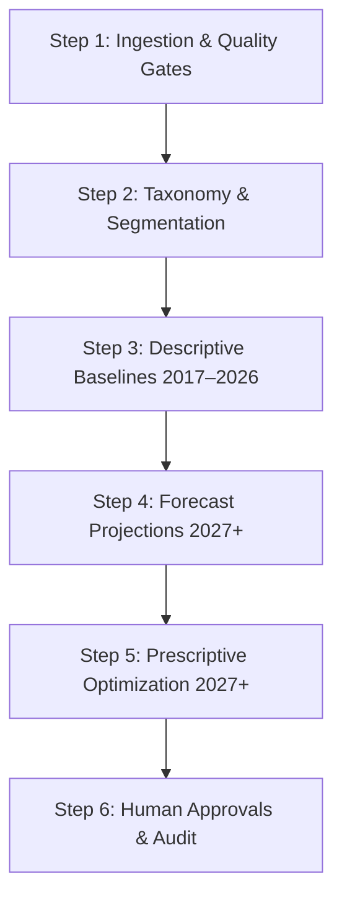
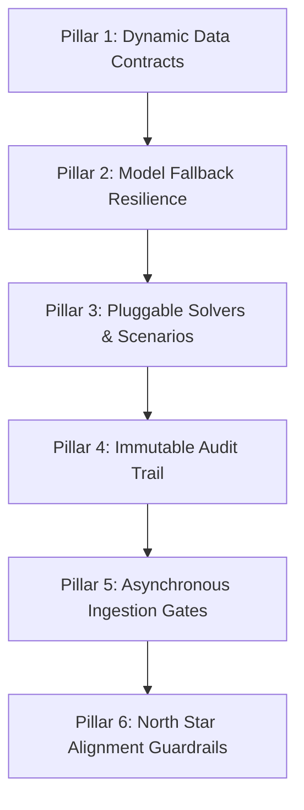

# MedShield Executive DSS Dashboard: Design Architecture & Build Guide

This document defines the design methodology and system architecture for the MedShield **Decision Support System (DSS)** — an enterprise-grade platform for pharmaceutical distribution and inventory planning in the Philippines (CALABARZON / Bicol / Metro Manila). It bridges data engineering, predictive forecasting, and prescriptive optimization into a clean, executive-facing interface aligned with the **MedShield North Star Diagram** (`references/NStar.md`) and the Group 9 ISB capstone research framework (`references/PRIVATE_SUMMER_CAPSTONE_2 - GROUP9_ISB.pdf`).

> [!IMPORTANT]
> **Data Horizon**: Historical data spans **2017–2026**. All forward-looking forecasts, inventory parameters (EOQ, ROP, Safety Stock), and LP allocations target **2027 and beyond**. This boundary is enforced across all dashboard modules, charts, and filter controls.

---

## 1. Objective-to-Solution Mapping Matrix

| Objective / Phase | Target Outcome | Analytics Technique |
| --- | --- | --- |
| **Sales Diagnostic** | Analyze 2017–2026 sales performance baseline across territories | **STL Decomposition** (descriptive layer) |
| **Product & Area Prioritization** | Identify key revenue drivers, client accounts, and slow movers | **80/20 Pareto Analysis** (descriptive) + **XGBoost ABC Classifier** (predictive) |
| **Demand Forecasting** | Forecast territory-level pharmaceutical demand from 2027 onwards | **Facebook Prophet** with DII & RSI external regressors + **XGBoost Urgency Scoring** |
| **Prescriptive Planning** | Optimize procurement & allocation (target expiry wastage ≤ 5%) | **EOQ**, **ROP**, **Safety Stock**, **MCDA**, and **LP Stock Allocation** |

---

## 2. The Executive Dashboard Philosophy

The MedShield DSS dashboard must support **critical decisions, not display raw data clutter**. Executives require:

1. **Immediate Context**: High-level, red-or-green strategic metrics within 5 seconds of page load.
2. **Actionable Recommendations**: Clear, cost-justified suggestions (what to order, where to allocate, for 2027+).
3. **Auditable Guardrails**: Full visibility into assumptions, data limitations, and override audit trails.
4. **No Black Boxes**: Explainable optimization constraints and model fallback states.

---

## 3. Consolidated Analytics Pipeline Outputs

The executive DSS dashboard consolidates **all analytical stage outputs** mapped directly to North Star Diagram nodes:

### Descriptive Analytics Outputs (Historical Baseline: 2017–2026)

* **Ingestion Quality Logs**: Total rows processed vs. accepted clean rows; isolated margin anomalies flagged.
* **Geographic & Channel Segmentations** `[North Star 2A, 6A, 7A]`: Clean actual sales vs. backward-allocated service contracts (clearly flagged as `estimated_backward_allocation`).
* **Seasonality Indices** `[North Star 3A]`: Monthly historical demand multipliers via STL decomposition across the 10-year baseline (e.g., Dengue seasonal surges historically peaking July–September).
* **YoY Demand Growth Trends** `[North Star 5A]`: Comparative monthly growth percentages between consecutive years in the 2017–2026 window.
* **Pareto Revenue Share Bands** `[North Star 4A]`: Product groups categorized into ABC bands based on historical sales concentration.

### Predictive Analytics Outputs (Forecasting: 2027 Onwards)

* **Prophet Demand Forecasts** `[North Star 2B]`: Monthly expected demand volumes `y(t)` for **2027+**, with upper and lower confidence intervals.
* **Forecast Accuracy Metrics** `[North Star 3B]`: MAPE, RMSE, MAE, and naive seasonal benchmarks validated against **2026 actuals** (held-out test set).
* **Model Fallback Indicators** `[North Star 4B, 5B]`: Visual badges showing whether forecasts use active exogenous regressors (`DII_lag`, `RSI`) or have downgraded to a historical Naive Baseline.
* **XGBoost Classifications & Scores** `[North Star 6B, 7B]`: Predicted ABC class designations and continuous Demand Urgency Scores for cold-start and existing SKUs, informing 2027 procurement prioritization.

### Prescriptive Analytics Outputs (Optimization: 2027 Planning Cycle)

* **MCDA Priority Scores** `[North Star 6C]`: Unified territory priority scores via weighted multi-criteria ranks (revenue from 2017–2026, growth trajectory, and 2027 epidemiological risk).
* **Inventory Control Parameters** `[North Star 2C, 3C]`: Cost-minimized EOQ, Reorder Points (ROP), and Safety Stock buffers — all calibrated to 2027 Prophet demand forecasts.
* **LP Allocation Matrices** `[North Star 2C, 6C]`: Optimized stock distribution by product and province for 2027, with active binding constraints surfaced (budget limits, capacity ceilings), targeting expiry wastage ≤ 5%.
* **Collaborative Filtering Recommendations** `[North Star 7C]`: Product-territory expansion pairings for 2027 with cosine similarity scores sourced from the 2017–2026 demand history.
* **Stop-Purchasing Flags** `[North Star 8C]`: Dead-stock Class C items flagged based on trailing 6-month velocity within the 2026 tail of the historical series.
* **System Override Records** `[North Star 4C, 5C]`: High-contrast typhoon and outbreak alert banners overriding default 2027 parameters, paired with mandatory planner comments in the immutable audit log.

---

## 4. External Data Integration (Weather & Disease Signals)

The dashboard integrates the following external datasets to support environmental decision models. Their parameters and limitations are explicitly surfaced in the UI:

1. **DOH Disease Data (2017–2026 Historical Baseline)**:
   * *Metric*: Monthly Disease Intensity Indicator (DII) by province for Dengue, Leptospirosis, and Influenza.
   * *UI Label*: **"Historical epidemiological reference signals"** — never described as a live real-time outbreak surveillance alert.
   * *Usage*: Training baseline for `AvgCases(r, d)` and computing DII normalization across the 10-year history.

2. **PAGASA Meteorological Reference (2017–2026)**:
   * *Metric*: Rainfall (mm), humidity, wind speed, and temperature from historical station logs.
   * *UI Label*: **"Historical meteorological reference data"** — not used for post-2026 active real-time forecasting.

3. **Open-Meteo Weather API Reanalysis Proxy (2017–2026)**:
   * *Metric*: Localized weather patterns by coordinates used to generate the Monthly Severity Proxy (0.0–1.0) and Rainfall Severity Index (RSI).
   * *UI Label*: **"Provider-derived weather proxy observations"** — never presented as official PAGASA alert signals.

---

## 5. Interface Layout & Navigation Architecture

The MedShield DSS interface is organized into **5 Core Modules**:

```text
+-------------------------------------------------------------------------------------------+
| MedShield DSS  [Home/KPIs]  [Sales Diagnostic]  [Prioritization]  [Forecast]  [Prescriptive] |
+-------------------------------------------------------------------------------------------+
```

### Module 1: Home Page & KPI Overview
* **Audience**: CEO, COO, VP of Procurement.
* **Goal**: Immediate situational awareness within 5 seconds — no scrolling required for critical signals.
* **Elements**:
  * **Environmental Alert Banner**: High-contrast, dynamic alert for active disease outbreaks or typhoon triggers that override 2027 plan parameters.
  * **KPI Summary Cards**: Corporate Revenue (2017–2026 actuals), Gross Profit Margin, Active Risk Index, ETL Pipeline Health.
  * **Strategic Overview Chart**: Historical actual sales (2017–2026) seamlessly transitioning into Prophet demand forecasts (2027+) with shaded confidence bounds.
  * **Year Filter Controls**: `<select id="topbarYearSelect">` for single-year views; `yoyBaseYearSelect` / `yoyTargetYearSelect` pair for Y/Y comparisons — dynamically supports any year in the 2017–2026 range without code changes.

### Module 2: Sales Diagnostic Module
* **Audience**: Business Analysts, Operations Researchers.
* **Goal**: Deep analysis of 2017–2026 historical sales baselines across delivery territories.
* **Elements**:
  * **Time Granularity Filters**: Monthly, Weekly, Annual selectors; territory and channel dropdowns.
  * **Service Contract Toggle**: Toggle between actual sales only vs. backward-allocated service contract estimates (`estimated_backward_allocation`).
  * **STL Decomposition Heatmap**: Monthly seasonality multipliers visualized as a grid (e.g., Dengue medicines historically showing 1.3x demand in July–September).
  * **YoY Comparative Chart**: Dual-axis line and bar chart comparing years within the 2017–2026 window. Partial-year data near the 2026 cutoff is greyed out and labelled.

### Module 3: Product & Area Prioritization Module
* **Audience**: Category Managers, Procurement Officers, Sales Leads.
* **Goal**: Identify key revenue drivers, client account channels, and slow-moving items from the 2017–2026 history.
* **Elements**:
  * **Pareto 80/20 Revenue Curve**: Cumulative revenue chart isolating Class A (≤80%), Class B (80–95%), Class C (>95%).
  * **Pareto Doughnut Chart**: Portfolio mix showing product group concentration.
  * **Account Channel Leaderboard**: Ranked by institutional channel (Government Bidding, Hospital Tenders, Retail Pharmacies).
  * **Slow-Movers & Stop-Purchasing Flags**: Dead-stock Class C items based on trailing 6-month velocity.
  * **XGBoost ABC Classifier**: 2027 predicted ABC ranks and feature importance scores for cold-start SKUs.

### Module 4: Forecast Modeling Module
* **Audience**: Supply Chain Analysts, Lead Demand Forecasters.
* **Goal**: Project territory-level pharmaceutical demand from 2027 onwards and score stockout vulnerability.
* **Elements**:
  * **Prophet Demand Projections**: Historical sales (2017–2026) transitioning into 2027+ forecast lines with shaded upper/lower confidence intervals.
  * **Model Fallback Indicators**: Badge showing active DII & RSI regressors vs. historical Naive Baseline fallback.
  * **Forecast Accuracy Dashboard**: MAPE, RMSE, MAE evaluated against **2026 actuals** (held-out test set) to build planner confidence before acting on 2027 projections.
  * **XGBoost Urgency Scoring Table**: Continuous Demand Urgency Scores (0.00–1.00) combining 2027 forecast volume, velocity, and stock levels.

### Module 5: Prescriptive Planning & Data Upload Module
* **Audience**: Inventory Planners, Procurement Directorate, System Administrators.
* **Goal**: Optimize 2027 procurement, execute regional stock allocation (targeting expiry wastage ≤ 5%), and manage data ingestion.
* **Elements**:
  * **Scenario Control Sidebar**: Interactive sliders for Lead Time, Holding Cost, Target Service Level (Z-factor), and LP Budget Ceiling — all feeding into 2027 EOQ/ROP/LP calculations.
  * **EOQ & ROP Planning Table**: 2027 cost-minimizing order quantities, Safety Stock buffers, Reorder Points, and inline "Approve Order" actions.
  * **MCDA & LP Allocation Matrix**: 2027 optimized stock distribution by province with active binding constraints surfaced.
  * **Collaborative Filtering Expansion**: 2027 product-territory expansion recommendations based on 2017–2026 cosine similarity analysis.
  * **Live Data Ingestion Console**: Drag-and-drop CSV/XLSX parser, raw vs. accepted row counter, isolated margin anomaly log, and immutable DSS audit trail.

---

## 6. Step-by-Step Dashboard Build Process



### Step 1: Establish Data Trust & Quality Gates
* Verify ingestion quality: raw transaction row count, accepted clean sales row count, isolated anomalous records.
* Display **Data Health Status Badge** (green "100% Reconciled" or amber "Warning: Anomalies Isolated").
* **Never** hide data quality issues. Gross margin anomalies must be flagged and separated before any KPI calculations begin.

### Step 2: Align Clean Business Taxonomy
* Populate dropdowns dynamically from the underlying database schema — no hardcoded territory lists, SKU lists, or province names in UI code.
* Transition unserviced reference locations from `No Data (—)` to active metrics automatically once sales transactions exist.
* Flag `estimated_backward_allocation` rows clearly throughout all views.

### Step 3: Render Descriptive Strategic Baselines (2017–2026)
* Display YoY Demand Growth chart comparing years within the 2017–2026 window.
* Render Seasonality Index heatmap from STL decomposition of the full 10-year baseline.
* Grey out and label partial-year periods near the 2026 cutoff to prevent false decline signals.

### Step 4: Project Demand Ranges & Confidence Limits (2027+)
* Show historical sales (2017–2026) transitioning seamlessly into 2027+ Prophet forecast line.
* Always display shaded confidence intervals — never present point forecasts as absolute certainty.
* Show model fallback badge when exogenous DOH/PAGASA feeds are offline (Naive Baseline active).

### Step 5: Display Prescriptive Scenarios & Cost Levers (2027 Planning)
* Provide interactive sliders for scenario testing of Lead Time, Holding Cost, Service Level, and LP Budget Cap.
* Label all optimization outputs as **"Scenario-Based Planning Recommendations"** when actual cost, capacity, or lead-time data is incomplete.
* Surface binding LP constraints explicitly (e.g., "Allocation limited by: Budget Ceiling").

### Step 6: Enforce Human-in-the-Loop Approvals
* Every approved reorder or stock transfer requires a mandatory planner justification comment.
* All actions are written to an immutable, append-only audit log (`dss_action_logs`) containing user IDs, timestamps, and planner comments.
* Override alert banners (typhoon/outbreak) must be visually prominent and capture the triggering condition with timestamp.

---

## 7. Future-Proofing Architecture



### Pillar 1: Dynamic Data Contracts & Zero-Hardcoding Taxonomy
* UI dynamically populates dropdowns and tables from `dashboard_sales_snapshot.json` / Supabase tables.
* Year selectors support **any year in the 2017–2026 range** and automatically include new years as data is ingested — no code changes required.

### Pillar 2: Model Versioning & Dynamic Fallback Resilience
* If DOH disease or Open-Meteo weather API feeds experience downtime, the system downgrades from Prophet with regressors to a historical Naive Seasonal Baseline and displays a visual fallback badge.

### Pillar 3: Pluggable Prescriptive Optimization Solvers
* EOQ, ROP, Safety Stock, MCDA, and LP use parameterized REST API endpoints.
* Planners can dynamically test scenario sliders: Lead Time 5–45 days, Holding Cost 5–35%, Service Level 80–99%, LP Budget Cap ₱10M–₱100M.
* LP solver enforces the **expiry wastage ≤ 5%** cap constraint on every 2027 allocation run.

### Pillar 4: Immutable Audit Trail & Role-Based Access Control (RBAC)
* Every human approval, manual override, or emergency contingency trigger is written to an immutable history table with planner comments, user IDs, and timestamps.

### Pillar 5: Asynchronous ETL Ingestion Gates
* Sales batch uploads run asynchronously via background workers.
* Raw rows are validated against data quality contracts, isolating margin anomalies and `estimated_backward_allocation` rows before they reach analytics models.

### Pillar 6: North Star Alignment Guardrails
* All 5 dashboard modules, their chart outputs, and their underlying calculation methods map directly to named North Star Diagram nodes (2A through 8C).
* Any future feature additions must be traced to a North Star node or a documented extension of the capstone research framework before implementation.
